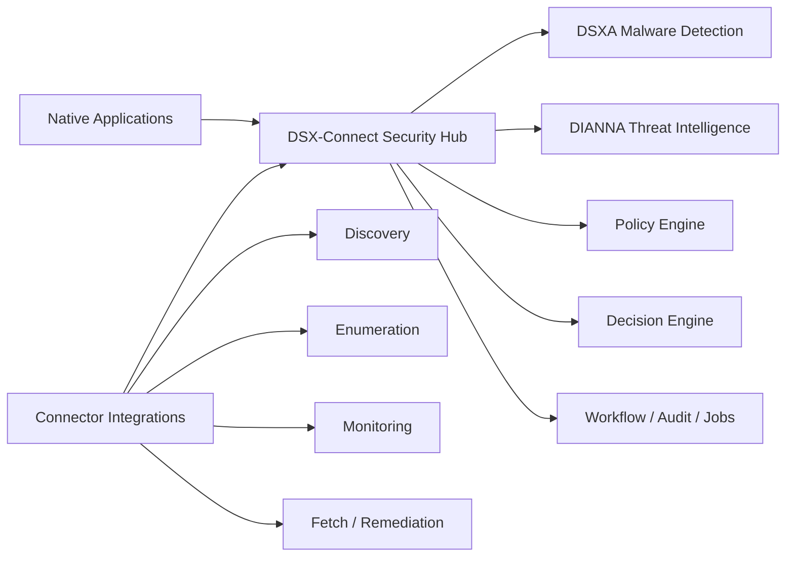
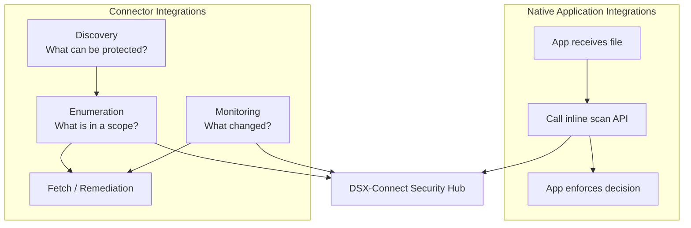
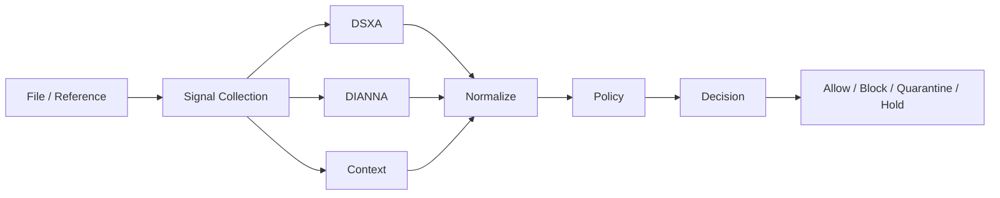
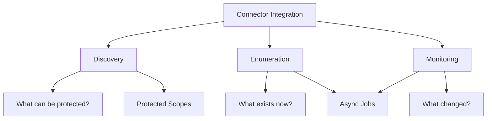
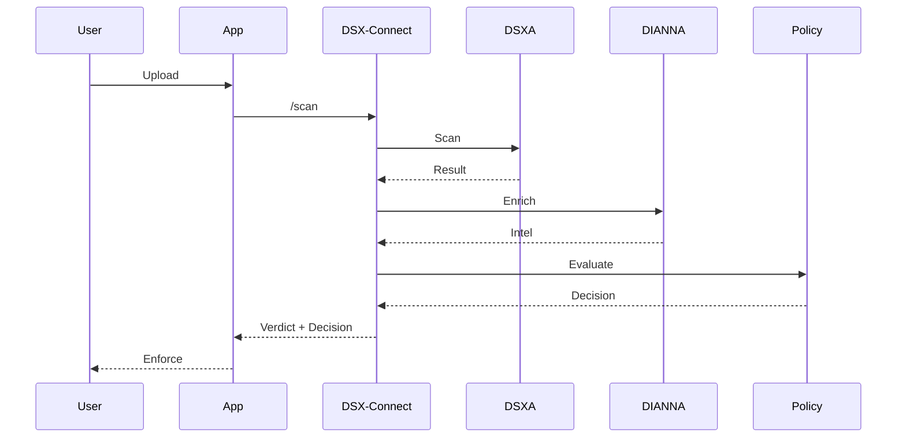
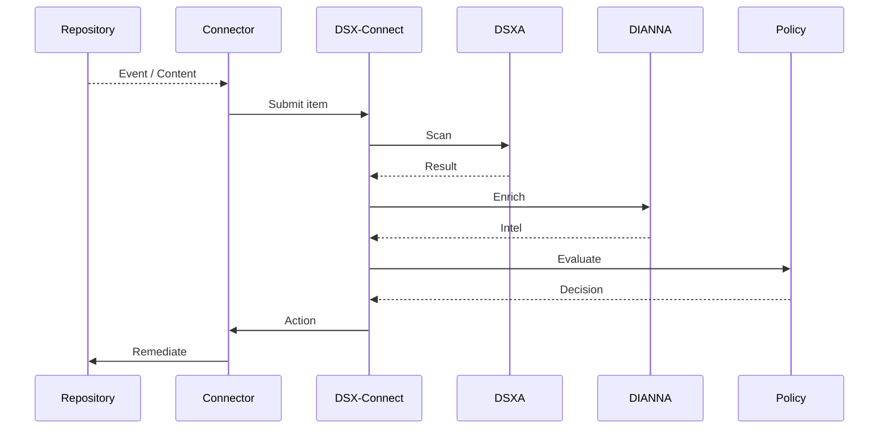

# DSX-Connect Architecture Overview

## Security Hub for File Risk Decisions

---

## Executive Summary

Modern enterprises face a fundamental challenge:

> Files enter systems from everywhere, but security decisions are fragmented, inconsistent, and often too late.

DSX-Connect addresses this by acting as a **central Security Hub** for file risk decisions.

* **File Scanning as a Service (FSaaS)**
* **Multi-signal decisioning (DSXA + intelligence + context)**
* **Unified policy and audit**
* **Inline + asynchronous workflows**

> **Any file. Anywhere. One decision.**

---

## The Core Shift

**From:** connect scanning into platforms
**To:** provide file security as a service

---

## Architecture Overview

### 1. Security Hub (Core)

* DSXA malware detection
* Threat intel enrichment (e.g., DIANNA)
* Policy evaluation & decisioning
* Audit, workflow, job lifecycle

---

### 2. Integration Patterns

#### A. Native Application Integrations (Inline)

* Real-time, “scan before store”
* App calls `/scan`, enforces decision

#### B. Connector Integrations (Repository / Platform)

* Discovery, enumeration, monitoring
* Fetch/scan and remediation
* Async, large-scale, existing content + new content landing on repo

---

### 3. Shared Decision Plane

* Same scan engine, policy, decisions, audit across all paths

---

## Multi-Signal Decision Engine

* **Verdict**: malicious / clean / suspicious / unknown
* **Decision**: allow / block / quarantine / hold

---

## Connector Model (Refined)

* **Discovery** → define scopes
* **Enumeration** → baseline/bulk
* **Monitoring** → changes over time

> Connectors describe the platform. Core decides.

---

## Execution Flows

### Inline (Synchronous)

### Connector / Repository (Async)

---

## Protected Scope Model

* Non-overlapping scopes
* Each object belongs to exactly one scope
* Policy attaches at scope (or logical app scope)

---

## Why This Matters

* **Consistency**: one decision model
* **Scalability**: inline + async
* **Flexibility**: apps + platforms
* **Extensibility**: new signals
* **Control**: centralized policy/audit

---

## Positioning

> **Security Hub for file risk decisions**
> **Multi-signal decision engine**
> **File Scanning as a Service**

---

## Closing

> **Any file. Anywhere. One decision.**
