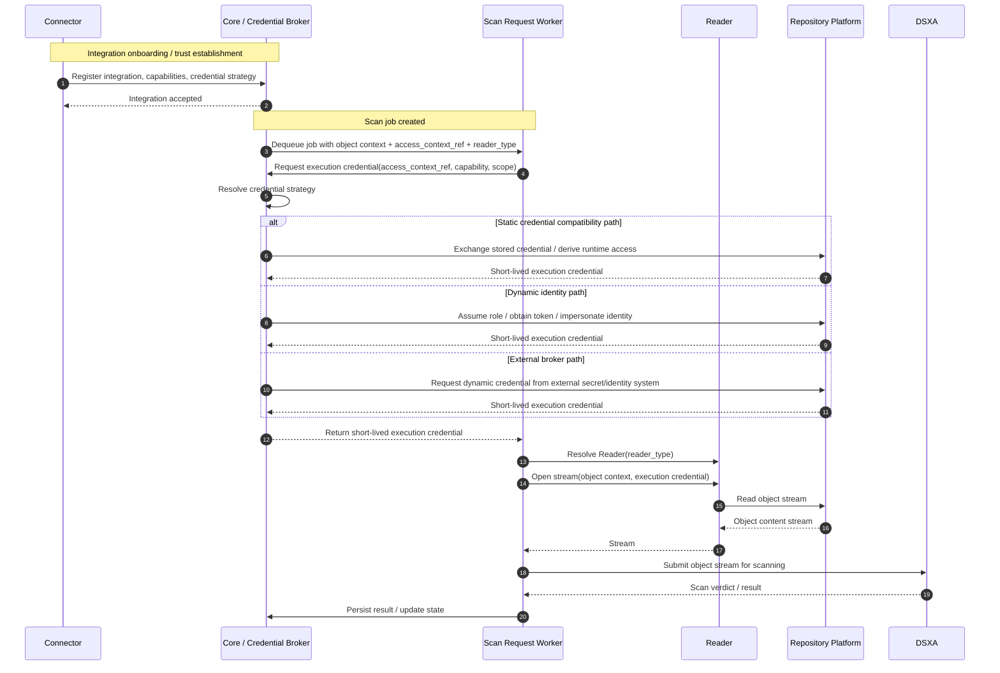
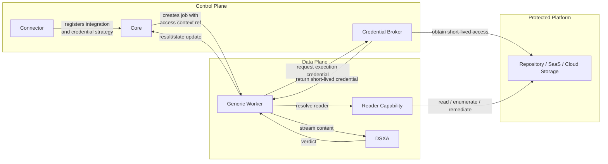
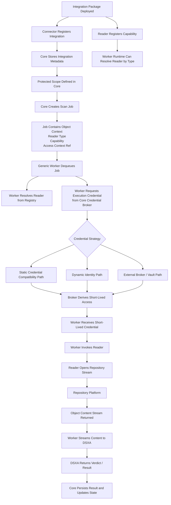

# Credential Strategy Mapping: Current vs Target State

* **Related:** ADR-009, ADR-010
* **Purpose:** Provide practical guidance for how DSX-Connect integrations should evolve from common credential patterns to the preferred architecture

---

## Overview

Most environments today rely on **static or semi-static credentials**.
DSX-Connect supports these for compatibility, but the **target state is always short-lived, identity-based access** resolved at runtime via the credential broker.

This document maps:

> **What customers typically have today → What DSX-Connect should move them toward**

---

# ☁️ AWS (S3, etc.)

## 🔴 Common Today (Tier 1)

```
AWS_ACCESS_KEY_ID
AWS_SECRET_ACCESS_KEY
```

Used via:

* IAM users
* long-lived credentials in config/env

**Problems**

* long-lived secrets
* manual rotation
* broad permissions
* hard to audit per execution

---

## 🟡 Transitional (Tier 2)

* Vault-issued AWS credentials
* rotated IAM user keys
* limited-lifetime keys

**Improvement**

* better rotation
* reduced exposure

---

## 🟢 Target State (Tier 3)

**IAM Role Assumption (STS)**

Flow:

1. Customer creates IAM Role with:

    * S3 read/enumerate/remediate permissions
    * trust relationship with DSX-Connect

2. DSX-Connect:

    * uses broker to call `AssumeRole`
    * receives short-lived credentials

3. Worker:

    * Reader uses temporary credentials
    * credentials expire automatically

---

## ✅ DSX-Connect Position

* support access keys (baseline)
* strongly recommend role assumption
* broker converts all strategies → STS creds at runtime

---

# ☁️ Azure (Blob, Data Lake, etc.)

## 🔴 Common Today (Tier 1)

* App Registration + Client Secret
* Storage account keys

**Problems**

* long-lived secrets
* manual rotation
* over-privileged access

---

## 🟡 Transitional (Tier 2)

* certificate-based auth
* rotated client secrets
* Key Vault-backed secrets

---

## 🟢 Target State (Tier 3)

**Managed Identity / Entra ID Token**

Flow:

1. DSX-Connect runs with:

    * Managed Identity (preferred)
      OR
    * App Registration with delegated trust

2. Broker:

    * obtains OAuth token from Entra ID

3. Worker:

    * Reader uses token to access Blob APIs

---

## ✅ DSX-Connect Position

* support client secrets (baseline)
* prefer managed identity wherever possible
* broker handles token acquisition

---

# ☁️ GCP (GCS, etc.)

## 🔴 Common Today (Tier 1)

* Service Account JSON key files

**Problems**

* long-lived keys
* key leakage risk
* manual rotation

---

## 🟡 Transitional (Tier 2)

* rotated service account keys
* Vault-managed keys

---

## 🟢 Target State (Tier 3)

**Workload Identity / Service Account Impersonation**

Flow:

1. DSX-Connect identity is allowed to:

    * impersonate target service account

2. Broker:

    * requests short-lived access token

3. Worker:

    * Reader uses token for GCS access

---

## ✅ DSX-Connect Position

* support JSON keys (baseline)
* strongly prefer impersonation
* eliminate long-lived keys where possible

---

# 🧩 SaaS Platforms (SharePoint, OneDrive, etc.)

## 🔴 Common Today

* App Registration + Client Secret
* tenant-wide permissions

---

## 🟢 Target State

**OAuth / App-Only Token (Brokered)**

Flow:

1. Connector:

    * establishes tenant consent

2. Broker:

    * obtains access token via OAuth

3. Worker:

    * Reader uses token for API access

---

## ⚠️ Notes

* no true “managed identity” equivalent
* broker is critical here
* scoping permissions is harder → must be enforced carefully

---

# 🧠 Key Architectural Insight

Across all platforms:

> **Static credentials are never the execution model — only an input into the broker.**

---

## Final Execution Pattern (Unified)

Regardless of platform:

1. Job created with:

    * `access_context_ref`

2. Worker:

    * requests execution credential from broker

3. Broker:

    * resolves using:

        * static creds → assume role / token exchange
        * identity → direct token
        * Vault → dynamic creds

4. Worker:

    * uses short-lived credential
    * discards after execution

---

# 🔥 DSX-Connect Positioning (This is important)

You now have a very strong, simple message:

> “We support your current credential model — but execute securely using short-lived access.”

---

# 🧭 Migration Guidance

DSX-Connect should guide customers along this path:

```
Static → Rotated → Identity-Based
```

Suggested approach:

* allow static onboarding
* surface warnings/recommendations
* provide docs + examples for upgrading
* make identity-based setup first-class

---

# 🚀 Summary

| Platform | Today (Common) | Target                 |
| -------- | -------------- | ---------------------- |
| AWS      | Access Keys    | AssumeRole (STS)       |
| Azure    | Client Secret  | Managed Identity       |
| GCP      | JSON Key       | Workload Identity      |
| SaaS     | Client Secret  | OAuth Token (Brokered) |

---

## Final Takeaway

The architecture does not force customers to change immediately.

But it ensures that:

* all execution uses short-lived credentials
* connectors stay out of the hot path
* workers scale cleanly
* security improves over time

---



The connector establishes trust and declares credential strategy, Core brokers runtime access, the worker resolves the Reader, and the Reader accesses the repository using short-lived execution credentials.



