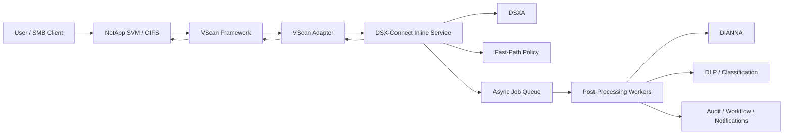
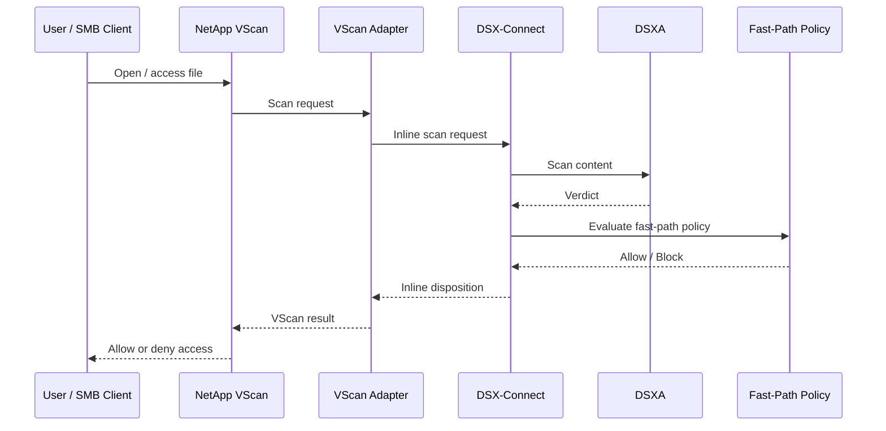
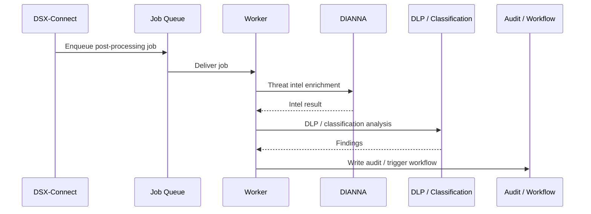
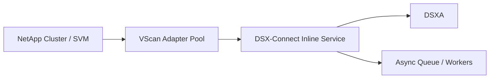

# VScan Adapter Architecture

## Purpose

This document defines the architecture for integrating **NetApp VScan** with DSX-Connect using a thin inline adapter pattern.

The goal is to let NetApp remain the inline enforcement surface while DSX-Connect provides:

* fast malware decisioning in the access path
* centralized policy and audit
* asynchronous post-processing and orchestration

This allows DSX-Connect to participate in NAS file access protection without collapsing all logic into a storage-specific integration.

---

## Architectural Role

The VScan adapter is a **thin protocol bridge** between NetApp VScan and DSX-Connect.

It is responsible for:

* receiving scan requests from NetApp VScan
* obtaining file content or stream access
* normalizing request metadata
* calling DSX-Connect’s fast inline service
* translating the returned disposition into the response expected by VScan

It is **not** responsible for:

* deep policy evaluation
* threat intelligence lookups
* DLP or classification
* workflow orchestration
* authoritative job state
* long-term audit ownership

> The adapter is a translation layer. DSX-Connect remains the decision and orchestration engine.

---

## High-Level Architecture



---

## Core Design Principle

The architecture separates file security into two paths:

### 1. Inline Enforcement Path

Optimized for:

* low latency
* immediate allow/block decision
* file access path enforcement

This path should do only what is required to answer:

> Can this file be accessed right now?

### 2. Post-Processing Path

Optimized for:

* enrichment
* compliance
* workflow
* reporting
* retrospective actions

This path answers:

> What else should we learn, record, or do about this file?

---

## Component Model

### NetApp VScan Framework

NetApp VScan is the storage-side enforcement surface.

Responsibilities:

* detect file access events
* invoke configured scan service
* wait for response
* allow or deny access based on scan outcome

---

### VScan Adapter

The adapter is the NetApp-facing integration component.

Responsibilities:

* implement the VScan-facing protocol or service contract
* receive file scan requests
* collect path, share, and platform metadata
* retrieve or stream file content
* call DSX-Connect fast-path inline endpoint
* translate response into VScan-compatible outcome
* emit telemetry and correlation data

Design goals:

* stateless where possible
* minimal logic
* horizontally scalable
* low-latency request handling

---

### DSX-Connect Inline Service

This is the low-latency decision service used in the file access path.

Responsibilities:

* receive normalized inline request
* invoke DSXA for fast malware decisioning
* apply fast-path policy
* return allow/block disposition
* emit audit event
* optionally enqueue post-processing jobs

---

### DSXA

DSXA provides the primary malware detection signal for the inline path.

Responsibilities:

* scan content quickly
* return malware verdicts
* support the inline latency envelope required by NAS access flows

---

### Async Queue and Workers

Used for post-inline processing.

Responsibilities:

* DIANNA enrichment
* DLP analysis
* content classification
* downstream notifications
* incident/case creation
* retrospective tagging or remediation recommendations

This path must not block the inline VScan response.

---

## Inline Request Flow



### Inline flow steps

1. User attempts to access file on SMB share
2. NetApp VScan triggers scan request
3. Adapter receives request and gathers file context
4. Adapter sends normalized inline request to DSX-Connect
5. DSX-Connect invokes DSXA
6. DSX-Connect applies fast-path policy
7. DSX-Connect returns inline disposition
8. Adapter maps that result into VScan response
9. NetApp allows or blocks access

---

## Post-Processing Flow



### Post-processing steps

1. DSX-Connect returns inline disposition
2. DSX-Connect enqueues async job
3. Workers perform enrichment and analysis
4. Findings are written to audit records
5. Optional follow-on actions are triggered

Examples of follow-on actions:

* SOC alert
* compliance notification
* administrative case creation
* retrospective quarantine recommendation
* content tagging or classification update

---

## Policy Split

A VScan-based integration should use two policy layers.

### Fast-Path Policy

Used in the inline access path.

Purpose:

* return allow/block quickly
* enforce only what must happen immediately

Examples:

* block if DSXA says malicious
* allow if DSXA says clean
* fail closed on scan error in strict environments
* fail open in selected environments

Fast-path policy should be:

* simple
* deterministic
* low-latency

---

### Extended Policy

Used in async workers.

Purpose:

* evaluate richer signals
* trigger workflows and follow-up actions

Examples:

* if DIANNA indicates high-risk family, notify SOC
* if DLP detects sensitive content, notify compliance
* if classification detects regulated data, apply workflow
* if post-processing changes risk posture, create retrospective action

---

## Inline API Contract

The VScan adapter should call a dedicated low-latency DSX-Connect endpoint.

Example:

```text
POST /v1/inline/nas/scan
```

### Example request shape

```json
{
  "integration_type": "netapp_vscan",
  "tenant_id": "tenant-1",
  "logical_scope": "nas-inline",
  "file_context": {
    "share": "engineering",
    "path": "/projects/specs/file.docx",
    "server": "svm-prod-01",
    "protocol": "smb"
  },
  "object_identity": {
    "platform": "netapp",
    "path": "/projects/specs/file.docx"
  },
  "scan_mode": "inline_fast_path"
}
```

### Example response shape

```json
{
  "request_id": "req-123",
  "inline_disposition": "allow",
  "verdict": "clean",
  "reason": "dsxa_clean",
  "post_processing_scheduled": true
}
```

### Inline disposition set

Recommended inline dispositions:

* allow
* block

Internally, DSX-Connect may also represent:

* unavailable
* timeout
* error

But the adapter should translate these into the final configured enforcement behavior for NetApp.

---

## Response Mapping

The adapter translates DSX-Connect results into VScan-native outcomes.

### Suggested mapping

| DSX-Connect result  | VScan enforcement outcome |
| ------------------- | ------------------------- |
| allow               | permit file access        |
| block               | deny file access          |
| error + fail closed | deny access               |
| error + fail open   | allow access and audit    |

This mapping should be adapter-configurable.

---

## File Handling Options

### Option A: Streaming to DSX-Connect

The adapter streams content directly to DSX-Connect.

Best when:

* low latency is critical
* file sizes are manageable
* DSX-Connect supports streaming efficiently

Pros:

* simpler central processing model
* cleaner control-plane ownership

Cons:

* adapter becomes part of the content data path

---

### Option B: Local staging

The adapter stages the file locally and sends DSX-Connect metadata or a local handle/reference.

Best when:

* streaming is not practical
* VScan mechanics favor file-based handling
* local buffering is required by the environment

Pros:

* useful for legacy mechanics

Cons:

* more complexity
* local retention lifecycle concerns
* added storage and cleanup requirements

### Current recommendation

Prefer **streaming** where feasible.
Use local staging only when required by integration mechanics.

---

## Deployment Model

The adapter should be deployed close to the filer and close to DSX-Connect.

Recommended locations:

* on-prem VM or appliance near NetApp
* containerized service in the same datacenter segment
* redundant adapter instances for high availability

Why this matters:

* inline path is latency sensitive
* content transfer may be heavy
* additional hops directly affect user experience

### Suggested topology



---

## High Availability

Because VScan participates in the access path, the adapter must be highly available.

Recommendations:

* run multiple adapter instances
* keep instances stateless
* use health-based failover where supported
* externalize state, audit, and orchestration to DSX-Connect
* support rolling replacement of adapter instances

The adapter should be treated as an interchangeable bridge service, not a stateful control-plane node.

---

## Observability and Correlation

End-to-end tracing is essential.

Correlation should connect:

* NetApp request context, where available
* adapter request ID
* DSX-Connect request ID
* async job IDs

### Recommended telemetry fields

* tenant ID
* SVM / filer identity
* share name
* file path
* protocol
* adapter instance ID
* DSXA verdict
* inline disposition
* latency breakdown
* async job ID
* error class, where relevant

This is critical for:

* troubleshooting
* customer support
* performance tuning
* policy verification

---

## Failure Handling

Failure handling must be explicit and configurable.

### DSXA unavailable

Possible behavior:

* fail closed
* fail open
* short retry within inline timeout budget

### DSX-Connect unavailable

Possible behavior:

* fail closed
* fail open
* emit strong telemetry and audit marker

### File read / stream failure

Treat as:

* scan failure
* map to configured allow/deny behavior

### Async worker failure

Must not affect the already returned inline disposition.

Instead:

* retry asynchronously
* mark audit record incomplete if needed
* alert operators if failure persists

---

## Security Boundaries

The adapter should be granted only the permissions needed to do its job.

Required access:

* receive VScan requests
* read file content required for scan
* call DSX-Connect inline API

The adapter should not own:

* broad control-plane permissions
* policy authoring permissions
* extended orchestration authority

Recommended controls:

* mutual TLS or equivalent between adapter and DSX-Connect
* service identity with narrow scope
* minimal retention of content in adapter local storage
* strong audit logging for inline requests

---

## Relationship to Other DSX-Connect Models

This architecture should be treated as a specialized **inline integration surface**, not a standard repository connector.

Why:

* it sits directly in the file access path
* it returns immediate enforcement decisions
* it behaves more like an inline enforcement protocol than a discovery/enumeration integration

This means:

* **VScan adapter** = inline enforcement bridge
* **repository connector** = discovery, enumeration, monitoring, and async content handling

A separate NetApp repository connector may still be useful later for:

* discovery of protectable shares or volumes
* baseline scanning
* large-scale asynchronous rescans
* reconciliation and reporting

Those should be treated as separate roles.

---

## Design Summary

The cleanest VScan architecture is:

* NetApp VScan remains the filer-side enforcement hook
* a thin VScan adapter bridges NetApp to DSX-Connect
* DSX-Connect inline service provides fast malware decisioning
* DSX-Connect async workers perform richer enrichment and orchestration
* fast-path and extended-path policy remain intentionally separate

> The VScan adapter should be a thin inline bridge that converts NetApp scan requests into DSX-Connect fast-path decisions, while DSX-Connect performs broader asynchronous orchestration after the file access decision is made.

## Pros and Cons

### Pros

* **Preserves the Security Hub model**
  NetApp VScan remains the enforcement hook, while DSX-Connect still owns policy, audit, and orchestration.

* **Supports split-phase security**
  Fast inline malware decisions can be returned immediately, while DIANNA, DLP, and classification run asynchronously.

* **Keeps the adapter thin**
  The VScan adapter stays focused on protocol handling and response translation rather than becoming a second control plane.

* **Creates a reusable inline pattern**
  The same architecture can later support CAVA, ICAP, mail gateways, and other low-latency enforcement surfaces.

* **Improves audit and workflow consistency**
  Even inline NAS flows feed the same DSX-Connect event, policy, and workflow model as other integrations.

### Cons

* **Latency is critical**
  Every additional hop in the inline path directly impacts file access performance.

* **Distributed deployments are risky**
  If adapter, DSX-Connect inline services, and DSXA are separated by weak or inconsistent networking, user experience and reliability may degrade quickly.

* **May require stack co-location**
  In practice, the fast-path components may need to live on or very near the VScan server tier to keep response times acceptable.

* **Operational footprint increases**
  Running DSX-Connect components near the filer or scan servers may complicate deployment, upgrades, and HA design.

* **Fast-path policy must stay intentionally narrow**
  Richer orchestration value is deferred to async processing, so not all security outcomes can be enforced inline.

* **Failure behavior becomes an architectural decision**
  Teams must explicitly choose fail-open vs fail-closed behavior for DSX-Connect, DSXA, and networking failures.

### Deployment Implication

This model is most practical when the **fast-path stack is deployed locally to the VScan environment**, typically including:

* VScan adapter
* DSX-Connect inline service
* DSXA service

The more these components are distributed across the network, the more the architecture depends on extremely low-latency, high-reliability connectivity.

### Current Design Leaning

For VScan-style integrations, DSX-Connect should likely be treated as having a **local fast-path footprint** for inline enforcement, with broader orchestration and post-processing remaining distributed where needed.
