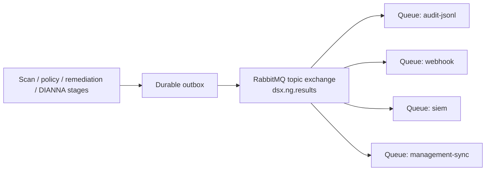

# Result Sink Model

## Purpose

This document defines the intended `ResultSink` abstraction for DSX-Connect.

The ResultSink exists so DSX-Connect can emit normalized stage-specific JSON result events without becoming a destination-specific forwarding platform.

For the architectural decision behind this direction, see:

- `adr/adr-011-result-sink-and-external-forwarding.md`
- `design/result-sink-examples.md`

---

## Core Principle

DSX-Connect should own:

- authoritative workflow state
- normalized result event production

Infrastructure should primarily own:

- routing
- fan-out
- forwarding
- archive policies
- destination-specific transforms

---

## ResultSink Responsibilities

A ResultSink is responsible for:

- accepting normalized result events from core
- serializing them as structured JSON
- writing them to a configured local sink
- optionally applying stronger durability/acknowledgement behavior for selected event families

A ResultSink is not inherently responsible for:

- interpreting policy
- deciding which workflow stages should run
- owning parent/job completion state
- serving as a generic destination-specific integration layer

---

## Future Pub/Sub Result Event Model

The RabbitMQ-backed implementation should treat result emission as event publication, not centralized result routing.

Core should publish normalized result events once.
Destination-specific workers should subscribe through their own queues.



This is important because RabbitMQ does not fan out to multiple workers that share one queue.
Workers sharing one queue compete for messages.
For pub/sub fan-out, each destination that needs the event must have its own durable queue bound to the result exchange.

Destination workers should own:

- their queue binding
- destination credentials
- payload formatting and transforms
- destination retry policy
- destination DLQ handling
- idempotency against the downstream system

Core should not own:

- per-destination branching logic
- destination-specific credentials
- destination-specific transport semantics
- one global decision tree for where every result should go

Candidate routing keys:

- `result.scan.completed`
- `result.scan.failed`
- `result.policy.completed`
- `result.remediation.completed`
- `result.remediation.skipped`
- `result.dianna.completed`
- `result.workflow_summary.completed`

Exact routing keys may evolve, but the design principle should remain stable:

- one normalized event publication path
- one subscriber-owned queue per destination
- per-destination retry and DLQ behavior outside the core workflow engine

---

## Event Families

The ResultSink should support at least:

- `scan_result`
- `remediation_result`
- `dianna_result`
- optional `workflow_summary`

Each event family is emitted when its corresponding result becomes available.

---

## Current `scan_result` Envelope

The current `scan_result` emission shape is intentionally consumer-friendly.

It includes:

- stable identity and correlation fields
- top-level scan outcome convenience fields
- stage payload content
- scanner/reader metadata useful for operational analysis

Current shape:

```json
{
  "schema_version": "1.0",
  "event_type": "scan_result",
  "event_time": "2026-05-22T14:00:00Z",
  "job_id": "job-123",
  "job_item_id": "item-456",
  "integration_id": "sharepoint-prod",
  "scope_id": "scope-finance",
  "object_identity": "drive:abc/item:def",
  "file_hash": "abc123",
  "scan_guid": "scan-789",
  "verdict": "Benign",
  "file_type": "Unknown",
  "content_source_mode": "original",
  "scanner_metadata": {
    "source": "dsxa",
    "reader": "connector_proxy",
    "readerElapsedMs": 17.8,
    "dsxaElapsedMs": 1325.7,
    "requestElapsedMs": 1343.4
  },
  "payload": {
    "verdict": "Benign",
    "fileType": "Unknown",
    "scanGuid": "scan-789",
    "details": {
      "fileInfo": {
        "file_hash": "abc123",
        "file_type": "Unknown"
      }
    },
    "scannerMetadata": {
      "source": "dsxa",
      "reader": "connector_proxy"
    }
  }
}
```

For non-summary events:

- `workflow_summary` is omitted

For `workflow_summary` events:

- the event may additionally include the full summary blob under `workflow_summary`

## Stability Guidance

Treat these fields as the stable consumer contract:

- `schema_version`
- `event_type`
- `event_time`
- `job_id`
- `job_item_id`
- `integration_id`
- `scope_id`
- `object_identity`
- `file_hash`
- `scan_guid`
- `verdict`
- `file_type`
- `content_source_mode`
- `payload`

Treat `scanner_metadata` as operationally useful but implementation-shaped:

- suitable for collectors, debugging, and analytics
- may gain fields over time
- should remain structured JSON rather than opaque strings

The exact schema may still evolve, but the envelope should remain:

- structured
- typed by `event_type`
- sufficient for downstream recombination

---

## Rsyslog Exemplar Pattern

The exemplar operational pattern is:

1. DSX-Connect emits JSON lines to a local file, stdout stream, syslog socket, or similar sink
2. `rsyslog` ingests those events
3. `rsyslog` rules decide whether to:
   - archive locally
   - forward to SIEM
   - forward to syslog relay
   - forward to another agent or pipeline
   - suppress selected event families

This makes rsyslog the routing/fan-out layer, not DSX-Connect core.

---

## Candidate ResultSink Implementations

Possible implementations include:

- `JsonFileResultSink`
- `StdoutResultSink`
- `SyslogResultSink`
- `DurableQueueResultSink`

Different deployments may choose different implementations without changing the core event model.

The same applies to the downstream collector/router layer.

DSX-Connect should remain compatible with multiple external forwarding agents because the contract is:

- structured JSON result emission
- not a hard-coded collector choice

Vector is the current reference example because it supports richer structured transforms if later aggregation or recombination is needed outside core.
That is a recommendation, not an architectural requirement.

---

## Delivery Guarantees

Most emitted result events are convenience outputs.

That means many deployments can accept:

- best-effort local emission
- forwarding managed by rsyslog or another agent

However, specific event families may justify stronger guarantees.

Current likely candidate:

- `dianna_result`

That stronger guarantee should be modeled as:

- a different ResultSink implementation
- or a differently configured local agent path

not as a reason to make all result emission destination-aware in core.

---

## Relationship to Workflow State

Result emission should not be confused with authoritative workflow completion.

For example:

- `scan_result` emission does not imply the item is fully completed
- `workflow_summary` emission may align with later completion semantics
- authoritative workflow state remains in Postgres-backed job/item/stage records

## Relationship to Scanner Result Truth

DSX-Connect is the source of truth for orchestration state, not for scanner-result history.

For the current DSXA path:

- DSXA produces the scan result
- DSXA reports scanner-side outcomes to the Deep Instinct Management Console where applicable
- the Deep Instinct Management Console remains the authoritative scanner-result console
- DSX-Connect keeps job, connector, asset, policy, remediation, and troubleshooting context

The Operator Console may show sample scan results and operational stage state, but those views are meant to answer operational questions about DSX-Connect execution.
They should not be treated as a replacement for the Deep Instinct Management Console result history.

If additional result destinations are needed later, add destination-specific subscriber workers rather than expanding core into a destination router.

---

## Per-Subscriber Delivery State

Today, DSX-Connect has a `delivery_stage` / result-sink concept for outward result emission.
That is useful while result emission is a single transitional path.

In a pub/sub model, there may be many downstream destinations.
A single global delivery state becomes ambiguous because one subscriber may succeed while another is retrying or dead-lettered.

If operator visibility needs downstream status later, model it as per-subscriber state, for example:

- subscriber id
- destination type
- last event id
- last delivery state
- retry count
- DLQ state
- last error

This keeps the workflow item state separate from optional destination delivery outcomes.

---

## Open Questions

- Should `workflow_summary` remain optional or become a standard event family?
- Which default ResultSink should local development use?
- Should DIANNA use a separate stronger-guarantee sink by default, or only when configured?
- What exact result-event exchange and routing-key taxonomy should the RabbitMQ topology expose?
- Which subscriber delivery states, if any, should be visible in the Operator Console?
