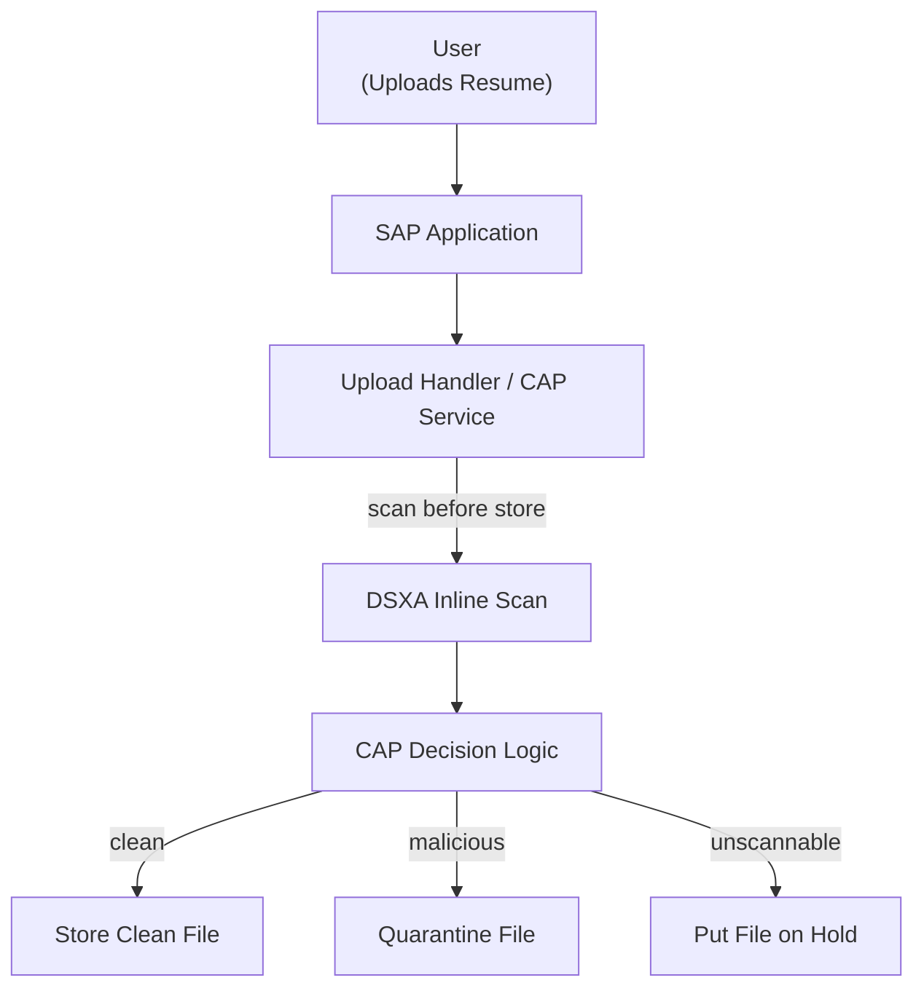
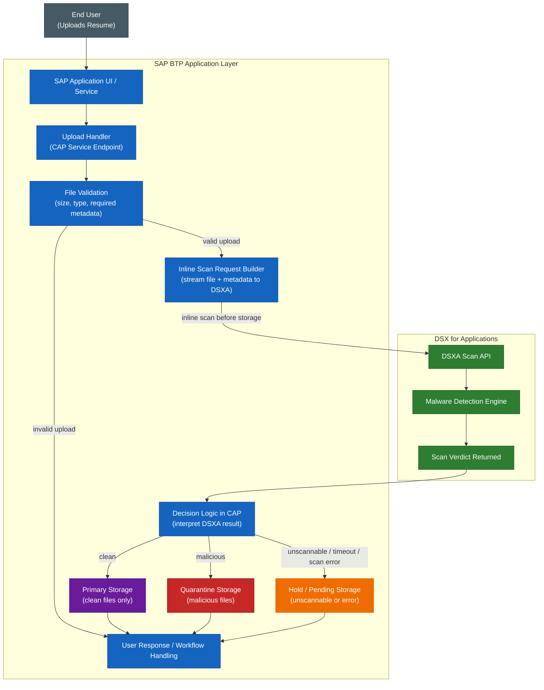
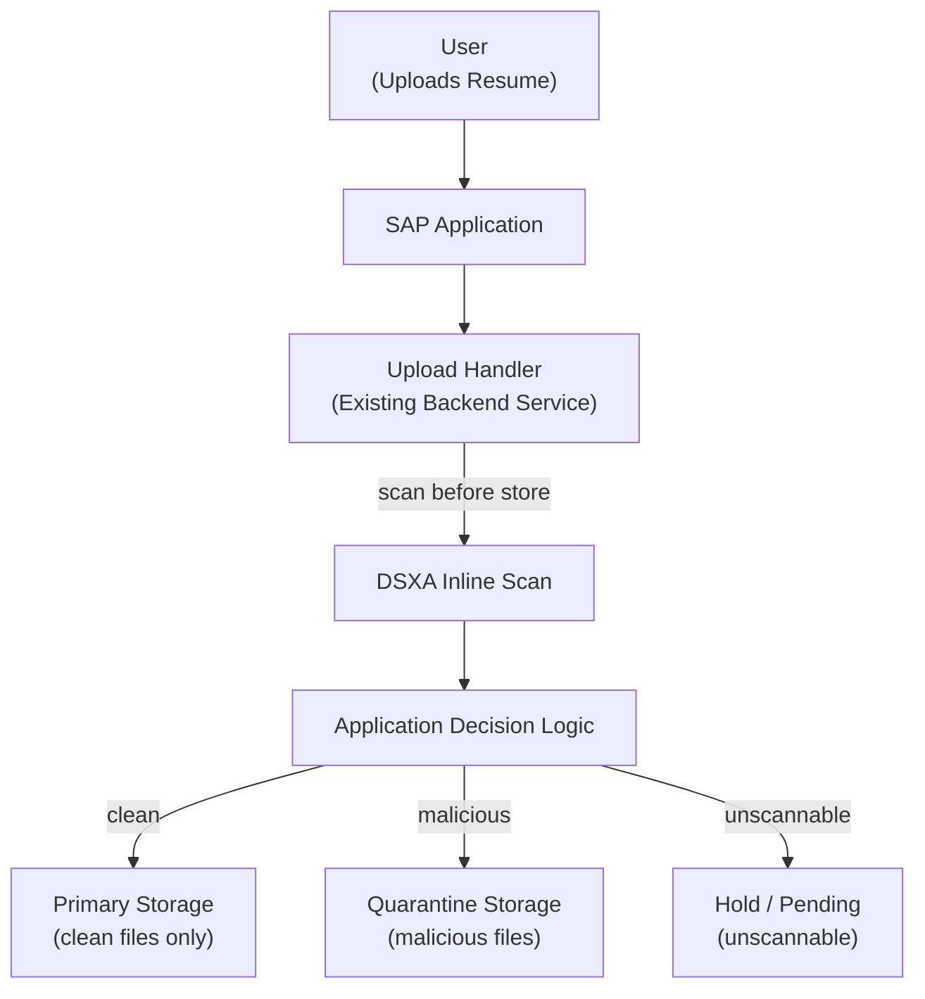
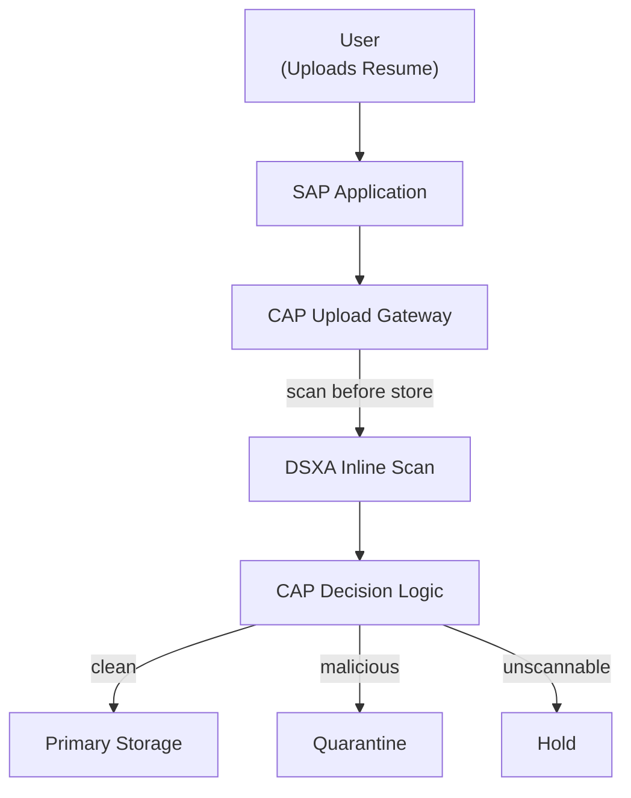
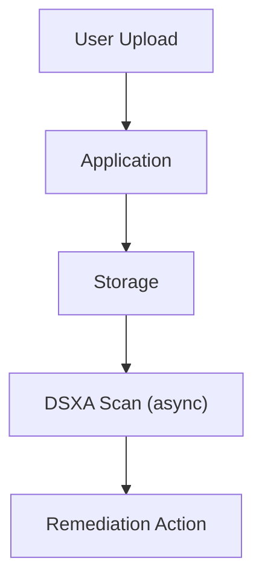

# DSX for Applications for SAP BTP

## Inline Upload Scanning with CAP

This document defines an inline scanning pattern for **SAP Business Technology Platform (BTP)** using a **CAP-based upload service** that calls **DSX for Applications (DSXA)** directly before storing uploaded files. The goal is to enforce **scan-before-store** for user-uploaded content such as resumes.

## Goals

* Enforce scan-before-store for uploaded files
* Keep storage and workflow ownership inside BTP
* Use CAP as the upload-handling service layer
* Call DSXA inline for malware scanning
* Support clean, malicious, and unscannable outcomes

## Core principle

> **BTP always owns file storage and workflow. DSXA provides the scan verdict.**

```text
User -> SAP Application -> CAP Upload Handler -> DSXA -> CAP decides -> BTP stores
```

## High-level flow



## Detailed implementation flow



## Implementation Patterns

There are three practical ways to integrate DSXA into a BTP application.

---

### Option 1 — Inline Scan in Existing Application (Preferred)

#### Description

Existing customer managed SAP application handles uploads and calls DSXA **directly before storing the file**.

This is the **cleanest and most direct implementation**.

---

#### Flow



---

#### Responsibilities

**Application**

* receives upload
* calls DSXA
* interprets result
* executes storage decision

**DSXA**

* scans file
* returns verdict

---

#### When to use

* application backend is accessible
* upload handler can be modified
* goal is fastest and simplest implementation

---

### Option 2 — CAP Sidecar / Upload Gateway

#### Description

A **CAP-based service** is introduced as an **upload proxy** that performs scanning before passing the file to the application or storage layer.

---

#### Flow



---

#### Responsibilities

**CAP Gateway**

* receives or proxies upload
* calls DSXA
* applies decision logic
* forwards or stores file

---

#### When to use

* existing app cannot be modified easily
* need a reusable scanning layer
* want separation of concerns

---

### Option 3 — Post-Upload Scanning (Fallback)

#### Description

The file is stored first, then scanned afterward.

---

#### Flow



---

#### ⚠️ Important

> This is **not scan-before-store**

---

#### When to use

* no ability to intercept uploads
* legacy constraints
* temporary fallback

---

## Decision Model

All patterns use the same outcome model:

| Verdict     | Action               |
| ----------- | -------------------- |
| Clean       | Store file           |
| Malicious   | Quarantine or reject |
| Unscannable | Hold for review      |

---

## Role of CAP

CAP is **one possible implementation mechanism**, not a requirement.

CAP can:

* act as upload handler (Option 1)
* act as sidecar/gateway (Option 2)

But the architecture does **not depend on CAP**.

---

## Future Implementation — DSX-Connect

As the system evolves, DSX-Connect can be introduced as a **centralized control plane**.

---

### Why introduce DSX-Connect

In Options 1 and 2, decision logic lives in application or CAP code:

* quarantine vs reject behavior
* hold logic
* file-type rules
* audit normalization

Over time, this becomes harder to maintain.

---

### Future flow

```text
User → Application → DSX-Connect → DSXA → DSX-Connect decision → Application executes
```

---

### What changes

**Instead of:**

* CAP/application interprets DSXA result

**You get:**

* DSX-Connect applies policy
* returns normalized action

---

### Benefits

* centralized policy
* less application code
* consistent decisions across systems
* reusable across platforms
* improved audit visibility

---

