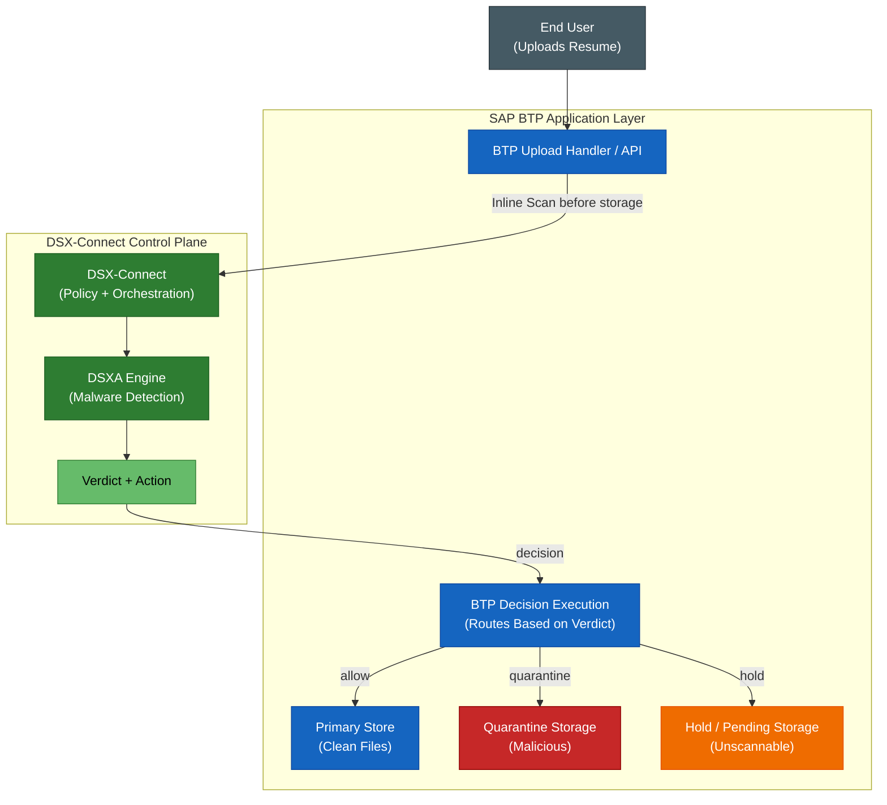

# DSX for Applications for SAP BTP — Inline Upload Scanning (VSI 2.0 Model)

This document defines a cloud-native scanning integration pattern for SAP Business Technology Platform (BTP) using DSX for Applications (DSXA, formally DPA) and DSX-Connect as a centralized scanning and policy control plane.

## Goals

* Enforce scan-before-store for uploaded files (e.g., resume documents)
* Centralize malware detection + policy decisions
* Support remediation on files (delete, quarantine, detection events)
* Align with native BTP architecture
* Enable future cross-platform reuse (BTP, S3, GCS, SharePoint, etc.)


## Overview

The user uploads a file to the application layer. The application sends the file for inline scanning before it is committed to primary storage. DSX-Connect applies orchestration and policy, DSXA performs malware detection, and the resulting verdict determines whether the file is allowed, quarantined, or held.

DSX-Connect should not appear to store the file. BTP always owns storage. DSX only returns a decision.

> **BTP always owns file storage and workflow. DSX provides a verdict decision.**

```text
Upload -> BTP -> DSX (scan + decision) -> BTP decides -> BTP stores
```

## Diagram




### What DSX-A/DSX-Connect does

* Receives file (stream or temp)
* Scans it (DSXA)
* Returns:
  * verdict
  * recommended action (??) 

### BTP (always owns these)

* File persistence
* Quarantine location
* Hold/pending storage
* User feedback
* File Workflow

## Important architectural principle

> **DSX is a decision service, not a data plane for file storage**

This is a major architectural point:

* No data residency concerns
* No storage duplication
* Fits SAP architecture cleanly
* Easier to adopt (no replatforming)

## Integration choices

The practical question is not whether BTP can integrate with scanning. It can.

The real question is which integration pattern should be used first.

There are two legitimate goals:

1. Make the project work.
2. Turn it into a reusable platform solution.

Those two goals do not always imply the same first implementation.

## What runs in BTP

In all options, there is still a BTP-side application or service that handles uploads.

That BTP service could be:

- a Node.js service
- a Java service
- a CAP service

`CAP` means SAP Cloud Application Programming Model, which is SAP’s application/service framework for building BTP applications.

So the decision is usually not Node.js versus CAP.

The decision is:

- direct scanning integration
- versus scanning through a centralized control plane

## Option 1: BTP application calls DSXA directly

The BTP upload-handling service calls DSXA directly using the JavaScript SDK or REST.

### Flow

```text
User -> BTP upload service -> DSXA -> BTP executes outcome
```

### What this optimizes for

- simplest implementation
- lowest operational weight
- fastest path to a working project
- lower latency
- fewer moving parts

### Tradeoffs

- policy logic may end up embedded in the BTP application
- auditing and decision normalization may differ from other integrations
- less reuse if additional platforms are added later
- weaker long-term control-plane story

## Option 2: BTP application calls DSX-Connect, which calls DSXA

The BTP upload-handling service calls DSX-Connect inline. DSX-Connect orchestrates scanning through DSXA and returns a normalized verdict and action recommendation.

### Flow

```text
User -> BTP upload service -> DSX-Connect -> DSXA -> DSX-Connect decision -> BTP executes outcome
```

### What this optimizes for

- centralized policy
- centralized audit/logging
- normalized verdicts and actions
- reuse across multiple platforms and file sources
- stronger long-term product/platform architecture

### Tradeoffs

- more moving parts
- more operational complexity
- extra network hop
- may be heavier than necessary for a single narrow upload use case

## Recommended interpretation

If the immediate goal is:

- one BTP application
- one upload workflow
- one project that needs to work quickly

then the simplest engineering answer may be:

> Start with direct BTP-to-DSXA integration.

If the strategic goal is:

- reusable policy
- common auditing
- multiple ingestion points
- a cross-platform file-security control plane

then the stronger architecture is:

> Move toward BTP-to-DSX-Connect-to-DSXA.

## Suggested phased approach

### Phase 1: Make the project work

Build the BTP upload service so it can:

- receive file uploads
- call the scanner path inline
- apply allow/quarantine/hold outcomes
- preserve BTP ownership of storage and workflow

For this phase, direct DSXA integration may be the best fit if speed and simplicity matter most.

### Phase 2: Make it a platform solution

Introduce DSX-Connect when the need expands to:

- shared policy across applications
- shared audit and operational visibility
- cross-platform reuse beyond BTP
- consistent decisioning across storage systems and business workflows

This is the point where DSX-Connect becomes valuable as a platform component rather than just another hop.

## Practical takeaway

Direct-to-DSXA is a project integration.

DSX-Connect in the path is a platform architecture.

Both are valid.

The right answer depends on whether the first milestone is:

- solving one upload workflow quickly
- or establishing a reusable file-security control plane
