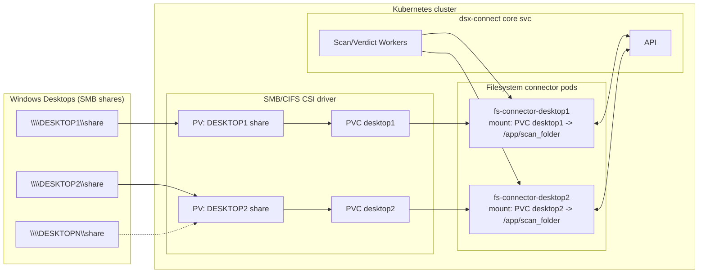

# Case Study: Scanning Windows Fileshares (No Agent on Desktops)

A customer inherits dozens of Windows desktops and wants to scan each filesystem without installing anything on the desktops. They run Docker/Compose today and can also use Kubernetes later. This guide shows how to mount Windows SMB shares on a Linux host and point one filesystem connector at each mount.

## Recommended Pattern (host-managed mounts for Docker/Compose)

Use this pattern for Docker/Compose: mount the SMB share on the host and bind it into each filesystem connector. For Kubernetes, prefer an SMB/CIFS CSI driver with a StorageClass/PV/PVC to present the share to the pod (see “Kubernetes Angle” below).

- On each Windows desktop, create a share (e.g., `\\DESKTOP1\share`, `\\DESKTOP2\share`).
- On a Linux host that can reach those shares, mount them under distinct paths (for example, `/mnt/DESKTOP1/share`, `/mnt/DESKTOP2/share`, …). Use systemd or fstab to keep mounts healthy across reboots.
- Deploy one filesystem connector per mount. Bind-mount the host path into the container and enable polling to handle SMB’s lack of inotify:


Example (adjust to your OS/paths):

- On Windows (create/share a folder):
  ```powershell
  # Create a local folder
  mkdir C:\ScanShare
  # Share it read/write for a service account (tweak permissions to your policy)
  net share ScanShare=C:\ScanShare /GRANT:DOMAIN\dsxsvc,FULL
  ```

- On Linux (mount the SMB share):
  ```bash
  sudo mkdir -p /mnt/DESKTOP1/share
  sudo mount -t cifs //DESKTOP1/ScanShare /mnt/DESKTOP1/share \
    -o username=dsxsvc,password='yourpass',domain=DOMAIN,vers=3.0,uid=1000,gid=1000,file_mode=0664,dir_mode=0775
  ```
  Note: options vary by distro and SMB server policy; adjust `vers`, `domain`, and `uid/gid` as needed.

### Docker compose deployment with file quarantine
When deploying with Docker compose, use a configuration like this:

```dotenv
# .filesystem.env
DSXCONNECTOR_ASSET=/mnt/DESKTOP1/share
DSXCONNECTOR_ITEM_ACTION_MOVE_METAINFO=/mnt/DESKTOP1/share/dsxconnect-quarantine
DSXCONNECTOR_ITEM_ACTION=move   # options: nothing, delete, tag, move, move_tag
# Monitor the asset path and force polling for SMB/CIFS
DSXCONNECTOR_MONITOR=true
DSXCONNECTOR_MONITOR_FORCE_POLLING=true
DSXCONNECTOR_MONITOR_POLL_INTERVAL_MS=1000
# Pin the image (optional)
#FILESYSTEM_IMAGE=dsxconnect/filesystem-connector:0.5.36
```

Then deploy with the latest filesystem connector compose file from the bundle (adjust the path to your versions):

```bash
docker compose \
  --env-file .filesystem.env \
  -f docker_bundle/dsx-connect-<version>/filesystem-connector-<version>/docker-compose-filesystem-connector.yaml \
  up -d
```

Note: polling is required for SMB/CIFS shares because inotify events are not emitted from the remote filesystem.

### Strategies for scanning multiple shares
1. Scan one share with one deployed connector. When complete, bring down the connector, change the configuration to point to a new mount (e.g., `/mnt/DESKTOP2/share`), deploy connector, and scan. This is the lowest operational overhead but is sequential.
2. Run one connector per share (as in the diagram above). Each service needs its own DNS name on the Docker network, its own host port, and its own scan/quarantine paths, so copy the filesystem connector service block and edit names/ports/paths per share. You can also segment by filter: one connector per share *and* `DSXCONNECTOR_FILTER` to target subtrees/file types if you need separate policies per share subset. This requires editing the compose file.  

Operational pattern (baseline + new files):
- Run a full scan on the existing contents of the share.
- Keep monitoring enabled; new files dropped into the share are detected and scanned.
- Repeat as needed (e.g., bulk copy, full scan again, then continue monitoring for deltas).

Example with two connectors on one host:

```yaml
services:
  filesystem_connector_desktop1:
    image: ${FILESYSTEM_IMAGE:-dsxconnect/filesystem-connector:latest}
    ports: [ "8620:8620" ]
    volumes:
      - type: bind
        source: ${DESKTOP1_ASSET:-/mnt/DESKTOP1/share}
        target: /app/scan_folder
      - type: bind
        source: ${DESKTOP1_QUARANTINE:-/var/lib/dsxconnect/quarantine-DESKTOP1}
        target: /app/quarantine
    environment:
      DSXCONNECTOR_CONNECTOR_URL: "http://filesystem-connector-desktop1:8620"
      DSXCONNECTOR_DSX_CONNECT_URL: "http://dsx-connect-api:8586"
      # Keep these source-centric (host semantics), not container target paths.
      DSXCONNECTOR_ASSET: ${DESKTOP1_ASSET:-/mnt/DESKTOP1/share}
      DSXCONNECTOR_ITEM_ACTION_MOVE_METAINFO: ${DESKTOP1_QUARANTINE:-/var/lib/dsxconnect/quarantine-DESKTOP1}
      DSXCONNECTOR_MONITOR: "true"
      DSXCONNECTOR_MONITOR_FORCE_POLLING: "true"
      DSXCONNECTOR_MONITOR_POLL_INTERVAL_MS: "1000"
    networks:
      dsx-network:
        aliases: [ filesystem-connector-desktop1 ]

  filesystem_connector_desktop2:
    image: ${FILESYSTEM_IMAGE:-dsxconnect/filesystem-connector:latest}
    ports: [ "8621:8620" ]
    volumes:
      - type: bind
        source: ${DESKTOP2_ASSET:-/mnt/DESKTOP2/share}
        target: /app/scan_folder
      - type: bind
        source: ${DESKTOP2_QUARANTINE:-/var/lib/dsxconnect/quarantine-DESKTOP2}
        target: /app/quarantine
    environment:
      DSXCONNECTOR_CONNECTOR_URL: "http://filesystem-connector-desktop2:8620"
      DSXCONNECTOR_DSX_CONNECT_URL: "http://dsx-connect-api:8586"
      DSXCONNECTOR_ASSET: ${DESKTOP2_ASSET:-/mnt/DESKTOP2/share}
      DSXCONNECTOR_ITEM_ACTION_MOVE_METAINFO: ${DESKTOP2_QUARANTINE:-/var/lib/dsxconnect/quarantine-DESKTOP2}
      DSXCONNECTOR_MONITOR: "true"
      DSXCONNECTOR_MONITOR_FORCE_POLLING: "true"
      DSXCONNECTOR_MONITOR_POLL_INTERVAL_MS: "1000"
    networks:
      dsx-network:
        aliases: [ filesystem-connector-desktop2 ]
```

Notes:

- The service name is the DNS name on the Docker network; keep `DSXCONNECTOR_CONNECTOR_URL` aligned with the service/alias.
- Host ports (`8620`, `8621`, …) must be unique per connector.
- Source-first rule: set `DSXCONNECTOR_ASSET`/`DSXCONNECTOR_ITEM_ACTION_MOVE_METAINFO` to source and quarantine paths.
- Treat `/app/scan_folder` and `/app/quarantine` as internal mount targets only; do not use them as the connector asset values.
- Managing many connectors this way can get cumbersome; Kubernetes scales this pattern with per-release values instead of many compose edits.


### Why host-managed mounts?

Yes, Compose can mount CIFS via the local driver, but it is best for low-volume or non-critical shares. You still need polling, and reconnect/permission edge cases are more common. For most production scenarios, prefer host-managed mounts plus bind mounts into the connector.

- SMB/CIFS does not propagate inotify; polling is required either way.
- Host mounts reconnect more reliably after network hiccups; Docker-managed CIFS often fails silently.
- Permissions and UID/GID mappings are easier to control on the host than inside the container namespace.
- Startup is less brittle: the container is not blocked by a slow SMB mount; the host handles retries.

## Kubernetes Angle



- Deploying multiple filesystem connectors with different assets is simpler: deploy another Helm release (or use a template) per share and set `DSXCONNECTOR_ASSET` to the mounted path.
- Prefer an SMB/CIFS CSI driver with StorageClass + PV + PVC to present shares to pods. If CSI is unavailable, a node-level mount (e.g., DaemonSet) is a fallback.
- The same polling guidance applies for SMB: enable polling when inotify is unavailable.

## Steps to Roll Out

1. Create Windows shares on each desktop.
2. Mount them on the Linux host under dedicated paths (`/mnt/<HOST>/share`).
3. For Docker Compose: create one connector service per mount with polling enabled and bind mounts for scan/quarantine paths.
4. For Kubernetes: deploy multiple filesystem connectors, each pointing to its own mounted path; use CSI or node mounts for SMB.
5. Verify change detection with a test file drop per share; confirm quarantine writes succeed.

This pattern keeps desktops agentless while giving DSX-Connect full coverage of each filesystem. Host-managed mounts plus polling deliver the most reliable behavior for SMB shares.
