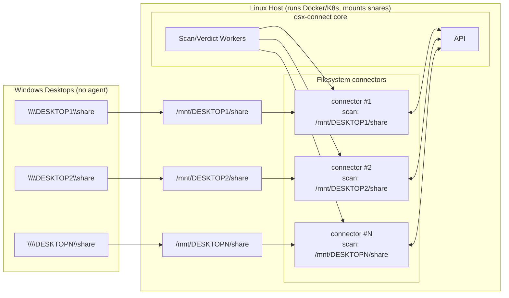

# Case Study: Scanning Windows Fileshares (No Agent on Desktops)

A customer inherits dozens of Windows desktops and wants to scan each filesystem without installing anything on the desktops. They run Docker/Compose today and can also use Kubernetes later. This guide shows how to mount Windows SMB shares on a Linux host and point one filesystem connector at each mount.

## Recommended Pattern (host-managed mounts)

- On each Windows desktop, create a share (e.g., `\\DESKTOP1\share`, `\\DESKTOP2\share`).
- On a Linux host that can reach those shares, mount them under distinct paths (for example, `/mnt/DESKTOP1/share`, `/mnt/DESKTOP2/share`, …). Use systemd or fstab to keep mounts healthy across reboots.
- Deploy one filesystem connector per mount. Bind-mount the host path into the container and enable polling to handle SMB’s lack of inotify:



Example (adjust to your OS/paths):

- On Windows (create/share a folder):
  ```powershell
  # Create a local folder
  mkdir C:\ScanShare
  # Share it read/write for a service account (tweak permissions to your policy)
  net share ScanShare=C:\ScanShare /GRANT:DOMAIN\dsxsvc,FULL
  ```

- On Linux (mount the SMB share):
  ```bash
  sudo mkdir -p /mnt/DESKTOP1/share
  sudo mount -t cifs //DESKTOP1/ScanShare /mnt/DESKTOP1/share \
    -o username=dsxsvc,password='yourpass',domain=DOMAIN,vers=3.0,uid=1000,gid=1000,file_mode=0664,dir_mode=0775
  ```
  Note: options vary by distro and SMB server policy; adjust `vers`, `domain`, and `uid/gid` as needed.

### Docker compose deployment with file quarantine
When deploying with Docker compose, use a configuration like this:

```dotenv
# .filesystem.env
DSXCONNECTOR_ASSET=/mnt/DESKTOP1/share
DSXCONNECTOR_ITEM_ACTION_MOVE_METAINFO=/mnt/DESKTOP1/share/dsxconnect-quarantine
DSXCONNECTOR_ITEM_ACTION=move   # options: nothing, delete, tag, move, move_tag
# Monitor the asset path and force polling for SMB/CIFS
DSXCONNECTOR_MONITOR=true
DSXCONNECTOR_MONITOR_FORCE_POLLING=true
DSXCONNECTOR_MONITOR_POLL_INTERVAL_MS=1000
# Pin the image (optional)
#FILESYSTEM_IMAGE=dsxconnect/filesystem-connector:0.5.36
```

Then deploy with the latest filesystem connector compose file from the bundle (adjust the path if your bundle version differs):

```bash
docker compose \
  --env-file .filesystem.env \
  -f docker_bundle/dsx-connect-0.3.59/filesystem-connector-0.5.36/docker-compose-filesystem-connector.yaml \
  up -d
```

Note: polling is required for SMB/CIFS shares because inotify events are not emitted from the remote filesystem.

Repeat with separate services (and ports) per share. Host-managed mounts keep permissions predictable and reconnect more reliably than Docker-managed SMB volumes.

### Why host-managed mounts?

- SMB/CIFS does not propagate inotify; polling is required either way.
- Host mounts reconnect more reliably after network hiccups; Docker-managed CIFS often fails silently.
- Permissions and UID/GID mappings are easier to control on the host than inside the container namespace.
- Startup is less brittle: the container is not blocked by a slow SMB mount; the host handles retries.

## Can Docker mount CIFS directly?

Yes, Compose can mount CIFS via the local driver, but it is best for low-volume or non-critical shares. You still need polling, and reconnect/permission edge cases are more common. For most production scenarios, prefer host-managed mounts plus bind mounts into the connector.

## Kubernetes Angle

- Deploying multiple filesystem connectors with different assets is simpler: deploy another Helm release (or use a template) per share and set `DSXCONNECTOR_ASSET` to the mounted path.
- Kubernetes can manage persistent volumes and mounts more robustly than Docker’s local driver. Use an SMB/CIFS CSI driver or node-level mounts, then mount into the pod.
- The same polling guidance applies for SMB: enable polling when inotify is unavailable.

## Steps to Roll Out

1. Create Windows shares on each desktop.
2. Mount them on the Linux host under dedicated paths (`/mnt/<HOST>/share`).
3. For Docker Compose: create one connector service per mount with polling enabled and bind mounts for scan/quarantine paths.
4. For Kubernetes: deploy multiple filesystem connectors, each pointing to its own mounted path; use CSI or node mounts for SMB.
5. Verify change detection with a test file drop per share; confirm quarantine writes succeed.

This pattern keeps desktops agentless while giving DSX-Connect full coverage of each filesystem. Host-managed mounts plus polling deliver the most reliable behavior for SMB shares.
