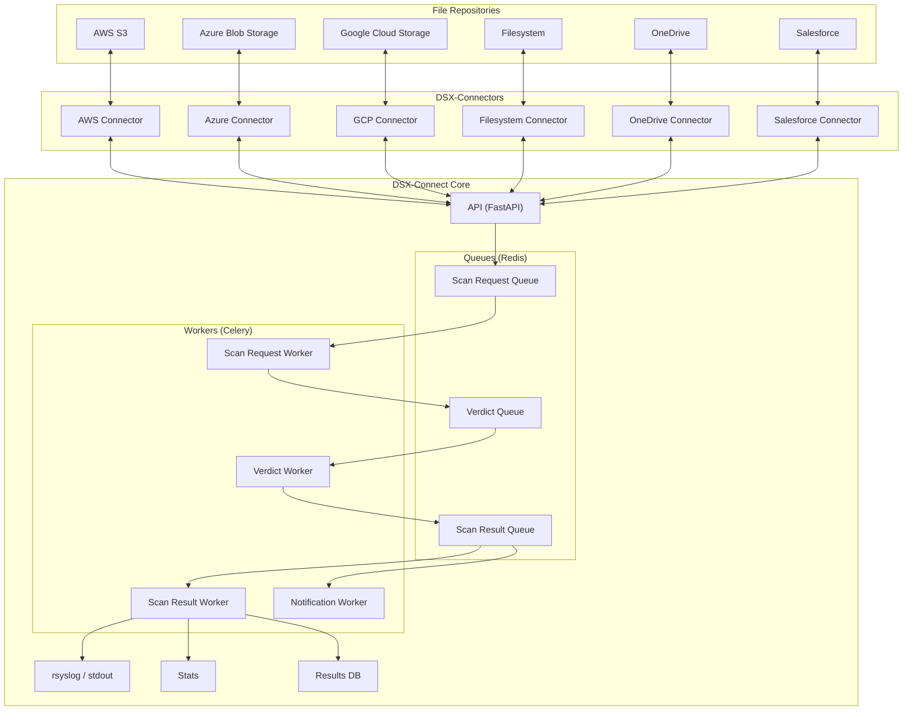

# DSX-Connect Architecture

DSX-Connect is a modular integration framework that orchestrates safe, scalable file scanning and remediation while remaining agnostic to specific repository integrations.

The core “scan brain” handles queuing, parallelism, and remediation.
DSX-Connectors adapt repositories (Filesystem, S3, GCS, SharePoint/OneDrive, Salesforce, etc.) to a consistent API.

DSX-Connect extends **Deep Instinct's**
[DSX for Applications](https://www.deepinstinct.com/dsx/dsx-applications)
to any repository or service.

## Architectural Overview

DSX-Connect is designed as a distributed, event-driven system composed of:

* Connectors (data access layer)
* Scan orchestration workers
* DSXA scanning engine
* Verdict and result processing workers
* Redis-backed queues and state
* Optional streaming and logging integrations

At a conceptual level:

*Figure 1: High-level conceptual architecture diagram*

---

## Core Scan Flow

The following diagram shows the full scan lifecycle from job submission to result persistence and notification.

*Figure 2: End-to-end scan flow (not a complete list of supported repositories)*

---

## Component Responsibilities

### Repositories

The external data sources being scanned.

### DSX-Connectors

Stateless integration adapters that:

* Enumerate files
* Read file content
* Execute item actions (delete, quarantine, etc.)
* Expose a consistent connector API

Connectors isolate repository semantics from scanning logic.

### DSX-Connect Core

The orchestration layer responsible for:

* Job creation and tracking
* Queue management (Redis)
* Worker coordination (Celery)
* DSXA invocation
* Verdict handling
* Result persistence
* Event streaming (SSE)

### Workers

Separate worker pools allow independent scaling:

* **Scan Request Worker:** Fetches file content and invokes DSXA.
* **Verdict Worker:** Applies remediation and produces results.
* **Scan Result Worker:** Persists and logs results.
* **Notification Worker:** Streams updates to subscribers.

### Redis Roles

Redis serves three purposes:

* Message broker for Celery queues
* Fast state store for job progress
* Result/statistics persistence layer

---

## Architectural Characteristics

* Event-driven and queue-based
* Horizontally scalable worker pools
* Stateless connectors
* Repository-agnostic orchestration
* Retry and DLQ support
* Observable and measurable
* Designed for multi-repository, multi-terabyte environments

---

## Deployment Models

DSX-Connect can be deployed using:

* Docker Compose
* Kubernetes (Helm)

Both models run the same services and container images.
They differ in operational capabilities and scalability.

Docker Compose is suited for development, evaluation, and single-host environments.

Kubernetes enables:

* Horizontal scaling (replicas)
* Autoscaling (HPA)
* Connector sharding via `DSXCONNECTOR_ASSET`
* Resource governance
* High availability
* Production-grade authentication and TLS management

See:

[Choosing Your Deployment: Docker Compose vs Kubernetes](deployment-models.md)

---

## Container Images

Images for DSX-Connect core and connectors are published at:

[https://hub.docker.com/repositories/dsxconnect](https://hub.docker.com/repositories/dsxconnect)

Examples:

* Core: `dsxconnect/dsx-connect`
* Connectors: `dsxconnect/filesystem-connector`, `dsxconnect/aws-s3-connector`, etc.

Images can be mirrored into internal registries as required.
