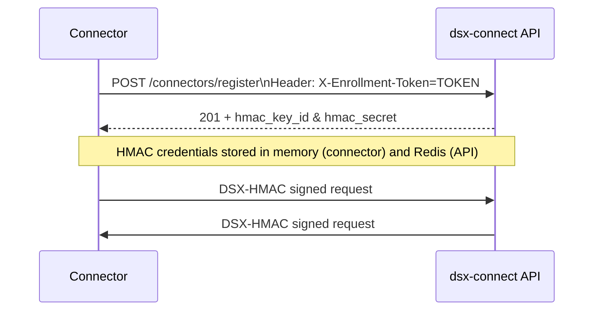

# Authentication

Authentication ensures that only trusted connectors can communicate with DSX-Connect, and that connectors only accept commands from a legitimate DSX-Connect instance.

When authentication is enabled:

- Connectors must successfully enroll before interacting with DSX-Connect.
- Every connector ↔ DSX-Connect request must be cryptographically signed.
- Unsigned or tampered requests are rejected.

Authentication is optional for local development, but strongly recommended for shared or production environments.

---

## Why Authentication Exists

Without authentication:

- Any service with network access to a connector could invoke endpoints such as:
  - `item_action`
  - `read_file`
  - `full_scan`
- Any process could attempt to impersonate a connector and submit results.

Authentication guarantees:

- Each connector has a verified identity.
- All API calls are tied to a registered connector.
- Only DSX-Connect can instruct connectors to perform high-impact operations.

---

## The Authentication Model

DSX-Connect uses a two-phase model:

### 1) Enrollment (Bootstrap)

A connector must first present a valid **enrollment token**.

If the token is valid:

- DSX-Connect registers the connector.
- DSX-Connect generates unique credentials for that connector.

This establishes identity.

### 2) DSX-HMAC (Ongoing Trust)

After enrollment:

- DSX-Connect issues a unique `hmac_key_id` and `hmac_secret`.
- The credentials are:
  - Stored in Redis on the server
  - Stored in memory only within the connector
  - Never written to disk

All subsequent requests must include:

```

Authorization: DSX-HMAC ...

```

Both sides validate the request signature before processing it.

---

## Authentication Flow



Once enrollment completes:

* Unsigned requests are rejected.
* Requests signed with invalid credentials are rejected.
* Replay or tampered requests fail signature validation.

---

## What Is Protected

Authentication is enforced at the API boundary.

It protects:

* Connector registration
* Scan request submission
* Result submission
* File read operations
* Item actions (move, delete, tag)
* Administrative connector endpoints

Workers inside DSX-Connect trust the authenticated API layer.

DSXA itself is independent of DSX-Connect authentication.

---

## When to Enable Authentication

Authentication should be enabled in:

* Shared environments
* Cluster deployments
* Production systems
* Any environment where connectors are network-accessible

Authentication may be disabled in:

* Local quickstarts
* Isolated development environments

---

## Relationship to TLS

Authentication verifies identity and message integrity.

TLS encrypts transport.

For production environments, both should be enabled:

* TLS protects data in transit.
* DSX-HMAC ensures only trusted services can issue commands.
