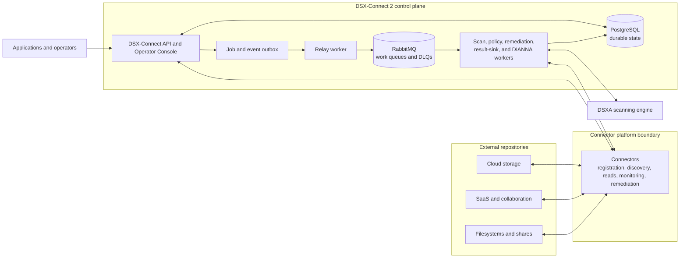
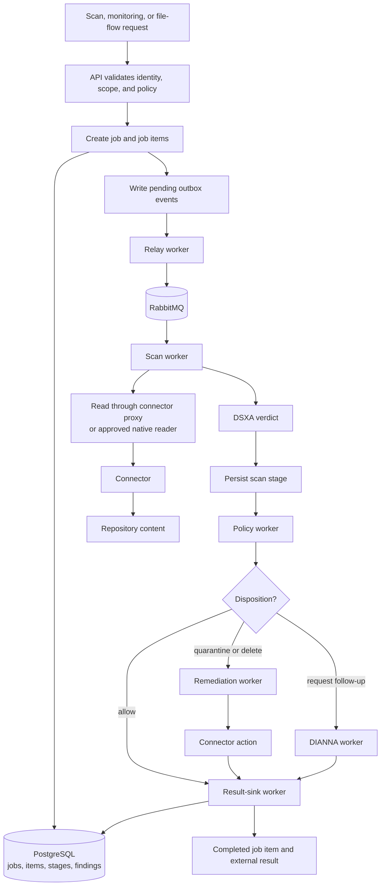

# DSX-Connect 2 Architecture

DSX-Connect 2 is a durable control plane for protecting files across repositories. It separates repository access, job state, asynchronous work, scanning, policy, remediation, and result delivery so that a connector or worker can restart without losing accepted work.

The high-level artwork remains useful as a conceptual view of the platform:

## Architectural overview

The v2 platform is composed of:

- **Applications and operators**, which submit scan or file-flow requests and inspect state through the API and Operator Console.
- **The control plane API**, which owns integrations, protected assets, jobs, policies, findings, dispositions, and audit context.
- **Connectors**, which provide repository-specific discovery, reads, monitoring, and remediation capabilities.
- **PostgreSQL**, which stores durable control-plane and job state.
- **The outbox relay**, which publishes accepted work from durable state to the runtime message bus.
- **RabbitMQ**, which dispatches asynchronous work between workers and provides retry and dead-letter boundaries.
- **Workers**, which execute relay, scan, policy, remediation, result-sink, and optional DIANNA stages.
- **DSXA**, which provides the malware scanning engine used by the scan stage.

At deployment time, these components can run in one Helm release for a lab or be distributed across separately managed services and worker pools for production.

*Figure 1: DSX-Connect 2 deployment and runtime boundaries*

## Core scan flow

The control plane accepts a request and records it before work is dispatched. The relay then turns durable outbox records into RabbitMQ messages. Workers advance the job item through explicit stages and persist each stage transition in PostgreSQL.

*Figure 2: Durable v2 scan and disposition flow*

## Component responsibilities

### Control plane API

The API is the entry point for applications, connectors, and operators. It is responsible for:

- registering and tracking connector integrations;
- managing tenants, applications, protected assets, and scopes;
- accepting jobs and creating job items;
- resolving protection profiles and policy context;
- exposing job, finding, health, and operational state;
- serving the Operator Console.

The API records accepted work in PostgreSQL before it is handed to asynchronous workers. It does not need to perform the complete scan synchronously in the request process.

### Connectors

Connectors own repository-specific access. Depending on their advertised capabilities, they can:

- discover repositories, assets, and changes;
- monitor repository events;
- enumerate files for a protected scope;
- stream file content to a scan worker through a proxy endpoint;
- read content directly when the native reader strategy is explicitly enabled;
- execute remediation or delivery actions.

Connectors do not own the global job lifecycle or policy decision. They provide access and capabilities to the control plane.

### Scan workers

Scan workers consume scan messages from RabbitMQ, obtain file content through the configured reader strategy, invoke DSXA, and persist the scan-stage result. A scan worker carries the attribution and protected-scope context for the item it processes.

The default `proxy` reader strategy keeps repository credentials in the connector and keeps generic scan workers independent of cloud-specific credentials. The `native` strategy is an explicit deployment choice for environments where scan workers are allowed to read directly from the repository.

### Policy workers

Policy workers evaluate the scan result and the assigned protection profile. They determine whether the item is allowed, blocked, quarantined, deleted, remediated, sent for DIANNA follow-up, or delivered to a result sink. The decision and its context are persisted as a distinct policy stage.

### Remediation workers

Remediation workers execute policy-directed actions through connector capabilities. This keeps repository-specific operations such as quarantine, delete, or metadata updates outside the generic scan worker.

### Result-sink workers

Result-sink workers publish or persist scan, remediation, DIANNA, and workflow results. A result sink can be the built-in sink or an external integration. Result delivery is an explicit stage so that reporting and downstream delivery do not block the core scan request.

### DIANNA workers

DIANNA workers handle optional follow-up analysis requested by policy or workflow. Their stage state is tracked independently so an item can express whether DIANNA is required, pending, completed, or failed before final delivery.

## PostgreSQL: durable source of truth

PostgreSQL stores the state that must survive process and pod restarts, including:

- connector integrations and leases;
- tenants, applications, assets, protected scopes, and policies;
- jobs and job items;
- scan, policy, remediation, delivery, and DIANNA stage state;
- findings, verdicts, dispositions, and attribution context;
- pending outbox records used by the relay.

PostgreSQL is not only a reporting database. It is part of the execution model. The worker pipeline uses it to recover accepted work, determine which stage is pending, and prevent a transient process failure from turning into lost work.

For a production deployment, use an externally managed PostgreSQL service or a persistent PostgreSQL deployment. The embedded chart database with `emptyDir` storage is suitable for quick validation only because deleting the pod removes its state.

## RabbitMQ: asynchronous work dispatch

RabbitMQ is the runtime message bus between the relay and workers. It carries stage-specific work such as scan requests, policy evaluation, remediation, DIANNA analysis, and result-sink emission.

RabbitMQ provides:

- asynchronous handoff between API state and worker execution;
- independent worker pools and prefetch controls;
- retry and dead-letter boundaries for failed messages;
- backpressure between stages with different capacities.

RabbitMQ is not the system of record for jobs. A message can be retried or dead-lettered, but the authoritative job-item and stage state remains in PostgreSQL. When a message is permanently failed, operators should inspect the worker error and durable item state before deciding whether to replay or create replacement work.

For queue inspection and dead-letter handling, see [Dead Letter Queues](../dsx-connect-2/operations/dead-letter-queues.md).

## Worker scaling

Worker pools scale independently because the stages have different resource profiles:

| Component | Primary constraint | Scaling control |
| --- | --- | --- |
| Relay | Database polling and active-item backpressure | Relay replicas and batch/poll settings |
| Scan worker | Repository read speed and DSXA latency | Replica count, prefetch, and scan-batch concurrency |
| Policy worker | Policy evaluation and stage transitions | Replica count and prefetch |
| Remediation worker | Repository write or quarantine operations | Replica count and prefetch |
| Result-sink worker | External sink latency | Replica count and prefetch |
| DIANNA worker | Follow-up scanner capacity | Replica count and prefetch |

Increasing scan workers alone does not guarantee higher throughput. RabbitMQ capacity, PostgreSQL write latency, connector behavior, DSXA response time, and downstream policy or remediation capacity all participate in the end-to-end rate.

## Deployment profiles

### API-only smoke test

The chart can run an API-only profile with in-memory backends and workers disabled. This is useful for checking routes and console behavior, but it does not represent a scan-capable deployment.

### Full-stack lab

A lab profile runs the API, PostgreSQL, RabbitMQ, and all workers in one Helm release. Embedded PostgreSQL and RabbitMQ are convenient for validation when persistence is explicitly acceptable to lose.

### Production topology

A production deployment should use persistent or externally managed PostgreSQL and RabbitMQ, durable secrets, appropriate ingress and TLS, and independently sized worker pools. Connectors and DSXA can run inside or outside the Kubernetes cluster as long as the required control-plane, repository, and scanner network paths are available.

The v2 Kubernetes deployment page contains the corresponding Helm values and service configuration: [Deploying DSX-Connect 2 with Helm](../dsx-connect-2/deployment/kubernetes.md).

## Architectural characteristics

- Durable job and stage state
- RabbitMQ-based asynchronous orchestration
- Independently scalable worker pools
- Repository-specific access isolated in connectors
- Policy and remediation separated from scanning
- Explicit attribution carried through the workflow
- Retry and dead-letter boundaries
- Support for embedded lab dependencies and external production services
