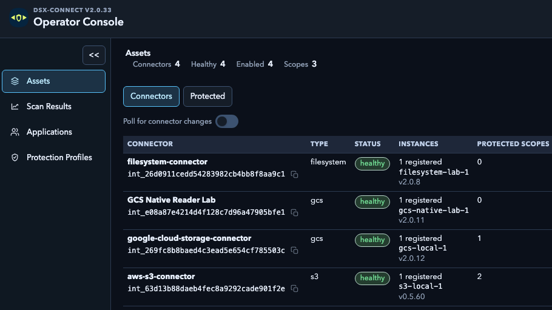
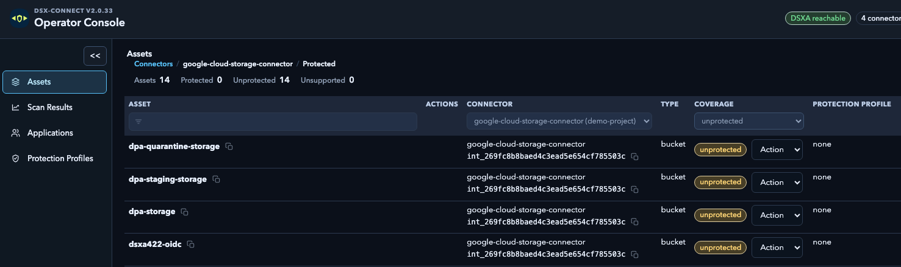
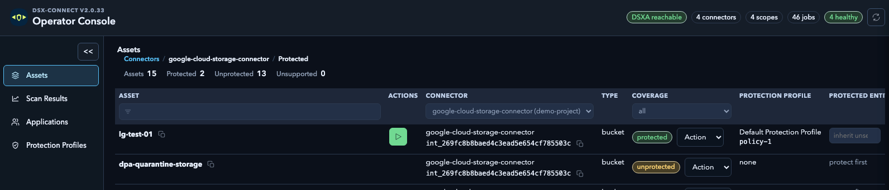

# Connector and Asset Model

In DSX-Connect 2, a connector represents access to a repository platform or other governed boundary. An asset represents a location or content set within that boundary. This distinction lets one connector expose multiple repositories, paths, buckets, shares, or other scopes without turning each one into a separate platform integration.

The Google Cloud Storage connector is a useful example because one connector can discover many buckets while operators choose exactly which buckets or prefixes should be protected.

## GCP connector example

The GCS connector has four separate responsibilities:

1. Authenticate to Google Cloud.
2. Represent a stable GCP platform boundary in DSX-Connect 2.
3. Discover buckets and report them as assets.
4. Read, monitor, and remediate only the assets that DSX-Connect 2 has placed under protection.

Those responsibilities should not be collapsed into one `bucket` setting. The credential determines what Google Cloud APIs the connector can access. The platform key identifies the connector boundary. Protected scopes determine what DSX-Connect 2 is authorized to act on.

## 1. Authenticate the connector

The connector uses Google Application Default Credentials. There are two common ways to provide them:

### Workload Identity Federation

For GKE, the recommended production model is Workload Identity Federation. The Kubernetes service account is annotated to impersonate a Google service account, and the connector receives credentials through the cluster's workload identity integration. No service-account JSON key is mounted in the pod.

For non-GKE Kubernetes environments, generic external Workload Identity Federation can provide an external account credential configuration to the pod.

### Mounted service-account JSON

For local labs or transitional deployments, the chart can mount a Secret containing a Google service-account JSON file. This is simpler to start with, but the key must be protected and rotated as an operational credential.

The authentication choice controls how the connector obtains Google credentials. It does not change the DSX-Connect 2 asset model or the discovery flow.

See [Google Cloud WIF for GCS Connector on GKE](../reference/google-cloud-wif-gke.md) and [GCS Connector Deployment](../dsx-connect-2/deployment/connectors/google-cloud-storage.md) for configuration details.

## 2. Define the platform boundary

The connector registers with DSX-Connect 2 using a platform type and a stable platform key:

```yaml
env:
  DSXCONNECTOR_NG_PLATFORM: "gcs"
  DSXCONNECTOR_NG_PLATFORM_KEY: "projects/example-gcs-project"
  DSXCONNECTOR_INSTANCE_ID: "gcs-prod-project-1"
```

These values have different meanings:

| Setting | Meaning |
| --- | --- |
| `DSXCONNECTOR_NG_PLATFORM` | The connector adapter type. For Google Cloud Storage, use `gcs`. |
| `DSXCONNECTOR_NG_PLATFORM_KEY` | A stable operator-chosen label for the platform boundary, such as a project, folder, organization, or account. It does not grant access. |
| `DSXCONNECTOR_INSTANCE_ID` | The identity of this running connector instance. Changing it creates a separate connector record. |

The platform key is useful for grouping and operating the integration. It is not automatically read from the service-account JSON and is not a substitute for IAM.

## 3. Discover bucket assets

For broad discovery, configure `DSXCONNECTOR_GCS_ASSET_INVENTORY_SCOPE` with a Cloud Asset Inventory scope:

```yaml
env:
  DSXCONNECTOR_GCS_ASSET_INVENTORY_SCOPE: "projects/example-gcs-project"
```

The scope can be a project, folder, or organization. The connector uses the Google credentials and the permissions granted at that scope to discover buckets. A connector running in one region can discover buckets in other Google Cloud locations; the Kubernetes cluster region does not limit the inventory scope.

Discovery makes buckets visible to DSX-Connect 2. It does not automatically protect every discovered bucket.

The resulting relationship is:

```text
Google credentials and IAM
    -> Cloud Asset Inventory discovery scope
        -> discovered GCS buckets and prefixes
            -> DSX-Connect 2 assets
```

`DSXCONNECTOR_ASSET` remains available as a configured single-bucket fallback for labs, repository checks, or the `configured_asset` discovery source. For normal v2 operation, protected scopes select the actual scan targets instead of putting one bucket in every connector values file.

## 4. Select protected assets

After registration and discovery, the Operator Console can show the connector and its discovered assets. Newly discovered buckets appear as **Unprotected** until an operator creates a protected scope for them.

The operator can:

1. Open the GCS connector under **Assets > Connectors**.
2. Review discovered buckets using the **All** or **Unprotected** coverage filter.
3. Select one or more buckets, or a narrower bucket prefix where supported.
4. Create or assign a protected scope.
5. Choose the protection profile and policy for that scope.
6. Confirm that the assets appear under the **Protected** coverage filter.

The protected scope is the control-plane decision that changes a discovered bucket into an active protection target. It determines where scans, monitoring events, remediation, and governed file operations are allowed to create work.

The same operation can be performed through the control-plane API. The API model associates a protected scope with an integration and an asset selection; jobs then reference the integration and scope rather than relying on a connector-wide bucket default.



*Figure 1: The `google-cloud-storage-connector` appears as the third GCS entry in the connector list. Its row currently reports one protected scope.*



*Figure 2: The connector-specific asset view shows 14 discovered buckets, with the coverage filter set to `unprotected` and no protection profile assigned yet.*



*Figure 3: `lg-test-01` is now protected and assigned the default protection profile, while the same connector inventory still shows other buckets as `unprotected`.*

## Discovery is not protection

This distinction is central to the v2 model:

| Layer | Example | What it answers |
| --- | --- | --- |
| Authentication | WIF or service-account JSON | Which Google Cloud APIs can the connector call? |
| Platform boundary | `projects/example-gcs-project` | Which connector/integration does this instance represent? |
| Discovery | Cloud Asset Inventory | Which buckets are visible to the control plane? |
| Asset | `bucket-a` or `bucket-a/incoming/` | Which repository location can be selected? |
| Protected scope | Bucket or prefix plus profile | Which locations should DSX-Connect 2 actively protect? |
| Monitoring | GCS notifications and Pub/Sub | Which changes can enter the protection workflow? |

A bucket may be discoverable but intentionally unprotected. A bucket may also be protected for scanning without monitoring enabled, depending on the desired operating mode and the connector's configured capabilities.

## Monitoring and scanning

For event-driven protection, Google Cloud bucket notifications publish object changes to Pub/Sub and the connector consumes the subscription. Google Cloud determines which buckets emit events; DSX-Connect 2 determines whether an event maps to an enabled protected scope.

In practice:

- configure notifications for buckets that should publish object events;
- configure the connector to consume the Pub/Sub subscription;
- create protected scopes for buckets or prefixes that should be acted on;
- use a full scan to establish baseline coverage;
- keep monitoring enabled to converge on subsequent creates, updates, and overwrites.

The connector may receive an event for a bucket that is not protected. That event should not create scan or remediation work until the control plane confirms that the asset belongs to an enabled protected scope.

## Why the separation matters

The connector supplies access and capabilities. DSX-Connect 2 supplies identity, asset selection, protection scope, policy, job state, and audit context. This lets one GCS connector represent a project, folder, organization, or storage estate without requiring one connector deployment per bucket.

The same model applies to other platforms:

- a filesystem connector can expose folders or mounted roots;
- a collaboration connector can expose sites, drives, or mail stores;
- an object-storage connector can expose buckets and prefixes.

For the broader architecture, see [DSX-Connect 2 Architecture](architecture.md). For the application-facing use case, see [Normalized Enterprise File Gateway](../dsx-connect-2/strategy/normalized-enterprise-file-gateway.md).
