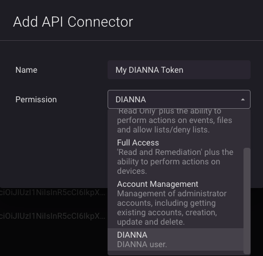

# DIANNA Worker (Kubernetes)

DIANNA (Deep Instinct Advanced Neural Network Assistant) is the generative AI component of Deep Instinct DSX.

It combines:

* The DSX Brain (deep learning malware detection)
* A specialized LLM tuned for malware analysis and explainability

Together, this provides:

* Real-time insight into zero-day threats
* Human-readable explanations of malicious behavior
* Actionable intelligence for security teams

When the DIANNA worker is enabled in DSX-Connect, scan results can be forwarded to the Deep Instinct Management Console for AI-driven analysis and enrichment.

This feature is optional and not required for core file scanning.

## When to Enable DIANNA

Enable the DIANNA worker when:

* You want explainability for malicious verdicts
* You want enriched analysis beyond binary clean/malicious results
* You are integrating DSX-Connect into a broader Deep Instinct security deployment

Leave it disabled when:

* DIANNA integration is not required

Excellent — this is exactly the right time to split DIANNA into a clean, first-class optional feature page.

Below is a fully structured `dianna.md` page that:

* Uses exactly one `#`
* No horizontal rules
* Matches the structure of Authentication and TLS
* Clearly separates Secret creation from Helm enablement
* Aligns with your current `values.yaml`
* Avoids duplicating too much config reference detail

You can drop this into `deployment/kubernetes/dianna.md`.

---

# DIANNA Worker (Kubernetes)

The DIANNA worker integrates DSX-Connect with the Deep Instinct Management Console. When enabled, it forwards relevant scan events for additional analysis and policy-driven actions.

This feature is optional and not required for core DSX-Connect operation.

## When to Enable DIANNA

Enable the DIANNA worker when:

* You want DSX-Connect scan results analyzed by Deep Instinct management
* You require centralized malicious verdict handling
* You want automated actions based on DI analysis

You can leave it disabled when:

* Running standalone DSX-Connect deployments
* Performing local development or testing
* DI integration is not required

## Requirements

To enable DIANNA:

1. Set `dsx-connect-dianna-worker.enabled=true`
2. Create a Kubernetes Secret containing:

    * Deep Instinct API token
    * Deep Instinct management console URL

---

## Step 1: Create the DIANNA API Secret

The Helm chart includes an example at:

`examples/secrets/dianna-api-secret.yaml`

Template:

```yaml
apiVersion: v1
kind: Secret
metadata:
  name: dianna-api
  namespace: dsx-connect
type: Opaque
stringData:
  apiToken: "<DIANNA-API-token>"
  managementUrl: "<your DI console>.deepinstinctweb.com"
```

### Required Fields

* `apiToken` — API token generated from the Deep Instinct Management Console (DIANNA user)
* `managementUrl` — Your Deep Instinct console hostname (without protocol)

Example:

```yaml
apiVersion: v1
kind: Secret
metadata:
  name: dianna-api
  namespace: dsx-connect
type: Opaque
stringData:
  apiToken: "REPLACE_WITH_DI_TOKEN"
  managementUrl: "your-tenant.deepinstinctweb.com"
```

Apply:

```bash
kubectl apply -f examples/secrets/dianna-api-secret.yaml
```

### Using a Different Secret Name

If you use a custom Secret name, configure:

```yaml
dsx-connect-dianna-worker:
  dianna:
    secretName: my-dianna-secret
```

If not set, the chart defaults to `dianna-api`.

---

## Step 2: Enable the DIANNA Worker in Helm

### Command-Line Override

```bash
helm upgrade --install dsx -n dsx-connect \
  oci://registry-1.docker.io/dsxconnect/dsx-connect-chart \
  --set dsx-connect-dianna-worker.enabled=true
```

### Values File (Recommended)

```yaml
dsx-connect-dianna-worker:
  enabled: true
```

Deploy:

```bash
helm upgrade --install dsx . -n dsx-connect -f my-values.yaml
```

---

## Optional DIANNA Configuration

The `dianna` section allows additional tuning.

Example:

```yaml
dsx-connect-dianna-worker:
  dianna:
    verifyTls: true
    chunkSize: 4194304
    timeout: 60
    autoOnMalicious: false
    pollResultsEnabled: true
    pollIntervalSeconds: 5
    pollTimeoutSeconds: 900
```

### Common Options

| Setting               | Description                                                  | Default   |
| --------------------- | ------------------------------------------------------------ | --------- |
| `verifyTls`           | Verify TLS certificate of DI console                         | `true`    |
| `caBundle`            | Custom CA bundle (if DI console uses internal CA)            | unset     |
| `chunkSize`           | Upload chunk size for large files                            | `4194304` |
| `timeout`             | API timeout in seconds                                       | `60`      |
| `autoOnMalicious`     | Automatically trigger configured action on malicious verdict | `false`   |
| `pollResultsEnabled`  | Poll DI for result completion                                | `true`    |
| `pollIntervalSeconds` | Poll interval                                                | `5`       |
| `pollTimeoutSeconds`  | Max poll duration                                            | `900`     |

Only override these if your deployment requires tuning.

---

## Verifying Deployment

After enabling DIANNA:

```bash
kubectl get pods -n dsx-connect
```

You should see a pod similar to:

```
dsx-dsx-connect-dianna-worker-xxxxx   1/1   Running
```

Check logs:

```bash
kubectl logs -n dsx-connect deploy/dsx-dsx-connect-dianna-worker
```

Look for successful authentication and DI connectivity messages.

---

## Troubleshooting

### DIANNA worker pod crashloops

Check:

* Secret exists in the correct namespace
* Secret name matches configuration
* `apiToken` and `managementUrl` keys are present
* Token is valid and not expired


__Figure: Adding DIANNA Token__ 

Verify Secret:

```bash
kubectl get secret -n dsx-connect dianna-api
```

### TLS verification errors

If using a private or internal CA:

* Set `verifyTls: true`
* Provide a CA bundle via `caBundle`
* Ensure certificate chain is valid

### API authentication failures

Confirm:

* DI token was generated for a DIANNA user
* Token permissions are sufficient
* Management URL is correct

---

## Related Pages

* [Deploying DSX-Connect (Helm)](dsx-connect.md)
* [Configuration Reference](configuration-reference.md)

