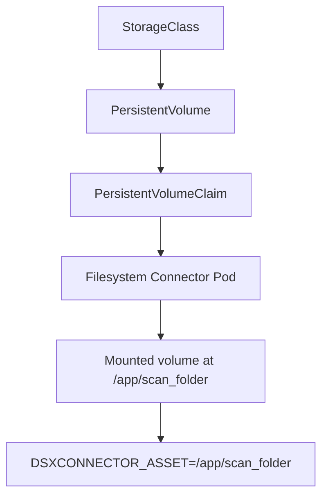

# Filesystem Connector - Kubernetes Deployment

The Filesystem connector scans files from a mounted filesystem.

In Kubernetes, the behavior of this connector is determined by the **storage backend used for the mounted volume**.

Unlike cloud connectors (S3, GCS, SharePoint, etc.), the Filesystem connector requires a **filesystem volume mounted into the container** at:

```
/app/scan_folder
```

The connector scans this internal directory.

---
## Storage Architecture

In Kubernetes, this filesystem volume is typically provided using a **PersistentVolumeClaim (PVC)** backed by a **StorageClass**.

> For a deeper dive into Kubernetes storage concepts, see: [Reference: Kubernetes Storage](../../reference/kubernetes-storage.md)

### Kubernetes-managed storage

The following diagram shows the typical Kubernetes storage architecture in use for the Filesystem connector. Ultimately, we need to mount
a volume into the connector pod, which is then used to read files from the filesystem.



#### StorageClass

Most Kubernetes clusters use **dynamic provisioning**, where a StorageClass automatically creates a PersistentVolume when a PVC is requested.

StorageClass implementations are platform-specific and depend on the environment.

Common examples include:

| Platform | Typical StorageClass |
|--------|--------|
| k3s / local clusters | NFS, Longhorn |
| AWS | EFS |
| Azure | Azure Files |
| GCP | Filestore |
| On-prem | NFS, CephFS |

Refer to your platform documentation for available StorageClasses.

#### Persistent Volume (PV) and Persistent Volume Claim (PVC)

The connector mounts storage through a **PersistentVolumeClaim**, which binds to a PersistentVolume provided by the cluster.

This allows:

* Node-independent scheduling
* Portability across cluster nodes
* Alignment with Kubernetes storage architecture

##### RWX Storage and Multi-Replica Deployments

Some Kubernetes storage backends support **ReadWriteMany (RWX)**, allowing multiple pods to mount the same filesystem volume.

However, RWX storage **does not automatically enable horizontal scaling of the Filesystem connector**.

Connector replicas do **not coordinate enumeration** of the filesystem. If multiple replicas scan the same root directory, they may enumerate the same files independently. This can result in duplicate full scans or duplicate scan requests.

For large datasets, it is recommended to **partition storage across multiple connector assets** instead of running multiple replicas against the same directory.

Example sharding pattern:
```bash
/data/shard1
/data/shard2
/data/shard3
```

Each connector instance scans a different root directory.


#### Filesystem Connector Pod Mount

The Filesystem connector does not read directly from a PersistentVolumeClaim name.

Instead, the Helm chart mounts the claim into the connector pod, and the connector reads files from the resulting in-container path.

Example Helm values:

```yaml
scanVolume:
  enabled: true
  existingClaim: dsxconnect-scan-pvc
  mountPath: /app/scan_folder

env:
  DSXCONNECTOR_ASSET: /app/scan_folder
```  
  

### Node-Local Storage (Development)

For single-node clusters (k3s, Colima, Minikube), you can also mount node-local storage using hostPath.  See Quick Deployment.

For purely node-local scanning, Docker Compose may be operationally simpler

---

## Minimal Deployment

The following steps will install the connector with minimal configuration changes.  Read the following section for specific configuration details.

### 1. Create Storage (PVC / Node-Local)

Choose the tab that matches your platform and filesystem access mode.

All examples below use the same claim name (`dsxconnect-scan-pvc`), referenced in step 2 as `scanVolume.existingClaim`.

!!! info "Static vs Dynamic provisioning"
    Kubernetes storage can be provisioned in two ways:

    **Static provisioning**  
    A `PersistentVolume` is manually created that points to an existing filesystem location  
    (for example an existing SMB share, NFS export, or disk).

    **Dynamic provisioning**  
    Kubernetes creates storage automatically using a `StorageClass`.  
    When a `PersistentVolumeClaim` is created, the storage backend dynamically provisions a new volume.

    For Filesystem connector deployments:

    * **Static provisioning** is typically used when the filesystem already exists and contains files to scan.
    * **Dynamic provisioning** is useful when Kubernetes should create and manage storage automatically.

    Some examples below include both approaches.

---

=== "k3s/Colima + NFS"

    This tab shows a complete local flow.

    **Step 1:** Ensure an NFS server/export exists and is reachable from your cluster nodes.

    **Step 2:** Create (or confirm) a `StorageClass` that points to that NFS server/share.

    Example `nfs-storageclass.yaml` (adjust `server` and `share`):

    ```yaml
    apiVersion: storage.k8s.io/v1
    kind: StorageClass
    metadata:
      name: nfs-csi
      namespace: default  
    provisioner: nfs.csi.k8s.io
    parameters:
      server: 10.0.0.25
      share: /exports/dsxconnect
    reclaimPolicy: Retain
    volumeBindingMode: Immediate
    mountOptions:
      - nfsvers=4.1
    ```
    
    - Replace `namespace` with your cluster namespace.
    - Replace `server` and `share` with your NFS server/share details.

    Apply:

    ```bash
    kubectl apply -f nfs-storageclass.yaml
    ```

    **Step 3:** Create the scan PVC.

    Example `scan-pvc.yaml`:

    ```yaml
    apiVersion: v1
    kind: PersistentVolumeClaim
    metadata:
      name: dsxconnect-scan-pvc
      namespace: default
    spec:
      accessModes:
        - ReadWriteMany
      storageClassName: nfs-csi
      resources:
        requests:
          storage: 100Gi
    ```

    Replace `namespace` with your cluster namespace.

    Apply:

    ```bash
    kubectl apply -f scan-pvc.yaml
    ```

    !!! note "Where NFS endpoint is configured"
        In this model, the NFS server/share endpoint is configured in the `StorageClass` (`parameters.server` and `parameters.share`),
        not in the PVC itself.

=== "k3s + Windows Share (SMB/CIFS)"

    Use this when your data lives on a Windows SMB share and you want Kubernetes storage resources (StorageClass/PV/PVC) to manage mounts.

    **Step 1:** Ensure the SMB CSI driver is installed in the cluster.

    [Install the CSI driver (follow steps 1 and 2)](../../../reference/kubernetes-storage/#example-smb-storage-on-k3s) on your cluster.

    See: https://github.com/kubernetes-csi/csi-driver-smb

    **Step 2:** Create SMB credentials secret in your target namespace.

    Example `smb-credentials.yaml`:

    ```yaml
    apiVersion: v1
    kind: Secret
    metadata:
      name: smb-credentials
      namespace: default
    type: Opaque
    stringData:
      username: "dsxconnect"
      password: "dsxconnect"
    ```

    - Replace `namespace` with your cluster namespace.
    - Set `username` and `password` to the credentials of a user with read/write access to the SMB share.

    Apply:

    ```bash
    kubectl apply -f smb-credentials.yaml
    ```

    === "Static Provisioning"
        **Step 3 (Static PV option, scan existing share-root data):**
        Dynamic provisioning commonly creates a PVC-specific subdirectory (for example `pvc-<uid>`) under the SMB share.
        If you need to scan files already present at the share root, use a static PV/PVC binding like this:
    
        ```yaml
        apiVersion: v1
        kind: PersistentVolume
        metadata:
          name: dsxconnect-scan-pv
        spec:
          capacity:
            storage: 100Gi
          accessModes:
            - ReadWriteMany
          persistentVolumeReclaimPolicy: Retain
          storageClassName: ""
          csi:
            driver: smb.csi.k8s.io
            volumeHandle: dsxconnect-scan-root-vol-001  # must be unique in the cluster
            volumeAttributes:
              source: "//10.2.4.130/scan"
            nodeStageSecretRef:
              name: smb-credentials
              namespace: default
        ---
        apiVersion: v1
        kind: PersistentVolumeClaim
        metadata:
          name: dsxconnect-scan-pvc
          namespace: default
        spec:
          storageClassName: ""
          accessModes:
            - ReadWriteMany
          resources:
            requests:
              storage: 100Gi
          volumeName: dsxconnect-scan-pv
        ```
        
        - Replace `namespace` with your cluster namespace.
        - Replace `volumeHandle` with a unique identifier for the volume.
        - Replace `source` with the SMB share path.
        - `nodeStageSecretRef.name` and `nodeStageSecretRef.namespace` needs to match the name and namespace of your credentials above.    

        Apply:
    
        ```bash
        kubectl apply -f scan-pv-pvc.yaml
        ```
    
        Alternate static example:
    
        `connectors/filesystem/deploy/helm/examples/volume-mounts/smb-rwx.yaml`
    
        !!! warning "SMB change detection"
            SMB/CIFS mounts often do not emit inotify events in containers. If monitor mode is enabled, force polling for reliable detection.


    === "Dynamic Provisioning"
        **Step 3 (Dynamic):** Create an SMB `StorageClass`, then request a PVC.
    
        Example `smb-storageclass.yaml`:
    
        ```yaml
        apiVersion: storage.k8s.io/v1
        kind: StorageClass
        metadata:
          name: smb-csi
        provisioner: smb.csi.k8s.io
        parameters:
          source: "//10.2.4.130/scan"
          csi.storage.k8s.io/provisioner-secret-name: smb-credentials
          csi.storage.k8s.io/provisioner-secret-namespace: default
          csi.storage.k8s.io/node-stage-secret-name: smb-credentials
          csi.storage.k8s.io/node-stage-secret-namespace: default
        reclaimPolicy: Retain
        volumeBindingMode: Immediate
        mountOptions:
          - dir_mode=0775
          - file_mode=0664
          - uid=1000
          - gid=1000
          - vers=3.0
        ```
    
        - Note: StorageClasses are cluster-scoped resources, so they do not include a namespace.
        - Replace `source` with the SMB share path.
        `csi.storage.k8s.io/provisioner-secret-namespace` and `csi.storage.k8s.io/node-stage-secret-namespace` needs to be the namespace of your credentials above.
    
        Example `scan-pvc.yaml`:
    
        ```yaml
        apiVersion: v1
        kind: PersistentVolumeClaim
        metadata:
          name: dsxconnect-scan-pvc
          namespace: default
        spec:
          accessModes:
            - ReadWriteMany
          storageClassName: smb-csi
          resources:
            requests:
              storage: 100Gi
        ```
    
        - Replace `namespace` with your cluster namespace.
    
        Apply:
    
        ```bash
        kubectl apply -f smb-storageclass.yaml
        kubectl apply -f scan-pvc.yaml
        ```

=== "k3s/Colima + Local Filesystem (dev only)"

    For single-node development clusters, you can bind to local node storage.

    !!! note "k3s on Colima vs Linux host"
        For **k3s in Colima**, start Colima with a host mount so `hostPath` paths are visible to the k3s node VM, for example:

        ```bash
        colima start --kubernetes --mount /Users/<you>/dsx-data:w
        ```

        For **k3s on a Linux host** (non-VM), no Colima mount flag is needed; `hostPath` uses native host paths.

    Example `scan-pv-pvc.yaml`:

    ```yaml
    apiVersion: v1
    kind: PersistentVolume
    metadata:
      name: dsxconnect-scan-pv
      namespace: default 
    spec:
      capacity:
        storage: 100Gi
      accessModes:
        - ReadWriteMany
      hostPath:
        path: <path/to/assets>
    ---
    apiVersion: v1
    kind: PersistentVolumeClaim
    metadata:
      name: dsxconnect-scan-pvc
    spec:
      storageClassName: ""   # important: disables default StorageClass assignment
      accessModes:
        - ReadWriteMany
      resources:
        requests:
          storage: 100Gi
      volumeName: dsxconnect-scan-pv
    ```
    Note the `hostPath.path` value, which should be a folder on the host system.

    Apply:

    ```bash
    kubectl apply -f scan-pv-pvc.yaml
    ```

    !!! warning "hostPath limitations"
        `hostPath` ties the workload to a node and is not recommended for multi-node production clusters.


=== "k3s (existing NFS CSI/provisioner)"

    Use this when your cluster already has an NFS-backed `StorageClass`.

    Verify available classes:

    ```bash
    kubectl get storageclass
    ```

    Example `scan-pvc.yaml`:

    ```yaml
    apiVersion: v1
    kind: PersistentVolumeClaim
    metadata:
      name: dsxconnect-scan-pvc
      namespace: default
    spec:
      accessModes:
        - ReadWriteMany
      storageClassName: nfs-csi
      resources:
        requests:
          storage: 100Gi
    ```

    - Replace `namespace` with your cluster namespace.

    Apply:

    ```bash
    kubectl apply -f scan-pvc.yaml
    ```


=== "AWS EKS (EFS CSI)"

    Use this when running on EKS with the AWS EFS CSI driver.

    **Step 1:** Ensure the EFS CSI driver is installed in the cluster.

    **Step 2:** Create an EFS-backed `StorageClass`.

    Example `efs-storageclass.yaml`:

    ```yaml
    apiVersion: storage.k8s.io/v1
    kind: StorageClass
    metadata:
      name: efs-sc
      namespace: default  
    provisioner: efs.csi.aws.com
    parameters:
      provisioningMode: efs-ap
      fileSystemId: fs-12345678
      directoryPerms: "750"
    reclaimPolicy: Retain
    volumeBindingMode: Immediate
    ```

    - Replace `namespace` with your cluster namespace.
    - Replace `fileSystemId` with the ID of the EFS file system.

    Apply:

    ```bash
    kubectl apply -f efs-storageclass.yaml
    ```

    **Step 3:** Create the scan PVC.

    Example `scan-pvc.yaml`:

    ```yaml
    apiVersion: v1
    kind: PersistentVolumeClaim
    metadata:
      name: dsxconnect-scan-pvc
      namespace: default
    spec:
      accessModes:
        - ReadWriteMany
      storageClassName: efs-sc
      resources:
        requests:
          storage: 100Gi
    ```
    
    - Replace `namespace` with your cluster namespace.

    Apply:

    ```bash
    kubectl apply -f scan-pvc.yaml
    ```


Note the PVC name (`metadata.name: dsxconnect-scan-pvc`), which is referenced in step 2 as `scanVolume.existingClaim`.

---

### 2. Install the connector

=== "Quick Install"

    Minimal install using Helm CLI overrides.

    ```bash
    helm install filesystem <-n <namespace>> \
      oci://registry-1.docker.io/dsxconnect/filesystem-connector-chart \
      --version <connector_version> \
      --set scanVolume.enabled=true \
      --set scanVolume.existingClaim=dsxconnect-scan-pvc \
      --set scanVolume.mountPath=/app/scan_folder \
      --set env.DSXCONNECTOR_ASSET=/app/scan_folder
    ```

    !!! note "Defaults"
        `scanVolume.mountPath` and `env.DSXCONNECTOR_ASSET` both default to `/app/scan_folder`.
        This example sets them explicitly for clarity, but you can omit both when using defaults.

    !!! note "--version"
        The version number is the chart version; removing it installs the latest chart version.

=== "values.yaml Install"

    Use a values file when deploying in production or GitOps workflows.

    First, pull the chart:
    
    ```bash 
    helm pull oci://registry-1.docker.io/dsxconnect/filesystem-connector-chart --version <connector_version> --untar
    ```
    !!! note "--version"
        The version number is the chart version; removing it uses the latest chart version.


    Edit the `values.yaml` within the untarred chart directory. Start by setting the storage and path alignment:

    ```yaml
    scanVolume:
      enabled: true
      existingClaim: dsxconnect-scan-pvc
      mountPath: /app/scan_folder

    env:
      DSXCONNECTOR_ASSET: /app/scan_folder
      DSXCONNECTOR_ITEM_ACTION: nothing
    ```

    If you use `item_action=move`, also configure quarantine storage and path alignment:

    ```yaml
    quarantineVolume:
      enabled: true
      existingClaim: dsxconnect-quarantine-pvc
      mountPath: /app/quarantine

    env:
      DSXCONNECTOR_ITEM_ACTION: move
      DSXCONNECTOR_ITEM_ACTION_MOVE_METAINFO: /app/quarantine
    ```

    Then install with your values file (from the chart directory):

    ```bash
    helm install filesystem . -f values.yaml
    ```

---

## Required Settings

### `DSXCONNECTOR_ASSET`

Defines the root directory that the connector scans.

Example:

```bash
DSXCONNECTOR_ASSET=/app/scan_folder
```

Unlike Docker deployments, this path refers to the **mounted volume path inside the container**.

!!! note "Kubernetes Filesystem Special Case"
    This is one of the few deployment cases where you should usually **leave `DSXCONNECTOR_ASSET` alone**.

    Why:

    - The filesystem connector must read files by an actual in-container filesystem path.
    - In Kubernetes, that path is determined by the volume mount (`scanVolume.mountPath`).
    - The real scan source (PVC/hostPath) is configured via `scanVolume.*`, not by changing `DSXCONNECTOR_ASSET` to a PVC name.

Required pattern:

- Configure source storage with `scanVolume.existingClaim` (or `scanVolume.hostPath`).
- Keep `env.DSXCONNECTOR_ASSET` aligned to the mounted path (default `/app/scan_folder`).

---

### `DSXCONNECTOR_ITEM_ACTION`

Defines what happens to malicious files.

Common values:

* `nothing`
* `move`
* `delete`

If using `move`, also set:


### `DSXCONNECTOR_ITEM_ACTION_MOVE_METAINFO`


Example:

```bash
DSXCONNECTOR_ITEM_ACTION_MOVE_METAINFO=/app/quarantine
```

This path must exist on the mounted volume.

!!! note "Kubernetes Filesystem Special Case"
    In Kubernetes, you should usually **leave `DSXCONNECTOR_ITEM_ACTION_MOVE_METAINFO` aligned to the in-container quarantine mount** (default `/app/quarantine`).

    Why:

    - The move action implementation writes to a filesystem path inside the connector container.
    - The real destination storage is configured by `quarantineVolume.*` (PVC/hostPath), then mounted into that container path.
    - Setting this value to a PVC name will not work; it must be a valid filesystem path seen by the container.

Required pattern:

- Configure destination storage with `quarantineVolume.existingClaim` (or `quarantineVolume.hostPath`).
- Keep `env.DSXCONNECTOR_ITEM_ACTION_MOVE_METAINFO` aligned to `quarantineVolume.mountPath` (default `/app/quarantine`).

---

## Monitoring Settings (Kubernetes)

### `DSXCONNECTOR_MONITOR`

Enable or disable continuous monitoring mode.

```bash
DSXCONNECTOR_MONITOR=true
```

### `DSXCONNECTOR_MONITOR_FORCE_POLLING`

Force polling when filesystem notification events are unreliable (common on some network filesystems).

```bash
DSXCONNECTOR_MONITOR_FORCE_POLLING=true
```

### `DSXCONNECTOR_MONITOR_POLL_INTERVAL_MS`

Polling interval in milliseconds when force polling is enabled.

```bash
DSXCONNECTOR_MONITOR_POLL_INTERVAL_MS=1000
```

---

## Scaling Considerations

Even with shared RWX storage:

* Multiple replicas scanning the same root will duplicate enumeration.
* Large datasets should be **partitioned across assets**.

Example sharding pattern:

```
/data/shard1
/data/shard2
/data/shard3
```

Each connector instance scans a different root.

See:

➡️ [Concepts → Performance & Throughput](../../concepts/performance.md)

---
