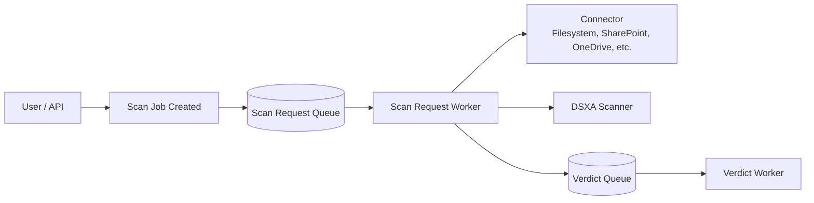
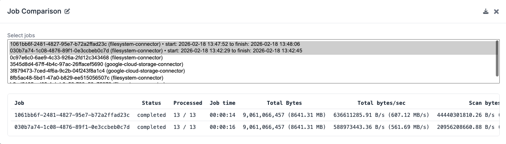
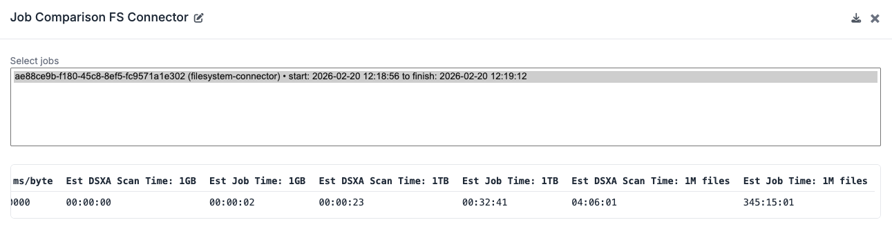
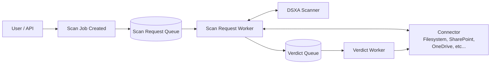

# Performance Tuning with DSX-Connect Job Comparisons

This guide explains how to use the **Job Comparison** feature in the DSX-Connect Console to tune performance.

The goal is to:

* Run repeatable scans
* Compare measurable results
* Adjust concurrency and replicas
* Improve throughput without overloading your environment

---

## Understanding Scan Performance and Data Flow

Before tuning, it’s important to understand what happens during a scan job.

A **Job** represents a user-initiated scan (via UI or API).
A Job consists of many **Scan Request tasks**, each processing one file.

Every file follows the same fundamental path (results queue/worker omitted for brevity):



For each file, the system must:

* Read the file from the source (I/O + network)
* Transfer the file to DSXA
* Process the file in DSXA
* Return and act on the verdict

---

!!! note "Performance Reality"
    In most environments, file I/O and network bandwidth have a greater impact on performance than raw CPU.
    
    Tuning DSX-Connect alone will not improve throughput if:
    
    * The connector source is slow
    * Network latency is high
    * Bandwidth is saturated
    * DSXA is already operating at capacity

---

## Why Concurrency Improves Throughput

Increasing concurrency allows more files to be processed simultaneously.

Instead of:

`File 1 → File 2 → File 3 → File 4`

You process in parallel:

```
File 1
File 2
File 3
File 4
```

This increases total throughput — up to a point.

---

## Why Concurrency Has Limits

Concurrency increases parallelism, but it also increases:

* CPU usage
* Memory usage
* Network utilization
* Context switching overhead
* Queue contention

Eventually:

* CPU becomes saturated
* Memory pressure increases
* Network throughput maxes out
* DSXA becomes the bottleneck

When that happens, adding more concurrency may:

* Produce diminishing returns
* Increase latency
* Reduce stability

Tuning must be measured — not guessed.

---

## Throughput Ceiling Checklist

When tuning performance, consider where your real bottleneck is.

### Infrastructure Limits

* Available CPU cores per node
* Available memory per pod
* Node-level network bandwidth
* Storage I/O performance

### Connector Limits

* Read throughput, ex:
  * Filesystem IOPS
  * SharePoint/API rate limits
  * OneDrive API throughput
* Network proximity to data

### DSXA Limits

* Scan processing rate
* CPU saturation inside DSXA pods
* Memory limits
* Concurrent scan handling capacity

### DSX-Connect Limits

* Worker concurrency
* Replica count
* Queue backlog growth

---

## Tuning Strategy (DSX-Connect and DSXA)

Performance tuning applies to **both**:

* DSX-Connect workers
* DSXA scanner deployment

If DSXA is deployed in-cluster, you can scale it with:

* Multiple DSXA pods
* Load balancing
* Increased resource requests/limits

### Recommended Approach

1. Establish a baseline with default settings, i.e. run a full scan on a connector.
2. Increase `celery.concurrency` modestly (2 → 4 → 6).

    * Start with the Scan Request Worker concurrency (and most likely the only place in DSX-Connect where you will need to tune)

4. Observe:

    * Total job time
    * Total bytes/sec
    * CPU usage
    * Memory pressure
   
4. When concurrency gains flatten, increase `replicaCount`.
5. If DSXA becomes the bottleneck, scale DSXA pods.
6. Stop when:

    * Throughput gains flatten
    * Resource utilization approaches safe limits
    * Error rates increase

---

!!! tip "Goal of Performance Tuning"
    The goal is not maximum concurrency.

    The goal is sustained, predictable throughput without saturating your cluster.
    
    The optimal configuration balances:
    - I/O capacity
    - Network bandwidth
    - DSXA scan capacity
    - CPU and memory utilization
    - Operational cost

---

## Job Comparison UI

On the top right of the DSX-Connect Console, you can access the Job Comparison view by clicking the Job Comparison button (the scale):




Note that the Job Comparison view is available for all jobs, and referenced by Job ID.  Select which jobs to compare, look at the table of jobs and/or download a CSV copy to use tools like Excel.

### Job Comparison Fields

| Field                               | Description                                     | Why it matters                              |
|-------------------------------------|-------------------------------------------------|---------------------------------------------|
| Job                                 | Job ID                                          | Identifier for a scan Job                   |
| Status                              | Completion state                                | Indicates whether the scan completed or not |
| Processed                           | Processed vs total items                        | How far the scan progressed                 |
| Job time                            | Overall runtime                                 | Primary performance indicator               |
| Total Bytes                         | Total bytes scanned                             | Indicates workload size                     |
| Total bytes/sec                     | End-to-end throughput                           | Measures tuning impact                      |
| Scan bytes/sec                      | DSXA-only throughput                            | Identifies DSXA bottlenecks                 |
| Avg Req ms                          | Average per-file request time                   | Captures connector + DSXA latency           |
| Scan ms/byte                        | Per-byte scan cost                              | Compare across file sizes                   |
| Est Job Time: 1GB / 1TB / 1M files  | Normalized projections of DSX-Connect job times | Capacity planning                           |
| Est DSXA Time: 1GB / 1TB / 1M files | Normalized projections of DSXA scanning times   | Capacity planning                           |

#### Using Extrapolated Metrics for Capacity Planning

The Job Comparison view provides normalized estimates such as:

* Estimated DSXA/Job Time: 1GB
* Estimated DSXA/Job Time: 1TB
* Estimated DSXA/Job Time: 1M files



These are projections based on the dataset you scanned.  Note that there are DSXA Scan Times and Job Times, the former gives a projection of the total time spent in DSXA scanning, the latter gives a projection of the time required to process the dataset (reading file from connector, sending file to DSXA, etc...).

They allow you to answer practical questions such as:

* “If I have 5 TB of data, how long will this take?”
* “If I have 1 billion small files, is this realistic?”
* “Is 5 hours total job time acceptable for my environment?" 
* "What are the tradeoffs of increasing concurrency?”

---

!!! warning "Important: These are estimates"
    Extrapolations are based on the specific dataset scanned.
    
    Accuracy depends on:
    - File size distribution
    - File type mix
    - Network conditions
    - DSXA performance characteristics
    
    Always test with representative data.


### Making Cost-Aware Decisions

Performance tuning is not only about speed — it is also about cost.

For example:

* Configuration A completes in **5 hours**
* Configuration B completes in **4.5 hours**
* Configuration B consumes significantly more CPU and memory

In cloud environments, additional CPU and memory directly increase cost.

The correct choice may not be the fastest configuration —
it may be the most cost-efficient configuration that meets your SLA.


# Re-run and Compare

After each tuning change:

1. Re-run the same full scan.
2. Compare jobs side-by-side.
3. Evaluate:

    * Lower total duration
    * Higher throughput
    * Stable error/skip rates
    * Similar verdict distribution

Stop tuning when gains flatten or costs outweigh benefits.


# Performance Tuning with Job Comparisons

This guide shows how to use the DSX-Connect Console's Job Comparison feature to tune performance. The goal is to run repeatable scans, compare results, and adjust concurrency/replicas to improve throughput without overloading the cluster.

## Understanding Scan Performance and Data Flow

Before tuning concurrency or scaling workers, it is important to understand what actually happens during a scan job.

A Job represents a user-initiated scan (via UI or API).
A Job consists of many Scan Request tasks, each processing one file.

Every file scanned follows the same fundamental path (Results Queue and Results Worker omitted for brevity).


### What Actually Impacts Performance

For each file, the system must:

* Read the file from the source (I/O + network)
* Transfer the file to DSXA 
* Process the file in DSXA 
* Return and take action the verdict (i.e., skip, delete file, move file)

!!! note "Performance Reality"
    In most environments, file I/O and network bandwidth have a greater impact on performance than raw CPU.

Tuning DSX-Connect alone will not improve throughput if:
- The connector source is slow
- Network latency is high
- Bandwidth is saturated
- DSXA is already operating at capacity

That said...

### Why Concurrency Improves Throughput

Increasing concurrency allows more files to be processed simultaneously.

Instead of:
```File 1 → File 2 → File 3 → File 4```

Process in parallel:
```
File 1
File 2
File 3
File 4
```
This increases overall throughput — up to a point.

### Why Concurrency Has Limits

Concurrency increases parallelism, but it also increases:
* CPU usage 
* Memory usage 
* Network utilization 
* Context switching overhead 
* Queue contention

At some point:
* CPU becomes saturated 
* Memory pressure increases 
* Network throughput maxes out 
* DSXA becomes the bottleneck

When that happens, adding more concurrency may:
* Produce diminishing returns 
* Increase latency 
* Reduce stability

This is why tuning must be measured — not guessed.

## Throughput Ceiling Checklist

When tuning performance, consider the following constraints:

**Infrastructure Limits**

* Available CPU cores per node
* Available memory per pod
* Node-level network bandwidth
* Cross-zone latency (if applicable)
* Storage I/O performance

**Connector Limits**

* Read throughput, ex:
  * Filesystem IOPS
  * SharePoint/API rate limits
* Network proximity to source data

**DSXA Limits**

* Scan processing rate
* CPU saturation inside DSXA container
* Memory limits
* Concurrent request handling capacity

**DSX-Connect Limits**

* Worker concurrency
* Replica count
* Queue backlog growth

## Practical Tuning Strategy

1. Establish a baseline with default settings.
2. Increase `celery.concurrency` modestly (2 → 4 → 6).
3. Observe:
    * Total job time
    * Total bytes/sec
    * CPU usage
    * Memory pressure
4. When concurrency gains flatten, increase `replicaCount`.
5. Scale downstream workers if queue backlog grows.
6. Stop when:
    * Throughput gains flatten
    * Resource utilization approaches safe limits
    * Error rates increase

!!! tip "Goal of Performance Tuning"
    The goal is not maximum concurrency.

    The goal is sustained, predictable throughput without saturating the cluster.
    
    The optimal configuration balances:
      - I/O capacity
      - Network bandwidth
      - DSXA scan capacity
      - CPU and memory utilization

Performance tuning in DSX-Connect is about identifying the real bottleneck.

In most deployments, throughput is constrained by:

* File read performance
* Network bandwidth
* DSXA processing capacity

Scaling concurrency and replicas increases parallelism, but only improves performance until one of these components becomes saturated.

Use Job Comparison to measure changes objectively and select the configuration that delivers the highest stable throughput for your environment.

## Job Comparison Fields

| Field | Description | Why it matters |
|---|---|---|
| Job | Job ID | Use to compare runs of the same dataset |
| Status | Completion state | Confirms the job finished before comparing |
| Processed | Processed vs total items | Ensures you scanned the same dataset |
| Job time | Overall job runtime | Primary performance indicator |
| Total Bytes | Total bytes scanned | Indicates data volume |
| Total bytes/sec | End-to-end throughput | Shows impact of tuning |
| Scan bytes/sec | DSXA scan throughput | Isolates DSXA performance |
| Avg Req ms | Average per-file request time | Captures connector + DSXA latency |
| Scan ms/byte | Per-byte scan cost | Helps compare across file sizes |
| Est DSXA Scan Time: 1GB | Projected DSXA scan time for 1 GB | Normalized DSXA cost |
| Est Job Time: 1GB | Projected end-to-end time for 1 GB | Normalized total cost |
| Est DSXA Scan Time: 1TB | Projected DSXA scan time for 1 TB | Normalized DSXA cost |
| Est Job Time: 1TB | Projected end-to-end time for 1 TB | Normalized total cost |
| Est DSXA Scan Time: 1M files | Projected DSXA scan time for 1M files | Normalized DSXA cost |
| Est Job Time: 1M files | Projected end-to-end time for 1M files | Normalized total cost |

Tip: Run the same dataset and avoid changing connector filters between tests so comparisons are meaningful.

## Job Comparison UI


## Scaling DSX-Connect: Concurrency and Replicas

Workers scale with two knobs. Use them together for best results:

Terminology:
- Replica count (`replicaCount`): number of pods. Each pod has its own CPU/memory limits/requests and its own Celery process. Good for horizontal scaling and resilience.
- Concurrency (`celery.concurrency`): number of task workers inside one pod. Increases parallelism within a pod; shares that pod’s resources.
- Task: tasks are processed by the workers. 
  - One such task is a scan request, which is processed by a Scan Request worker.
  - Scan Request Workers queue Verdict tasks, which are processed by a Verdict worker.
  - Verdict Workers queue results tasks, which are processed by a Results worker. 
- Task queue: a queue of tasks waiting to be processed.
- Job: a set of all tasks initiated by a user (via the UI or API). A job can contain multiple scan requests.

- `concurrency` adds to speed of processing tasks (and a job) by adding Worker parallelism.  
- `replicaCount` adds Worker fault tolerance and parallelism by adding more pods of a particular worker type. 
- Increasing replicas does add parallelism, but it is usually less efficient than increasing concurrency first.

### Practical Tuning Tips

- The scan request workers are generally the place to start with concurrency. These workers take enqueued scan requests, read a file from a connector, and send it to DSXA for scanning. It is by far the most time‑consuming and resource‑intensive worker.
- Default scan_request concurrency is `2`, so each scan_request pod can handle two scan requests at a time. Adding another pod doubles that (e.g., 2 pods × 2 concurrency = 4 total workers).
- Start by raising `celery.concurrency` modestly (2–4), then add `replicaCount` to spread load across nodes.
- If when increasing concurrency you notice CPU/memory saturation within a pod, increase pod resources or add replicas.
- Scale downstream workers (verdict/result/notification) when increasing request throughput to avoid bottlenecks.

Example configuration:

| Concurrency | Replicas | Scan Request Workers |
|---|---|---|
| 2 | 2 | 4 |

This gives good parallelism and resiliency, for a total of 4 scan request workers.

## Re-run and Compare

After each tuning change, re-run the same full scan and compare jobs side-by-side. Look for:
- Lower total duration
- Higher throughput
- Stable error/skip rates
- Similar verdict breakdowns

Stop tuning when throughput gains flatten or resource usage becomes too high for your cluster.
