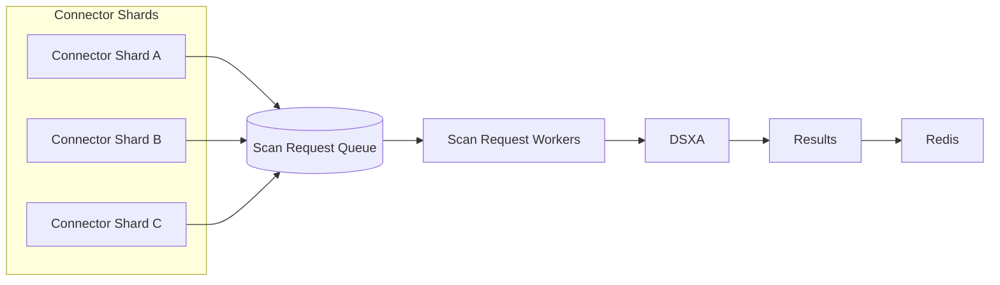

# Scaling & Performance (Kubernetes)

This page explains how to scale DSX-Connect infrastructure in Kubernetes.

Use **Operations → Performance Tuning** to measure throughput.
Use this page to apply those tuning decisions safely in Kubernetes.

## Architecture Scaling Model

DSX-Connect scales horizontally. Throughput is controlled by:

* `dsx-connect-scan-request-worker` concurrency
* `dsx-connect-scan-request-worker` replica count
* Connector sharding via `DSXCONNECTOR_ASSET`
* DSXA capacity
* Infrastructure limits (CPU, memory, network)



Primary scaling hierarchy:

* scan_request concurrency
* scan_request replicas
* connector sharding (assets)
* Redis capacity
* DSXA capacity
* network bandwidth


Scaling should follow this order and be validated using Job Comparisons.

## Scaling scan_request Workers

`dsx-connect-scan-request-worker` controls how many files are processed concurrently.

Tuning must follow the same order described in Performance Tuning.

### Step 1: Increase Concurrency

Increase concurrency first when:

* Worker CPU and memory have headroom.
* DSXA is not saturated.
* Network bandwidth is available.

Example:

```yaml
dsx-connect-scan-request-worker:
  replicaCount: 1
  celery:
    concurrency: 4
```

Increase gradually (for example 2 → 4 → 6) and measure after each change.

Watch for:

* CPU saturation
* Memory pressure
* Growing latency
* Queue backlog growth

Stop increasing concurrency when throughput gains flatten or instability appears.

### Step 2: Increase Replicas

Increase replicas when:

* Concurrency gains plateau.
* Per-pod memory pressure increases.
* You need better distribution across nodes.
* You want to enable autoscaling.

Example:

```yaml
dsx-connect-scan-request-worker:
  replicaCount: 4
  celery:
    concurrency: 4
```

Replicas add horizontal capacity without increasing per-pod memory pressure.

Do not increase concurrency and replicas simultaneously during tuning. Adjust one variable at a time and validate using Job Comparisons.

## Scaling Connectors

Connectors are typically I/O-bound and scale differently than core workers.

Increasing `replicaCount` alone does not always improve performance and may cause:

* Duplicate enumeration
* Excessive list operations
* API rate-limit amplification
* Network contention

Connector throughput depends on:

* Number of concurrent scan_request workers
* Connector enumeration speed
* Source system throughput
* Network latency and bandwidth
* Sharding strategy using `DSXCONNECTOR_ASSET`

### Preferred Strategy: Shard with DSXCONNECTOR_ASSET

`DSXCONNECTOR_ASSET` defines the logical root of a connector’s scan scope. It enables partitioning a large repository into smaller shards so multiple connector instances can operate in parallel.

For very large repositories (millions or billions of items), sharding is the primary scaling mechanism.

Examples:

* S3: `bucket/A/*`, `bucket/B/*`, or time partitions like `bucket/2025-01/*`
* Filesystem: `/data/shard1`, `/data/shard2`
* SharePoint: split by library or folder scope

Deploy one connector instance per shard.

In Kubernetes, this typically means:

* Multiple Helm releases of the connector, each with a distinct `DSXCONNECTOR_ASSET`
* Or multiple deployments configured with unique asset values

Simply increasing replica count while all replicas point at the same asset may not improve throughput and can increase API pressure.

### Assets vs Filters

* Use **Assets** for coarse partitioning (sharding).
* Use **Filters** for fine-grained inclusion/exclusion inside a shard.
* Combine both for large-scale environments.

Filters alone are not sufficient for billion-item repositories because enumeration still occurs inside the asset boundary.

## Redis Scaling

Redis affects:

* Queue depth
* Backlog handling
* Retry behavior
* Burst tolerance

Increase Redis memory if:

* You observe evictions
* Backlog persists
* Workers are idle due to queue issues

Example:

```yaml
redis:
  resources:
    requests:
      cpu: 500m
      memory: 2Gi
    limits:
      cpu: "1"
      memory: 4Gi
```

Redis should be sized to tolerate bursts without eviction.

## DSXA Capacity Planning

DSXA often becomes the true bottleneck.

If increasing concurrency and replicas does not increase throughput:

* Check DSXA CPU usage
* Review DSXA scan bytes/sec
* Verify concurrent scan capacity

If DSXA is saturated, scale DSXA before increasing workers further.

Adding workers beyond DSXA capacity increases queue depth without improving scan rate.

## Horizontal Pod Autoscaler (HPA)

CPU-based autoscaling works well for `dsx-connect-scan-request-worker`.

Example:

```yaml
apiVersion: autoscaling/v2
kind: HorizontalPodAutoscaler
metadata:
  name: dsx-scan-request
spec:
  scaleTargetRef:
    apiVersion: apps/v1
    kind: Deployment
    name: dsx-connect-scan-request-worker
  minReplicas: 2
  maxReplicas: 10
  metrics:
  - type: Resource
    resource:
      name: cpu
      target:
        type: Utilization
        averageUtilization: 70
```

Guidance:

* Start conservative (min 2, max 5–10).
* Ensure cluster capacity supports maxReplicas.
* Monitor DSXA before raising limits.
* Avoid scaling API unless it is CPU-bound.

## Node Capacity Planning

Plan cluster capacity before enabling autoscaling.

If each scan_request worker requests:

```
1 vCPU
1 Gi memory
```

And maxReplicas is 10, your cluster must support:

```
10 vCPU
10 Gi memory
+ connectors
+ Redis
+ API
+ system overhead
```

Include ingress, logging, monitoring, and system pods in capacity planning.

For production environments, dedicate node pools for scan workloads when possible.

## Recommended Scaling Workflow

Follow the same order used in Performance Tuning.

1. Establish a baseline using Job Comparisons.
2. Increase `dsx-connect-scan-request-worker.celery.concurrency`.
3. When gains flatten, increase `replicaCount`.
4. Shard large connectors using `DSXCONNECTOR_ASSET`.
5. Increase Redis memory if backlog appears.
6. Scale DSXA if scan time dominates.
7. Validate network bandwidth and latency.

After each change:

* Re-run the same workload.
* Compare results.
* Modify one variable at a time.

The goal is sustained, predictable throughput without saturating your infrastructure.
