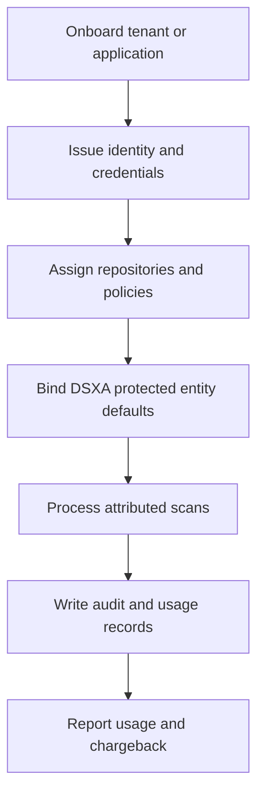
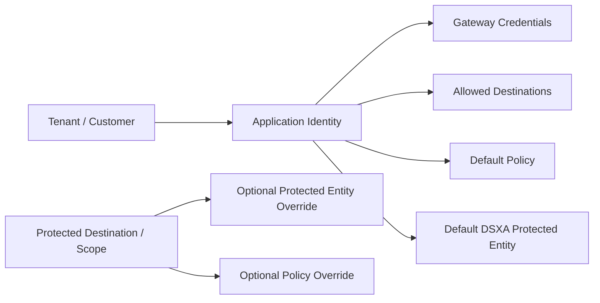
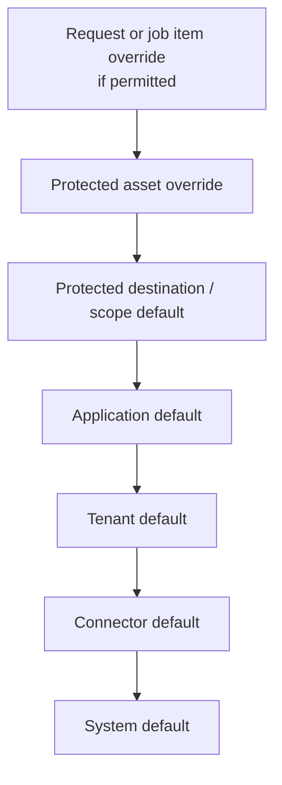
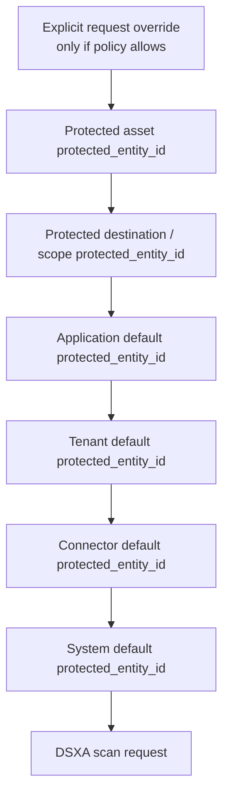
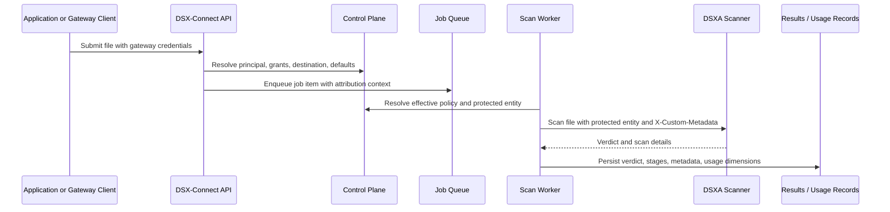

# Tenant Attribution, Metering, And Chargeback Architecture

## Purpose

In a file-scanning-as-a-service model, authentication and scanning are not enough.

The platform operator must be able to answer:

- who submitted the file
- which tenant, customer, business unit, application, and cost center owns the request
- which user or service account initiated it
- which repository, connector, and protected destination were involved
- which policy and scanner were applied
- what verdict and disposition resulted
- how many files and bytes were processed
- who should be billed, charged back, or reported against

This makes DSX-Connect the identity, governance, attribution, and metering control plane around file scanning.
It should not behave like an anonymous scan proxy.

The architectural rule is:

```text
No anonymous scan requests.

Every request carries an attribution context that survives across APIs,
queues, connectors, scanner adapters, callbacks, result sinks, and final
audit records.
```

## Why This Matters

Enterprises that expose DSX-Connect to application teams need organizational ownership for every scan.

That ownership supports:

- auditability
- troubleshooting
- access control
- reporting
- internal usage metering
- chargeback or showback
- tenant billing
- security operations
- compliance evidence

The same design applies to internal enterprise teams and external customer-facing services.

For internal use, the platform may need to charge scans back to a business unit, product team, or cost center.
For a multi-tenant service, the platform may need to bill customers based on files, bytes, repository usage, or policy tier.

## Onboarding Scope

DSX-Connect onboarding should register more than a connector.

Onboarding should establish:

- tenant or customer identity
- application or service identity
- authentication credentials
- authorized repositories and protected destinations
- assigned policies
- quotas and limits
- billing or cost-center metadata
- DSXA attribution bindings

Conceptual onboarding flow:



## Attribution Context

Every accepted file request should create an attribution context.

Minimum fields:

- tenant or customer id
- tenant or customer display name
- application or service id
- application display name
- submitting user or service-account identity
- authentication method
- cost center or billing identifier
- source connector
- destination connector
- protected destination id
- protected asset or repository scope
- file count
- bytes submitted
- scanner provider
- policy applied
- verdict
- disposition
- processing status
- timestamps
- latency
- correlation id
- job id
- job item id

Recommended ownership fields:

| Field | Purpose |
| --- | --- |
| `tenant_id` or `customer_id` | Identifies the organization or customer that owns the request. |
| `application_id` | Identifies the application or service that generated the request. |
| `submitted_by` | Identifies the user, service account, or automation principal that initiated the request. |
| `cost_center` | Identifies the internal accounting owner that should absorb or report usage cost. |
| `billing_code` | Identifies the project, contract, budget line, product, or usage bucket used for allocation. |

`cost_center` and `billing_code` are intentionally separate.
A cost center usually maps to finance or organizational ownership.
A billing code is often more specific: a product, project, customer contract, campaign, or internal work order.

Example:

```text
tenant_id: manufacturing-enterprise
application_id: claims-upload-service
submitted_by: svc-claims-upload
cost_center: claims-platform-engineering
billing_code: claims-upload-prod
```

Example:

```json
{
  "tenant_id": "tenant_acme",
  "tenant_name": "Acme Enterprise",
  "application_id": "claims_portal",
  "application_name": "Claims Portal",
  "submitted_by": "svc_claims_portal",
  "auth_method": "oauth2_client_credentials",
  "cost_center": "CC-1042",
  "billing_code": "BU-CLAIMS",
  "source_connector_id": "gateway_upload",
  "destination_connector_id": "gcs_prod",
  "destination_id": "scope_claims_intake",
  "protected_target": "gs://claims-prod/inbound",
  "file_count": 1,
  "bytes_submitted": 184320,
  "scanner_provider": "dsxa",
  "policy_profile": "standard_upload_policy",
  "verdict": "benign",
  "disposition": "delivered",
  "status": "completed",
  "correlation_id": "corr_...",
  "job_id": "job_...",
  "job_item_id": "job_item_..."
}
```

## DSXA Attribution Channels

DSXA and the DSX Management Console provide two important attribution mechanisms that DSX-Connect should use.

### Protected Entity ID

The protected entity id gives DSXA and the DSX Management Console a native reporting dimension.

DSX-Connect should support:

- selecting an existing protected entity id during onboarding
- creating a protected entity through the DSX Management Console API when allowed
- validating that a configured protected entity id exists
- storing the protected entity id and display name in DSX-Connect
- passing the protected entity id on DSXA scan requests

The protected entity should represent the tenant, application, or business owner that should receive scan attribution.

Application identity is a natural place to bind a default protected entity id, but it should not be the only binding point.
The relationship should be configurable rather than strictly one-to-one.

Common models:

- one application maps to one DSXA protected entity
- one tenant maps to one default DSXA protected entity
- multiple applications share one DSXA protected entity
- one application uses different protected entities by environment, destination, region, or data classification
- one protected destination overrides the application default

Conceptual DSX-Connect application binding:

```json
{
  "application_id": "claims_portal",
  "display_name": "Claims Portal",
  "dsxa": {
    "protected_entity_id": 65,
    "protected_entity_name": "Claims Portal"
  }
}
```

Conceptual binding model:



### Custom Metadata Header

The custom metadata channel should carry richer DSX-Connect context that does not fit into a single protected entity id.

Conceptual metadata:

```json
{
  "dsx_connect_tenant_id": "tenant_acme",
  "dsx_connect_application_id": "claims_portal",
  "application_name": "Claims Portal",
  "business_unit": "Claims",
  "cost_center": "CC-1042",
  "billing_code": "BU-CLAIMS",
  "destination_id": "scope_claims_intake",
  "destination_type": "gcs",
  "protected_target": "gs://claims-prod/inbound",
  "policy_profile": "standard_upload_policy",
  "job_id": "job_...",
  "job_item_id": "job_item_...",
  "submitted_by": "svc_claims_portal",
  "source": "file_gateway_api"
}
```

The protected entity id gives DSXA-native grouping.
The custom metadata header gives richer audit, chargeback, and troubleshooting context.

## Attribution Precedence

DSX-Connect should resolve attribution consistently at scan time.

Recommended precedence:



This lets operators start simple and become more granular over time.

Examples:

- one protected entity per tenant
- one protected entity per application
- one protected entity per protected destination
- one protected entity per high-value asset
- one billing code per cost center

Protected entity id should follow the same resolution approach:



The resolved protected entity id gives DSXA-native reporting.
The resolved attribution context gives DSX-Connect audit, chargeback, and troubleshooting detail.

## Scan Worker Requirements

The scan worker must not create scanner requests from file data alone.

Before sending a file to a scanner, it should resolve:

- scanner provider
- policy profile
- protected entity id
- custom metadata
- tenant id
- application id
- submitting principal
- destination and protected target
- job and job item identifiers

Then it should pass the scanner-specific attribution fields through the scanner adapter.

For DSXA, that means:

- protected entity id in the scanner request where supported by the DSXA REST contract
- custom metadata in the DSXA custom metadata header
- correlation identifiers that let scan results be tied back to DSX-Connect jobs

The scan result persisted by DSX-Connect should include the same attribution context, not only the scanner verdict.

End-to-end attribution path:



## Usage Records

DSX-Connect should emit a usage record for each file item and aggregate records for each job.

Item-level usage supports precise audit and billing.
Job-level usage supports dashboards and reporting.

Item-level usage fields:

- tenant id
- application id
- principal id
- cost center
- billing code
- job id
- job item id
- file name
- file size
- file hash when available
- source connector
- destination connector
- scanner provider
- policy profile
- verdict
- disposition
- started at
- completed at
- latency milliseconds
- error code when failed

Job-level usage fields:

- total files
- terminal files
- completed files
- failed files
- benign files
- malicious files
- not-scanned files
- total bytes
- scan duration
- end-to-end job duration
- files per second
- bytes per second

## Reporting And Chargeback

Attribution and usage records should support reports such as:

- scans by tenant
- scans by application
- scans by business unit
- scans by cost center
- files and bytes by destination
- malicious files by tenant or application
- not-scanned rates by policy
- cost by scanner provider
- latency by destination or connector
- monthly chargeback by billing code

The reporting model should not depend solely on DSXA Console reporting.

DSXA protected entity reporting is important, but DSX-Connect also needs its own usage and governance records because DSX-Connect sees:

- caller identity
- gateway authorization decisions
- destination selection
- repository delivery result
- remediation action
- queue timing
- connector-level failures
- end-to-end job lifecycle

## API And UI Implications

### Applications

The DSX-Connect console should expose application onboarding:

- create application
- assign tenant or customer
- configure authentication
- assign destinations
- assign policies
- configure cost-center and billing metadata
- bind or create DSXA protected entity
- rotate credentials
- disable application
- view usage

### Tenants

For multi-tenant deployments, the console should expose tenant onboarding:

- create tenant
- assign tenant owners
- configure default policy
- configure default protected entity
- configure billing account
- configure quotas
- view tenant usage

### Protected Destinations

Protected destinations should support attribution defaults:

- default protected entity id
- default policy profile
- default billing code
- default business unit
- allowed application grants

### Scan Results

Scan results should show attribution fields:

- tenant
- application
- submitted by
- protected entity id
- cost center or billing code
- destination
- policy
- scanner provider
- verdict
- disposition

## Design Principles

- Do not accept anonymous scan requests.
- Do not lose attribution when work moves through queues.
- Do not expose repository credentials to application teams.
- Keep gateway identity separate from repository identity.
- Treat protected entity id as scanner-console attribution, not as the full DSX-Connect authorization model.
- Use custom metadata for rich attribution context.
- Persist attribution in DSX-Connect even when the scanner does not echo it back.
- Make usage records first-class outputs of the workflow.

## Relationship To Existing Documents

- [Normalized Enterprise File Gateway](../strategy/normalized-enterprise-file-gateway.md)
- [Gateway Access Control Model](../strategy/gateway-access-control.md)
- [Developer File API Versus Managed File Transfer](../strategy/developer-file-api-vs-mft.md)
