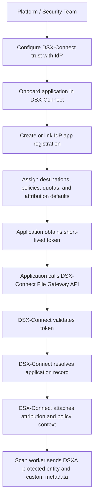
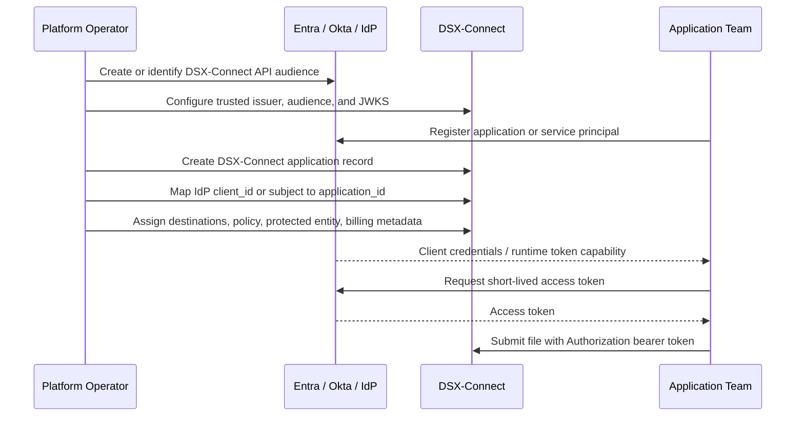
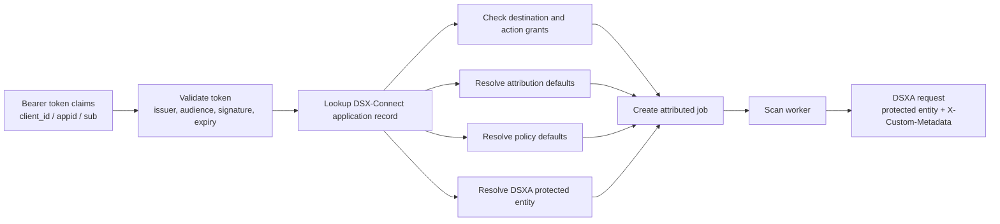

# Application Identity And Attribution

## Concept

DSX-Connect should not treat application scan requests as anonymous file uploads.

In the enterprise file gateway model, an application is onboarded as a known caller.
That caller receives an identity through an enterprise identity provider such as Entra ID, Okta, or another OAuth2/OIDC provider.
At runtime, the application uses that identity to obtain a short-lived access token and sends the token to DSX-Connect.

DSX-Connect validates the token, maps it to an onboarded application record, and uses that record to populate attribution, authorization, policy, and chargeback context.

The token proves who is calling.
DSX-Connect decides what that caller can do and what metadata should follow the file.

## Applications Are Not Assets

Applications should be modeled as callers, not as protected assets.

An asset is a repository resource DSX-Connect can protect, such as a bucket, prefix, filesystem path, folder, or other connector-visible storage target.
Assets answer the question:

> What file location is governed?

An application answers a different question:

> Who is allowed to use the file gateway, and what attribution should follow that work?

That means Applications deserve their own operator-console surface.
They are not rows under `Assets > Connectors` or `Assets > Protected`.

The relationship is:

```text
Application
    -> identity binding
    -> destination grants
    -> attribution defaults
    -> default DSXA protected entity

Asset / Destination
    -> connector
    -> protected scope
    -> repository path, bucket, prefix, or folder
    -> protection profile
```

In practice, an application may be granted access to one or more protected assets or gateway destinations.
The same asset can be used by multiple applications, and the same application can use multiple destinations.

This separation keeps repository governance, caller authorization, and usage attribution independent.



## Current MVP

The current implementation supports first-class DSX-Connect gateway application records.
Each application can define:

- application id and display name
- enabled or disabled status
- identity bindings
- tenant, customer, business unit, cost-center, and billing metadata
- default DSXA protected entity id
- allowed destinations, actions, and path prefixes
- operator metadata

For local and demo use, identity bindings can use static bearer tokens.
That keeps the onboarding and attribution model real while avoiding external IdP setup.

The older static JSON token mapping remains as a compatibility and bootstrap fallback, but the intended MVP model is:

```text
static bearer token
    -> DSX-Connect gateway application record
    -> grants, attribution defaults, protected entity default
```

Example control-plane application record:

```json
{
  "application_id": "claims-upload-service",
  "display_name": "Claims Upload Service",
  "enabled": true,
  "identity_bindings": [
    {
      "provider": "static_bearer",
      "token": "claims-demo-token"
    }
  ],
  "tenant_id": "claims-business-unit",
  "customer_id": "enterprise-internal",
  "business_unit": "Claims",
  "cost_center": "CC-1042",
  "billing_code": "CLAIMS-UPLOAD-PROD",
  "default_protected_entity_id": 65,
  "grants": [
    {
      "destination_ids": ["gcs-claims-intake"],
      "actions": ["discover", "submit", "status"],
      "path_prefixes": ["inbound"]
    }
  ]
}
```

## What Is Still Missing

The production model needs an onboarding step that establishes communication between DSX-Connect and the customer identity provider.

At minimum, DSX-Connect needs:

- trusted issuer URL
- token audience
- JWKS or certificate discovery endpoint
- accepted signing algorithms
- claim mapping rules
- application identity claim, such as `client_id`, `appid`, `azp`, or `sub`
- optional tenant claim mapping
- optional group or role claim mapping

Conceptually:

```text
IdP token validation settings
    +
DSX-Connect application registry
    =
trusted application identity and attribution context
```

## Onboarding Workflow

Application onboarding has two related tracks.

First, the platform integrates DSX-Connect with the identity provider.
This is usually owned by the platform, IAM, or security team.

Second, each application is onboarded into DSX-Connect.
This creates the DSX-Connect-side policy, authorization, and attribution record.



## Runtime Workflow

At runtime, the application does not send every attribution field manually.
The application sends a token.
DSX-Connect resolves the token into an application record and uses that record to enrich the request.



Example token claim:

```json
{
  "iss": "https://login.microsoftonline.com/tenant/v2.0",
  "aud": "api://dsx-connect-file-gateway",
  "appid": "4f7f9b89-0000-0000-0000-111111111111",
  "azp": "4f7f9b89-0000-0000-0000-111111111111",
  "sub": "service-principal-subject",
  "exp": 1790000000
}
```

Example DSX-Connect application mapping:

```json
{
  "application_id": "claims-upload-service",
  "display_name": "Claims Upload Service",
  "identity": {
    "issuer": "https://login.microsoftonline.com/tenant/v2.0",
    "client_id": "4f7f9b89-0000-0000-0000-111111111111"
  },
  "tenant_id": "claims-business-unit",
  "customer_id": "enterprise-internal",
  "business_unit": "Claims",
  "cost_center": "CC-1042",
  "billing_code": "CLAIMS-UPLOAD-PROD",
  "default_protected_entity_id": 65,
  "allowed_destinations": [
    "gcs-claims-intake"
  ],
  "allowed_actions": [
    "discover",
    "submit",
    "status"
  ]
}
```

Resolved scan metadata:

```text
application-id:claims-upload-service
tenant-id:claims-business-unit
customer-id:enterprise-internal
business-unit:Claims
cost-center:CC-1042
billing-code:CLAIMS-UPLOAD-PROD
protected-entity-id:65
destination-id:gcs-claims-intake
```

## Separation Of Responsibilities

The identity provider answers:

- who is calling
- whether the token is valid
- when the token expires
- which tenant issued it
- which client, service principal, user, or workload identity is represented

DSX-Connect answers:

- whether that caller is onboarded
- which destinations the caller can use
- which actions the caller can perform
- which policy applies
- which DSXA protected entity should be used
- which tenant, customer, business unit, application, cost center, and billing code should be recorded
- which usage and audit records should be emitted

This separation matters because IdP claims usually should not be treated as the complete security policy.
The IdP establishes identity.
DSX-Connect owns file gateway authorization, repository grants, scan policy, attribution enrichment, and usage metering.

## Demo Mode

The current lab can use static token mapping:

```text
demo-gateway-token
    -> demo-developer-mvp
    -> Demo Tenant
    -> DSX-Connect File Gateway Developer MVP
    -> demo-cost-center
    -> demo-chargeback
```

This is intentionally a demo identity provider.
It lets the demo prove the end-to-end behavior:

- app submits file
- token maps to an application identity
- destination grants are enforced
- attribution is written into the job
- scan worker passes attribution in DSXA custom metadata
- result records preserve the same context

The production implementation should replace static token mapping with OIDC/JWT validation and a DSX-Connect application registry.

## Related Concepts

- [Tenant Attribution, Metering, And Chargeback](../architecture/tenant-attribution-chargeback.md)
- [Gateway Access Control Model](../strategy/gateway-access-control.md)
- [Normalized Enterprise File Gateway](../strategy/normalized-enterprise-file-gateway.md)
