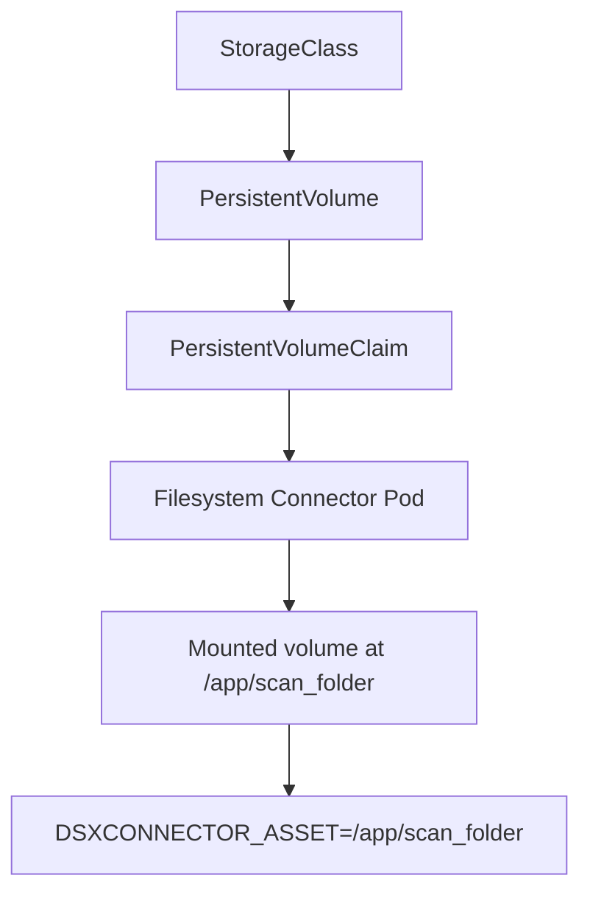

# Filesystem Connector - Kubernetes Deployment

The Filesystem connector scans files from a mounted filesystem.

In Kubernetes, the behavior of this connector is determined by the storage backend used for the mounted volume.

Unlike cloud connectors, the Filesystem connector requires a filesystem volume mounted into the container at:

```text
/app/scan_folder
```

The connector scans this internal directory.

---

## Full Scan and Monitoring Guidance

Full scans establish baseline coverage across the mounted filesystem scope at a point in operational time.

Because the underlying filesystem may remain active during scanning, full scans should be treated as best-effort enumeration of a live data set rather than immutable point-in-time snapshots.

Continuous monitoring or event-driven protection, where enabled and supported by the deployment model, maintains convergence by detecting:

* newly created objects
* modified objects
* overwritten objects
* post-scan changes

Operationally:

* full scans are recommended during lower repository activity when possible
* monitoring should remain enabled for steady-state protection where the deployment supports it
* protection coverage is achieved through the combination of baseline scanning and continuous monitoring

---

## Storage Architecture

In Kubernetes, this filesystem volume is typically provided using a PersistentVolumeClaim (PVC) backed by a StorageClass.

For a deeper dive into Kubernetes storage concepts, see [Reference: Kubernetes Storage](../../../reference/kubernetes-storage.md).



### Kubernetes-managed storage

Most Kubernetes clusters use dynamic provisioning, where a StorageClass automatically creates a PersistentVolume when a PVC is requested.

Common examples include:

| Platform | Typical StorageClass |
| --- | --- |
| k3s / local clusters | NFS, Longhorn |
| AWS | EFS |
| Azure | Azure Files |
| GCP | Filestore |
| On-prem | NFS, CephFS |

### RWX Storage and Multi-Replica Deployments

Some Kubernetes storage backends support ReadWriteMany (RWX), allowing multiple pods to mount the same filesystem volume.

RWX storage does not automatically enable horizontal scaling of the Filesystem connector.
Connector replicas do not coordinate enumeration of the filesystem.
If multiple replicas scan the same root directory, they may enumerate the same files independently.

For large datasets, partition storage across multiple connector assets instead of running multiple replicas against the same directory.

Example sharding pattern:

```text
/data/shard1
/data/shard2
/data/shard3
```

Each connector instance scans a different root directory.

---

## Minimal Deployment

The following steps install the connector with minimal configuration changes.

### 1. Create Storage

Choose the storage model that matches your platform and filesystem access mode.
All examples below use the same claim name, `dsxconnect-scan-pvc`, referenced during connector install as `scanVolume.existingClaim`.

!!! info "Static vs Dynamic provisioning"
    Static provisioning is typically used when the filesystem already exists and contains files to scan.
    Dynamic provisioning is useful when Kubernetes should create and manage storage automatically.

=== "k3s/Colima + NFS"

    Ensure an NFS server/export exists and is reachable from your cluster nodes.

    Example `nfs-storageclass.yaml`:

    ```yaml
    apiVersion: storage.k8s.io/v1
    kind: StorageClass
    metadata:
      name: nfs-csi
    provisioner: nfs.csi.k8s.io
    parameters:
      server: 10.0.0.25
      share: /exports/dsxconnect
    reclaimPolicy: Retain
    volumeBindingMode: Immediate
    mountOptions:
      - nfsvers=4.1
    ```

    Example `scan-pvc.yaml`:

    ```yaml
    apiVersion: v1
    kind: PersistentVolumeClaim
    metadata:
      name: dsxconnect-scan-pvc
      namespace: dsx-connect
    spec:
      accessModes:
        - ReadWriteMany
      storageClassName: nfs-csi
      resources:
        requests:
          storage: 100Gi
    ```

    Apply:

    ```bash
    kubectl apply -f nfs-storageclass.yaml
    kubectl apply -f scan-pvc.yaml
    ```

=== "k3s + Windows Share (SMB/CIFS)"

    Use this when your data lives on a Windows SMB share and you want Kubernetes storage resources to manage mounts.

    Install the SMB CSI driver in the cluster:

    ```text
    https://github.com/kubernetes-csi/csi-driver-smb
    ```

    Example `smb-credentials.yaml`:

    ```yaml
    apiVersion: v1
    kind: Secret
    metadata:
      name: smb-credentials
      namespace: dsx-connect
    type: Opaque
    stringData:
      username: "dsxconnect"
      password: "dsxconnect"
    ```

    Example static `scan-pv-pvc.yaml` for scanning existing share-root data:

    ```yaml
    apiVersion: v1
    kind: PersistentVolume
    metadata:
      name: dsxconnect-scan-pv
    spec:
      capacity:
        storage: 100Gi
      accessModes:
        - ReadWriteMany
      persistentVolumeReclaimPolicy: Retain
      storageClassName: ""
      csi:
        driver: smb.csi.k8s.io
        volumeHandle: dsxconnect-scan-root-vol-001
        volumeAttributes:
          source: "//10.2.4.130/scan"
        nodeStageSecretRef:
          name: smb-credentials
          namespace: dsx-connect
    ---
    apiVersion: v1
    kind: PersistentVolumeClaim
    metadata:
      name: dsxconnect-scan-pvc
      namespace: dsx-connect
    spec:
      storageClassName: ""
      accessModes:
        - ReadWriteMany
      resources:
        requests:
          storage: 100Gi
      volumeName: dsxconnect-scan-pv
    ```

    Apply:

    ```bash
    kubectl apply -f smb-credentials.yaml
    kubectl apply -f scan-pv-pvc.yaml
    ```

    !!! warning "SMB change detection"
        SMB/CIFS mounts often do not emit inotify events in containers.
        If monitor mode is enabled, force polling for reliable detection.

=== "k3s/Colima + Local Filesystem"

    For single-node development clusters, you can bind to local node storage.

    !!! note "k3s on Colima vs Linux host"
        For k3s in Colima, start Colima with a host mount so `hostPath` paths are visible to the k3s node VM:

        ```bash
        colima start --kubernetes --mount /Users/<you>/dsx-data:w
        ```

        For k3s on a Linux host, `hostPath` uses native host paths.

    Example `scan-pv-pvc.yaml`:

    ```yaml
    apiVersion: v1
    kind: PersistentVolume
    metadata:
      name: dsxconnect-scan-pv
    spec:
      capacity:
        storage: 100Gi
      accessModes:
        - ReadWriteMany
      hostPath:
        path: /var/dsx-connect-2-test
    ---
    apiVersion: v1
    kind: PersistentVolumeClaim
    metadata:
      name: dsxconnect-scan-pvc
      namespace: dsx-connect
    spec:
      storageClassName: ""
      accessModes:
        - ReadWriteMany
      resources:
        requests:
          storage: 100Gi
      volumeName: dsxconnect-scan-pv
    ```

    Apply:

    ```bash
    kubectl apply -f scan-pv-pvc.yaml
    ```

    !!! warning "hostPath limitations"
        `hostPath` ties the workload to a node and is not recommended for multi-node production clusters.

=== "AWS EKS (EFS CSI)"

    Use this when running on EKS with the AWS EFS CSI driver.

    Example `efs-storageclass.yaml`:

    ```yaml
    apiVersion: storage.k8s.io/v1
    kind: StorageClass
    metadata:
      name: efs-sc
    provisioner: efs.csi.aws.com
    parameters:
      provisioningMode: efs-ap
      fileSystemId: fs-12345678
      directoryPerms: "750"
    reclaimPolicy: Retain
    volumeBindingMode: Immediate
    ```

    Example `scan-pvc.yaml`:

    ```yaml
    apiVersion: v1
    kind: PersistentVolumeClaim
    metadata:
      name: dsxconnect-scan-pvc
      namespace: dsx-connect
    spec:
      accessModes:
        - ReadWriteMany
      storageClassName: efs-sc
      resources:
        requests:
          storage: 100Gi
    ```

    Apply:

    ```bash
    kubectl apply -f efs-storageclass.yaml
    kubectl apply -f scan-pvc.yaml
    ```

### 2. Install the Connector

=== "Quick Install"

    Minimal install using Helm CLI overrides.

    ```bash
    export NAMESPACE=dsx-connect
    export FILESYSTEM_VERSION=2.0.3

    helm upgrade --install filesystem \
      oci://registry-1.docker.io/dsxconnect/filesystem-connector-chart \
      --version "$FILESYSTEM_VERSION" \
      --namespace "$NAMESPACE" \
      --create-namespace \
      --set scanVolume.enabled=true \
      --set scanVolume.existingClaim=dsxconnect-scan-pvc \
      --set scanVolume.mountPath=/app/scan_folder \
      --set-string env.DSXCONNECTOR_REGISTER_WITH_CORE=false \
      --set-string env.DSXCONNECTOR_REGISTER_WITH_NG_CONTROL_PLANE=true \
      --set-string env.DSXCONNECTOR_DSX_CONNECT_URL=http://dsx-connect-api:8091 \
      --set-string env.DSXCONNECTOR_DSX_CONNECT_NG_URL=http://dsx-connect-api:8091 \
      --set-string env.DSXCONNECTOR_INSTANCE_ID=filesystem-local-1 \
      --set-string env.DSXCONNECTOR_NG_PLATFORM=filesystem \
      --set-string env.DSXCONNECTOR_NG_PLATFORM_KEY=local-kubernetes \
      --set-string env.DSXCONNECTOR_ASSET=/app/scan_folder \
      --set-string env.DSXCONNECTOR_ITEM_ACTION=nothing
    ```

    !!! note "Defaults"
        `scanVolume.mountPath` and `env.DSXCONNECTOR_ASSET` both default to `/app/scan_folder`.
        This example sets them explicitly for clarity.

=== "values.yaml Install"

    Use a values file when deploying in production or GitOps workflows.

    First, pull the chart:

    ```bash
    helm pull oci://registry-1.docker.io/dsxconnect/filesystem-connector-chart \
      --version <connector_version> \
      --untar
    ```

    Copy the DSX-Connect 2 example values file and edit it for the target storage:

    ```bash
    cp docs/dsx-connect-2/deployment/examples/filesystem-connector-values.yaml \
      filesystem-connector-values.yaml
    ```

    Relevant DSX-Connect 2 values:

    ```yaml
    env:
      DSXCONNECTOR_REGISTER_WITH_CORE: "false"
      DSXCONNECTOR_REGISTER_WITH_NG_CONTROL_PLANE: "true"
      DSXCONNECTOR_DSX_CONNECT_URL: "http://dsx-connect-api:8091"
      DSXCONNECTOR_DSX_CONNECT_NG_URL: "http://dsx-connect-api:8091"
      DSXCONNECTOR_INSTANCE_ID: "filesystem-local-1"
      DSXCONNECTOR_NG_PLATFORM: "filesystem"
      DSXCONNECTOR_NG_PLATFORM_KEY: "local-kubernetes"
      DSXCONNECTOR_ASSET: "/app/scan_folder"
      DSXCONNECTOR_ITEM_ACTION: "nothing"
      DSXCONNECTOR_ITEM_ACTION_MOVE_METAINFO: "/app/quarantine"
      DSXCONNECTOR_MONITOR: "false"
      DSXCONNECTOR_MONITOR_FORCE_POLLING: "false"

    scanVolume:
      enabled: true
      mountPath: "/app/scan_folder"
      existingClaim: "dsxconnect-scan-pvc"
    ```

    If you use `DSXCONNECTOR_ITEM_ACTION=move`, also configure quarantine storage and path alignment:

    ```yaml
    quarantineVolume:
      enabled: true
      existingClaim: dsxconnect-quarantine-pvc
      mountPath: /app/quarantine

    env:
      DSXCONNECTOR_ITEM_ACTION: "move"
      DSXCONNECTOR_ITEM_ACTION_MOVE_METAINFO: "/app/quarantine"
    ```

    Install the released chart:

    ```bash
    helm upgrade --install filesystem \
      oci://registry-1.docker.io/dsxconnect/filesystem-connector-chart \
      --version "$FILESYSTEM_VERSION" \
      --namespace "$NAMESPACE" \
      --create-namespace \
      -f filesystem-connector-values.yaml
    ```

---

## Required Settings

### `DSXCONNECTOR_ASSET`

Defines the root directory that the connector scans.

Example:

```bash
DSXCONNECTOR_ASSET=/app/scan_folder
```

Unlike Docker deployments, this path refers to the mounted volume path inside the container.

!!! note "Kubernetes Filesystem Special Case"
    This is one of the few deployment cases where you should usually leave `DSXCONNECTOR_ASSET` aligned to the chart's mount path.

    The filesystem connector must read files by an actual in-container filesystem path.
    In Kubernetes, that path is determined by the volume mount.
    The real scan source is configured with `scanVolume.*`, not by changing `DSXCONNECTOR_ASSET` to a PVC name.

Required pattern:

* Configure source storage with `scanVolume.existingClaim` or `scanVolume.hostPath`.
* Keep `env.DSXCONNECTOR_ASSET` aligned to the mounted path, default `/app/scan_folder`.

### `DSXCONNECTOR_ITEM_ACTION_MOVE_METAINFO`

If using `move`, this path must exist inside the connector container.

Example:

```bash
DSXCONNECTOR_ITEM_ACTION_MOVE_METAINFO=/app/quarantine
```

Required pattern:

* Configure destination storage with `quarantineVolume.existingClaim` or `quarantineVolume.hostPath`.
* Keep `env.DSXCONNECTOR_ITEM_ACTION_MOVE_METAINFO` aligned to `quarantineVolume.mountPath`, default `/app/quarantine`.

### DSX-Connect 2 Registration

| Key | Description |
| --- | --- |
| `env.DSXCONNECTOR_REGISTER_WITH_NG_CONTROL_PLANE` | Must be `"true"` for DSX-Connect 2 registration. |
| `env.DSXCONNECTOR_REGISTER_WITH_CORE` | Usually `"false"` for DSX-Connect 2-only deployments. |
| `env.DSXCONNECTOR_DSX_CONNECT_NG_URL` | DSX-Connect 2 API URL. In-cluster default is `http://dsx-connect-api:8091`. |
| `env.DSXCONNECTOR_INSTANCE_ID` | Stable connector instance ID. |
| `env.DSXCONNECTOR_NG_PLATFORM` | Use `"filesystem"`. |
| `env.DSXCONNECTOR_NG_PLATFORM_KEY` | Host, cluster, tenant, or other boundary represented by this connector. |

---

## Monitoring Settings

### `DSXCONNECTOR_MONITOR`

Enable or disable continuous monitoring mode.

```bash
DSXCONNECTOR_MONITOR=true
```

### `DSXCONNECTOR_MONITOR_FORCE_POLLING`

Force polling when filesystem notification events are unreliable, which is common on some network filesystems.

```bash
DSXCONNECTOR_MONITOR_FORCE_POLLING=true
```

### `DSXCONNECTOR_MONITOR_POLL_INTERVAL_MS`

Polling interval in milliseconds when force polling is enabled.

```bash
DSXCONNECTOR_MONITOR_POLL_INTERVAL_MS=1000
```

---

## Scaling Considerations

Even with shared RWX storage:

* Multiple replicas scanning the same root can duplicate enumeration.
* Large datasets should be partitioned across assets.

## Verify Registration

Check the connector pod:

```bash
kubectl get pods -n dsx-connect
kubectl logs -n dsx-connect deploy/filesystem-filesystem-connector
```

Open the Operator Console:

```text
http://127.0.0.1:8091/api/v1/ui/
```

The connector should appear under **Assets > Connectors**.
When the connector stops heartbeating, the console shows it as offline after its lease expires.

## Tear Down

```bash
helm uninstall filesystem -n dsx-connect
```

## Common Issues

| Symptom | Likely cause | Check |
| --- | --- | --- |
| Connector pod is `ImagePullBackOff` | Cluster cannot pull the image | Verify registry, tag, pull secret, and `image.pullPolicy` |
| Filesystem pod has `FailedMount` | PVC, hostPath, or storage class is wrong | `kubectl describe pod -n dsx-connect` |
| Connector starts but does not register | Control plane URL is wrong or API is unavailable | Check `DSXCONNECTOR_DSX_CONNECT_NG_URL` and API service |
| Connector registers but reads fail | Mounted path and `DSXCONNECTOR_ASSET` do not align | Check `scanVolume.mountPath` and `env.DSXCONNECTOR_ASSET` |
| Monitoring misses changes | Filesystem events do not propagate through the mount | Enable `DSXCONNECTOR_MONITOR_FORCE_POLLING` |
