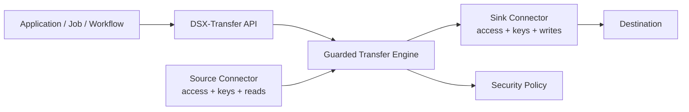
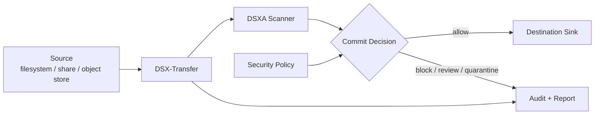
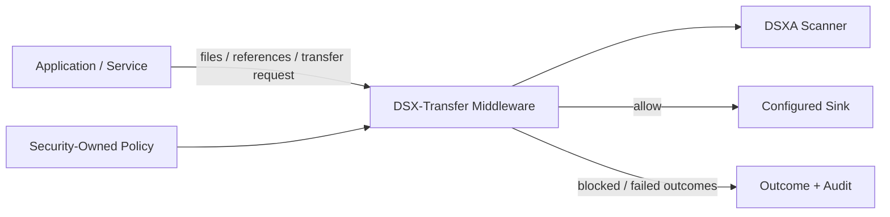
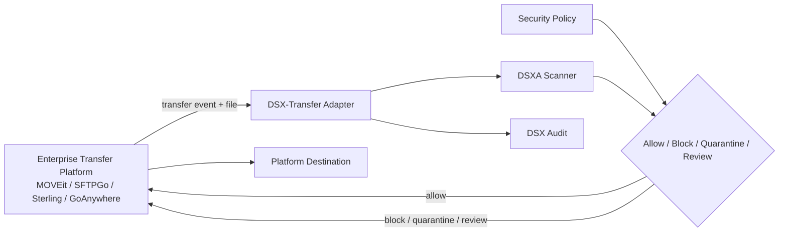

# Why DSX-Transfer

## Slide 1 - Title

**Why DSX-Transfer**

Guarded file movement for enterprise applications, DevOps workflows, and transfer platforms.

```text
Source -> DSX-Transfer -> Destination
          scan + policy + decision + audit
```

---

## Slide 2 - The Market Gap

Enterprise file transfer is a large operational category, but the market is underserved from a security-enforcement perspective.

Managed File Transfer and Enterprise File Transfer Management platforms focus on:

- transfer orchestration
- user and partner workflows
- protocols and routing
- scheduling and delivery
- operational reporting

They are not primarily designed around malware-aware, policy-enforced, scan-before-commit destination protection.

---

## Slide 3 - MFT Solves Movement, Not Security Enforcement

Traditional transfer platforms are good at getting files from point A to point B.

The hard security questions are still left open:

- Should this file be allowed to land?
- Which policy applies?
- What happens to malicious, unknown, or non-compliant files?
- Who owns remediation?
- Where is the audit record?
- Can the destination be treated as clean?

DSX-Transfer is built around those questions.

---

## Slide 4 - DSXA Is Necessary, But Not Enough

DSXA is the scanner.

It gives applications a powerful file scanning capability, but it is still a widget in the larger file-flow problem.

If every application developer calls DSXA directly, every team must rebuild:

- file enumeration
- streaming and retry behavior
- scan concurrency
- verdict-to-policy mapping
- allow/block/quarantine decisions
- remediation handling
- audit and reporting
- checkpoint and resume behavior
- destination commit safety

That model does not scale.

---

## Slide 5 - The Problem With App-Owned File Security

Relying on every application team to correctly implement guarded file movement is untenable.

Application teams should not have to become file security platform teams.

They will make different choices about:

- what verdicts mean
- how unknown files are handled
- how failures are retried
- where audit logs go
- which secrets can access destinations
- when a file is safe to commit

The result is fragmented security behavior across the enterprise.

---

## Slide 6 - DSX-Transfer Separates Responsibilities

DSX-Transfer creates a clean split:

| Team | Responsibility |
| --- | --- |
| Application developers | Build the application and request file movement |
| DevOps / platform teams | Configure source, sink, runtime, and deployment |
| Security teams | Own transfer policy, scanner posture, and enforcement rules |
| DSX-Transfer | Execute guarded file flow, commit decisions, audit, and remediation hooks |

This makes file movement a platform capability instead of per-application custom security code.

---

## Slide 7 - What The App Developer Sees

The application developer should not need to manage the full file security lifecycle.

They should only need to say:

```text
Move these files.
Use this source.
Use this destination sink.
Use the configured transfer policy.
Return the outcome.
```

The actual file flow is transparent to the application.

The application gets outcomes, not a pile of scanner, credential, audit, retry, and remediation logic.

---

## Slide 8 - What Security Owns

Security owns policy.

Security defines:

- benign, malicious, suspicious, unknown, and error actions
- file type blocks
- quarantine or review rules
- scanner configuration expectations
- audit and visibility requirements
- what constitutes a clean destination

Application developers do not need to reinterpret scanner results in every codebase.

---

## Slide 9 - What DSX-Transfer Owns

DSX-Transfer owns the guarded file-flow lifecycle:

```text
plan -> read -> scan -> evaluate policy -> commit or block -> audit -> checkpoint
```

It handles:

- source adapters
- sink adapters
- scanner calls
- bounded concurrency
- retry and failure handling
- allow/block decisions
- destination writes
- audit records
- checkpoints and run reports

This is the missing layer between "scanner result" and "safe file movement."

---

## Slide 10 - Connector-Backed Sources And Sinks

Sources and sinks can be backed by DSX connector capabilities.

That gives application developers a common transfer API regardless of where files live:

```text
transfer(source, sink, policy)
```

The application does not need to know whether the source or sink is:

- filesystem
- GCS
- S3
- Azure Blob
- SharePoint
- OneDrive
- another connector-backed repository

Connectors handle platform-specific access, keys, permissions, paging, object identity, and read/write mechanics.

DSX-Transfer gives the app one guarded movement contract.

---

## Slide 11 - Common API, Platform-Specific Access



This is the separation of responsibility:

- app developers use one API
- connectors own source and sink access
- security owns policy
- DSX-Transfer owns guarded file flow

---

## Slide 12 - Native Transfer Mode

In native mode, DSX-Transfer owns the transfer path.



Use this when DSX-Transfer should provide the guarded transfer engine directly.

---

## Slide 13 - Middleware Mode

In middleware mode, applications or services submit files, references, or transfer requests.



The caller does not need to own scanner orchestration, policy interpretation, destination secrets, or audit mechanics.

---

## Slide 14 - Transfer Platform Adapter Mode

In adapter mode, an existing transfer product keeps owning orchestration.

DSX-Transfer owns the security decision.



This lets DSX-Transfer secure the transfer path without replacing the customer's transfer platform.

---

## Slide 15 - Why Not Just Call DSXA Directly?

Direct DSXA calls are useful when an app only needs scanning as a service.

But guarded transfer needs more than scanning:

- policy
- destination commit control
- remediation behavior
- audit
- secrets
- retries
- concurrency
- checkpointing
- operational visibility

DSX-Transfer turns DSXA from a scanner widget into a complete transfer enforcement layer.

---

## Slide 16 - The Value Proposition

DSX-Transfer gives customers:

- clean destination enforcement
- consistent security policy across file movement paths
- one application API across many source and sink types
- connector-managed access, credentials, and repository mechanics
- less custom security code in applications
- separation of app, platform, and security responsibilities
- reusable integrations for MFT and migration platforms
- audit-ready transfer outcomes
- a practical path from DSXA scanning to enterprise file-flow security

---

## Slide 17 - Positioning Statement

DSX-Transfer is not trying to replace MFT platforms.

It secures the transfer decision they were not built to own.

```text
MFT owns orchestration.
Applications own business logic.
Connectors own source and sink access.
Security owns policy.
DSX-Transfer owns guarded file movement.
```

**DSX-Transfer: scan-before-commit security for files in motion.**
