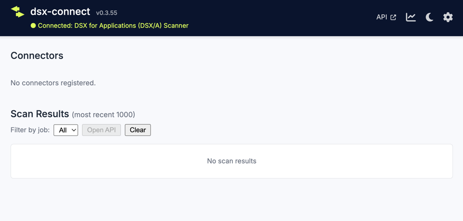
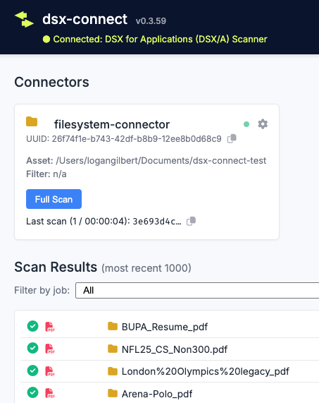

# Deploying DSX-Connect with Docker Compose

This guide walks you through running **DSXA**, **DSX-Connect Core**, and a **Filesystem Connector** locally using Docker Compose.

By the end, you will:

* See the DSX-Connect Console running
* Complete your first scan

---

## Prerequisites

* Docker installed ([Docker Install Reference](../reference/installations/dockerinstalls.md))  
* DSXA scanner token from Deep Instinct
* The DSX-Connect compose bundle downloaded

---

## 1) Download and Extract the Bundle

Download the latest release bundle from the
[DSX-Connect releases page](https://github.com/deep-instinct/dsx-connect/releases).

Grab the asset named:

```
dsx-connect-compose-bundle-<version>.tar.gz
```

Extract it:

```bash
tar -xzf dsx-connect-compose-bundle-<version>.tar.gz
```
```bash
cd dsx-connect-<version>
```

You should now see:

```
docker-compose-dsxa.yaml
docker-compose-dsx-connect-all-services.yaml
sample.core.env
sample.dsxa.env
filesystem-connector-<version>/
...
```

---

## 2) Prepare the Shared Docker Network

Create the shared bridge network (only needed once):

```bash
docker network create dsx-connect-network
```

Verify:

```bash
docker network ls
```

You should see:

```
dsx-connect-network   bridge
```

---

## 3) Start DSXA (Scanner)

### Copy the sample environment file

```bash
cp sample.dsxa.env .dsxa.env
```

Edit `.dsxa.env` and set:

```dotenv
DSXA_IMAGE=<location of dsxa image repo>
APPLIANCE_URL=<your-DI-appliance>.deepinstinctweb.com
TOKEN=<your-DI-appliance-token>
SCANNER_ID=<your-scanner-id>
#HOST_PORT=5000
```

!!! note "APPLIANCE_URL"
    The URL should be in the format: `<your-DI-appliance>.deepinstinctweb.com` No "https://"!

!!! tip
    Environment files may contain sensitive values.
    Never commit them to source control.

### Launch DSXA

```bash
docker compose --env-file .dsxa.env -f docker-compose-dsxa.yaml up -d
```

!!! tip "Troubleshooting Tip" 
    To see DSXA logs on the stdout, run without `-d` (detached).  This is useful for troubleshooting DSXA launch issues, as you can see the logs immediately.  Once you ctrl-c out of the logs, the container will stop. 

### Verify DSXA Started

```bash
docker ps
```

You should see a container similar to:

```
CONTAINER ID   IMAGE                              COMMAND                  CREATED          STATUS          PORTS                                       NAMES
393391645b43   dsxconnect/dpa-rocky9:4.1.1.2020   "/bin/bash -c 'sourc…"   16 minutes ago   Up 16 minutes   0.0.0.0:5000->5000/tcp, :::5000->5000/tcp   dsx-connect-0375-dsxa_scanner-1
```

Check logs - copy the container name or use the container ID from above:

```bash
docker logs <container name/id>
```

Look for:

```
Classifier initialized. Result: true
```

✅ If you see this, DSXA is ready.

---

## 4) Start DSX-Connect Core

### Copy the core environment file

```bash
cp sample.core.env .core.env
```

Edit `.core.env` if needed (image tag, optional auth settings).

### Launch Core

```bash
docker compose --env-file .core.env -f docker-compose-dsx-connect-all-services.yaml up -d
```

---

## 5) Verify the Console

Check services:

```bash
docker compose -f docker-compose-dsx-connect-all-services.yaml ps
```

Open your browser:

```
http://localhost:8586
```

You should see the DSX-Connect Console.



Look for the **“Connected”** status indicating DSXA is reachable.

✅ If connected, Core and DSXA are working together.

---

## 6) Add the Filesystem Connector

Now we’ll scan a local folder.

### Create a test folder

```bash
mkdir -p ~/Documents/dsx-connect-test
```

Optionally drop a few files into the folder.

---

### Configure the connector

```bash
cd filesystem-connector-<version>
cp sample.filesystem.env .filesystem.env
```

Edit `.filesystem.env`:

```dotenv
DSXCONNECTOR_ASSET=</path/to/scan/directory>
DSXCONNECTOR_ITEM_ACTION_MOVE_METAINFO=</path/to/scan/directory>/dsxconnect-quarantine
#DSXCONNECTOR_ITEM_ACTION=move
```

If `move` is enabled, detected files will be placed in the quarantine folder.

---

### Start the connector

```bash
docker compose \
  --env-file .filesystem.env \
  -f docker-compose-filesystem-connector.yaml \
  up -d
```

Within seconds, the connector registers automatically.

---

## 7) Run Your First Scan

1. Open `http://localhost:8586`
2. Go to **Connectors**
3. Select the Filesystem connector
4. Click:

    * **Preview** (confirm files detected)
    * **Sample Scan** or **Full Scan**



You should see scan results populate.

✅ If results appear, your local stack is fully operational.

---

## Success 🎉

You now have:

* DSXA running
* DSX-Connect Core running
* A Connector registered
* A completed scan

---

## Next Steps
* Kubernetes deployment quickstart [K8s Deployment Quickstart]()
* Learn about DSX-Connect Architecture [Core Concepts](../concepts/architecture.md)
* Learn about [Connectors](../concepts/connectors.md)

[//]: # (* Configure [Authentication]&#40;concepts/authentication.md&#41;)

[//]: # (* Enable [TLS / HTTPS]&#40;concepts/tls.md&#41;)

[//]: # (* Tune performance with Job Comparison)

[//]: # (* Deploy to Kubernetes)

---

## Tear Down (Optional)

```bash
docker compose -f docker-compose-dsx-connect-all-services.yaml down
docker compose -f docker-compose-dsxa.yaml down
docker compose -f filesystem-connector-<version>/docker-compose-filesystem-connector.yaml down
```
