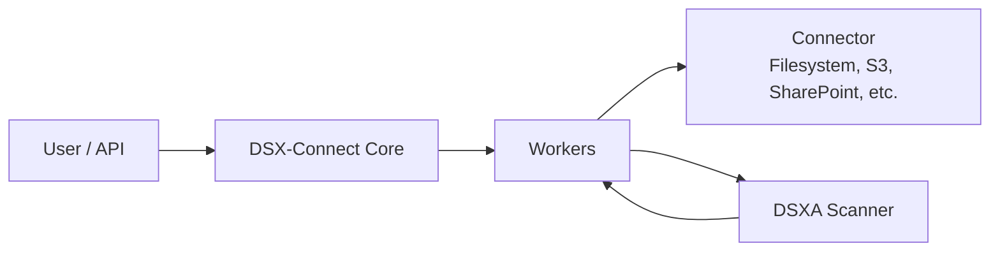

# Getting Started: Overview

DSX-Connect enables you to scan files using Deep Instinct’s DSXA engine through a flexible connector framework.

In the next few steps, you will:

* Deploy **DSXA (scanner)**
* Deploy **DSX-Connect Core**
* Register a Connector
* Run your first scan

The goal is simple:
**scan real files in your environment as quickly as possible.**

---

## Architecture at a Glance

Regardless of platform, the components are the same:

* **DSXA** performs scanning.
* **DSX-Connect Core** manages jobs and results.
* **Connectors** retrieve files from data sources.

Docker and Kubernetes differ only in how these components are deployed — not in how they function.

---

## Choose Your Deployment Path

### Docker Quickstart (Fastest Path)

Best for:

* Local development
* Evaluation
* Rapid testing

Runs everything on your machine using Docker Compose.

➡️ **Start here:** [Docker Quickstart](docker-quickstart.md)

---

### Kubernetes Quickstart (Helm)

Best for:

* Cluster-based environments
* Production-style deployments
* Scaling and high availability

Deploys via Helm charts into your Kubernetes cluster.

➡️ **Start here:** [Kubernetes Quickstart](kubernetes-quickstart.md)

---

## What Happens Next?

Once your first scan succeeds, you can:

* Dig Deeper into deployment options for DSX-Connect core
* Enable Authentication
* Configure TLS / HTTPS
* Tune performance
* Add additional connectors
* Scale for production workloads

