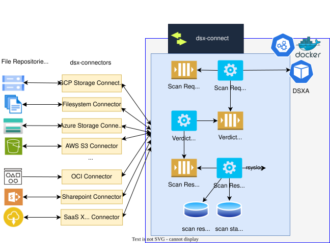

#

  

  Protect and govern files across every repository.

  DSX-Connect is the repository and file-governance layer for
  <strong>Deep Instinct’s <a href="https://www.deepinstinct.com/dsx/dsx-applications">DSX for Applications</a></strong>.
  It connects cloud, SaaS, on-premises, and application-owned repositories to consistent scanning, policy, and remediation workflows.

  Use it to monitor repositories, scan repository contents, or govern file movement between approved repositories.

  

## Three Ways To Use DSX-Connect

### 1. Monitor Repositories

Continuously watch repositories for new and changed files, while using baseline or full scans to establish coverage. Connectors handle repository-specific events, enumeration, credentials, and state so protection can converge over time.

Start with the [Connector Model](concepts/connectors.md), then see the [Filesystem monitoring guidance](deployment/kubernetes/filesystem.md#monitoring-settings-kubernetes).

### 2. Scan Repositories

Run on-demand, scheduled, event-driven, or full-repository scans across cloud storage, SaaS platforms, fileshares, and mounted filesystems. DSX-Connect dispatches work to DSXA and exposes durable job state, results, retries, and operational metrics.

Start with the [Docker Compose Quickstart](getting-started/docker-quickstart.md) or [Kubernetes (Helm) Quickstart](getting-started/kubernetes-quickstart.md).

### 3. Govern File Movement Between Repositories

Give applications one controlled way to move files into, out of, and between approved repositories. DSX-Connect centralizes repository access, scanning, policy decisions, remediation, audit context, and delivery instead of making each application implement its own file-security workflow.

Read the [Normalized Enterprise File Gateway strategy](dsx-connect-2/strategy/normalized-enterprise-file-gateway.md) and [Gateway Access Control Model](dsx-connect-2/strategy/gateway-access-control.md).

## What DSX-Connect Provides

* A reusable, event-driven scanning core built for predictable scale
* Pluggable connectors for cloud storage, SaaS platforms, and filesystems
* Repository monitoring, on-demand scans, and full-scan workflows
* Governed file movement for application workflows
* Fault-tolerant execution with durable queues and retry handling
* Portable deployment via Docker Compose or Kubernetes (Helm)
* Seamless integration with DSX for Applications’ deep-learning malware detection

Whether protecting an existing repository or enforcing policy in an application file flow, DSX-Connect applies consistent malware prevention and governance wherever data moves.

## Who This Is For

This documentation is intended for:

- Security engineers deploying file scanning across repositories
- Platform engineers operating DSX-Connect at scale
- DevOps teams integrating DSX-Connect into CI/CD or cloud workflows
- Architects evaluating deployment models

## About the Documentation

The DSX-Connect documentation is organized by role and lifecycle stage.

If you are new to DSX-Connect:

* Start with **Getting Started** for a quick deployment.
* Review **Core Concepts** to understand architecture, connectors, and performance.

If you are deploying:

* Use **Deployment** for Docker Compose or Kubernetes (Helm).
* See **Choosing Your Deployment** to understand the trade-offs.

If you are operating at scale:

* Use **Operations** for performance tuning, logging, monitoring, and upgrades.
* Refer to **Scaling & Performance (Kubernetes)** for infrastructure-level scaling.

If you need configuration details:

* Use **Reference** for environment variables, Helm values, and API definitions.

This structure separates:

* System concepts
* Deployment mechanics
* Operational procedures
* Reference material

So you can quickly find what you need.

---

## Quick Links

### 🚀 Getting Started

* [Overview](getting-started/index.md)
* [Docker Compose Quickstart](getting-started/docker-quickstart.md)
* [Kubernetes (Helm) Quickstart](getting-started/kubernetes-quickstart.md)

### 🧠 Core Concepts

* [Architecture Overview](concepts/architecture.md)
* [Connector Model](concepts/connectors.md)
* [Performance & Throughput](concepts/performance.md)
* [Choosing Your Deployment](concepts/deployment-models.md)

### ⚙️ Deployment

* [Docker Compose Overview](deployment/docker/index.md)
* [Kubernetes (Helm) Deployment](deployment/kubernetes/dsx-connect.md)
* [Scaling & Performance (Kubernetes)](deployment/kubernetes/scaling.md)

### 🔧 Operations

* [Performance Tuning](operations/performance-tuning-job-comparisons.md)
* [Quarantine and Remediation](operations/quarantine-and-remediation.md)
* [Syslog Forwarding](operations/syslog.md)

### 👩‍💻 Developer's Guide

* [Developer Overview](developer/index.md)
* [DSXA SDK](developer/dsxa-sdk.md)

### 📚 Reference

* [Configuration Reference](deployment/kubernetes/configuration-reference.md)
* [Environment Variables](deployment/kubernetes/configuration-reference.md#global-settings)
* [Filters Reference](reference/filters.md)

### 📦 Releases

* [Docker Compose Bundles](https://github.com/deep-instinct/dsx-connect/releases)
* [Docker Hub Images](https://hub.docker.com/repositories/dsxconnect)
* [GitHub Repository](https://github.com/deep-instinct/dsx-connect)
