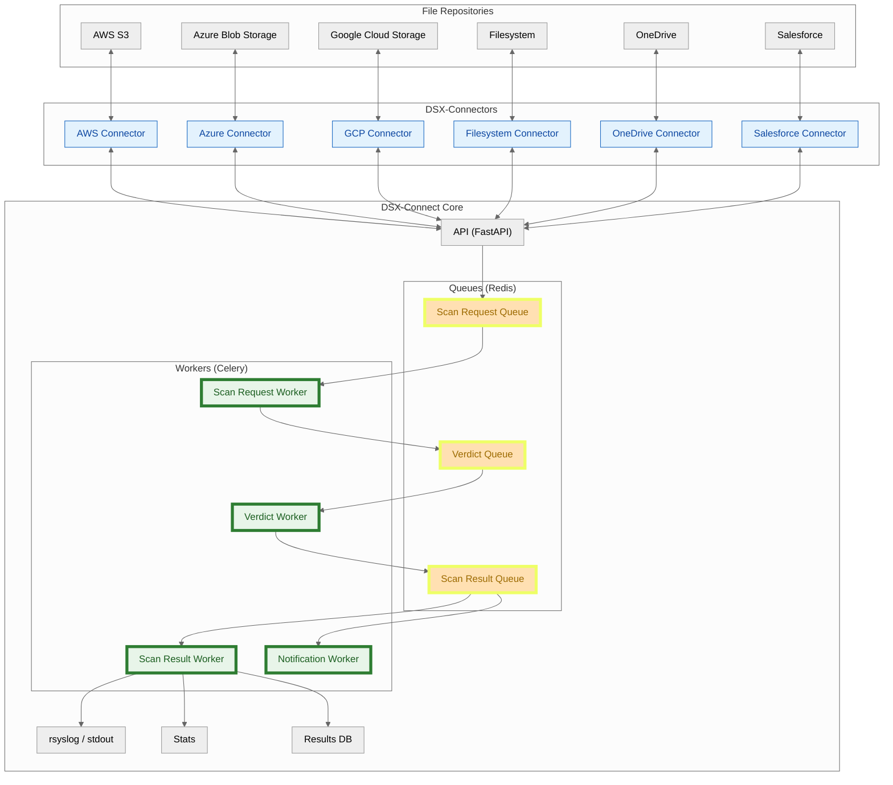
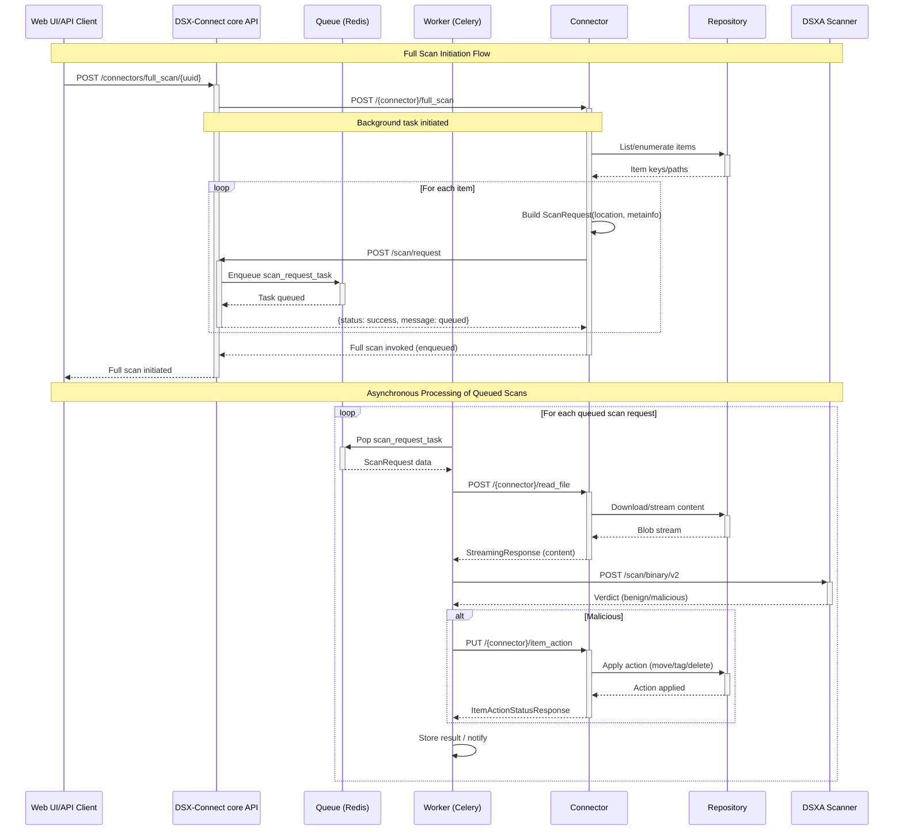

# DSX‑Connect Architecture

DSX‑Connect is a modular integration framework that orchestrates safe, scalable file scanning and remediation while remaining completely agnostic to specific repository integrations. The core “scan brain” handles queuing, parallelism, and remediation; DSX‑Connectors adapt repositories (Filesystem, S3, GCS, SharePoint/OneDrive, GitHub, etc.) to a simple, consistent API. It extends **Deep Instinct's** [**DSX for Applications**](https://www.deepinstinct.com/dsx/dsx-applications){: target="_blank" rel="noreferrer" } to any repository or service.

## Key Components

- **DSX‑Connect (Core):**
  - Receives scan requests, fetches file content from connectors, invokes scanning, and applies remediation.
  - Scales from one file to billions using queues and horizontally scalable workers.
  - Integration‑agnostic: depends only on a stable connector API.

- **DSX‑Connectors (Connectors):**
  - Connectors implement a consistent API and focus on the specifics of a repository.
  - Easily extendable: add new connectors to support new repositories.
  - Stateless and can be deployed independently.

*Figure 1: High-level conceptual architecture diagram*

## Docker Image Repository

If you need to mirror or pull images directly, images for dsx-connect core and connectors are published at Docker Hub under `dsxconnect/*` (https://hub.docker.com/repositories/dsxconnect). Examples:

- Core: `dsxconnect/dsx-connect`
- Connectors: `dsxconnect/filesystem-connector`, `dsxconnect/aws-s3-connector`, `dsxconnect/azure-blob-storage-connector`, etc.

If your environment requires an internal registry, mirror from that namespace and update image references in docker compose or helm deployments accordingly. The rest of this guide assumes access to the `dsxconnect` Docker Hub repo.

## Architecture Advantages

- **Clear delineation:** DSX-Connect core orchestrates scanning, verdict handling, logging, etc...; connectors handle repository specific semantics (list/read/actions).
- **Event‑driven:** Queues decouple enumeration, scanning, and remediation for high throughput and resilience.
- **Fault tolerant & HA:** Retries with exponential backoff, dead letter queues (DLQ), graceful degradation.
- **Scalable:** Core Worker pools handle parallelism and scaling; connectors operate independently.
- **Flexible:** Add new repositories by writing a connector; core components stay the same.
- **Consistent & pluggable:** All connectors share the same API contract; updating one doesn’t disrupt others.
- **Observability:** Health endpoints, queue metrics, DLQ management, structured logs.

## What’s Running Under the Hood

The following diagram demonstrates the workflow of a scan request, from the UI/API client to the results logged/stored in the database.  Scan requests are 
entered into a queue, which is processed by a Scan Request Worker pool.  The Scan Request Worker fetches the file content from the connector, 
sends it to DSXA for scanning, and writes the verdict to a Verdict Queue.  The Verdict Worker reads the verdict from the 
Verdict Queue, runs the item action (if any), and writes the scan result to a Scan Result queue.  The Scan Result Worker reads 
the scan result from the queue, logs to rsyslog and persists it in the database.  Not shown: Notification Queue and Notification Worker -
used to broadcast scan results and job progress to subscribers (SSE/UI and other sinks, including the dsx-connect Console).

*Figure 2: Scan flow diagram - note: not a complete list of repositories supported*

- **Repositories:** The data sources that DSX-Connectors connect to.
- **DSX-Connectors:** Images that implement the DSX-Connector API and integrate with a specific repository type (e.g., AWS S3, Azure Blob Storage, GCP Storage, Filesystem, etc.).
- **DSX-Connect Core:** The core orchestration engine that handles scan requests, verdict handling, and remediation.

- **API/UI (FastAPI):** Fronts the core API and UI, kicks off jobs, registers connectors, and exposes health/metrics.
- **Redis (three roles):**
    - **Queue:** Celery uses Redis as the broker for scan jobs, verdict jobs, and progress updates.
    - **State:** Job progress, counters, and recent status snapshots live in Redis for quick reads.
    - **Results DB/Stats:** Persists scan results and statistics for UI/API retrieval.
- **Workers (Celery):** Separate pools so you can scale or troubleshoot each:
    - **Scan Request Worker:** Dequeues scan requests, calls connectors’ `read_file`, streams content, and sends to DSXA for verdicts. (Maps to Scan Request Worker in the diagram.)
    - **Verdict Worker:** Dequeues verdicts, runs connector `item_action` on malicious files, and writes scan results. (Verdict Worker in the diagram.)
    - **Scan Result Worker:** Persists and notifies listeners about completed results. (Scan Result Worker in the diagram.)
    - **Notification Worker:** Broadcasts scan results and job progress to subscribers (SSE/UI and other sinks).
- **Logging & telemetry:** rsyslog/stdout for logs; queue metrics, health endpoints, and DLQ views for operational visibility.

## Sequence: Full Scan - Processing by Scan Request Worker

## Deployment Models

- **Docker Compose:** Ideal for evaluations and minimal production deployments.
- **Kubernetes + Helm:** Scalable, resilient, and portable across AKS/EKS/GKE/OKE. Integrates with HA Redis, object storage, and logging.  Ideal for 
   production environments connected to multiple repositories of the same or different types, high availability a necessity.

Both models use the same container images and configuration patterns, easing promotion from test to prod.

See [Deployment Advanced Settings](deployment/advanced.md) for environment options and worker retry policies.

## Fault Tolerance & High Availability

- **Retries & DLQ:** Intelligent retries per failure type (connector/DSXA/timeouts/rate limits). DLQ preserves failed tasks for reprocessing.
- **Graceful degradation:** Continue accepting/queuing when downstreams are degraded; resume automatically.
- **HA patterns:** Stateless workers; shared queues; multiple API replicas; connectors operate independently.
