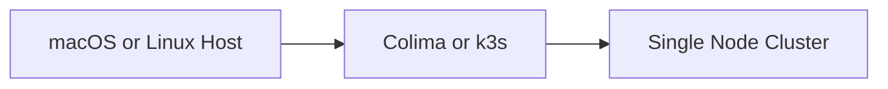
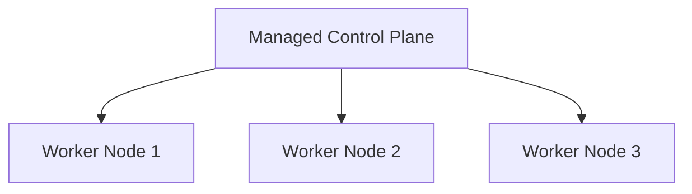

# Kubernetes Installation

Kubernetes is an ecosystem, not a single product.

There are many Kubernetes distributions and platforms available, including managed cloud services, enterprise distributions, and lightweight local environments.

DSX-Connect supports any conformant Kubernetes cluster.

This page focuses on recommended installations for:

- Local development
- Testing environments
- Lab deployments
- Lightweight production use cases

Enterprise production environments should use a managed Kubernetes platform.

---

## Supported Kubernetes Platforms

Kubernetes platforms generally fall into three categories:

### Managed Cloud Platforms

- Amazon EKS
- Azure AKS
- Google GKE
- Red Hat OpenShift

These platforms provide:

- Managed control planes
- High availability
- Integrated cloud networking
- Enterprise security features
- Automated upgrades

Recommended for enterprise production workloads.

---

### Lightweight Local and Edge Platforms

- Colima (macOS)
- k3s (Linux)
- Minikube
- Kind
- MicroK8s

These platforms are appropriate for development, testing, and smaller deployments.

This guide standardizes on:

- **Colima for macOS**
- **k3s for Linux**

---

## macOS Installation — Colima (Recommended)

Colima provides a lightweight Linux virtual machine with containerd and optional Kubernetes support.

It offers:

- Minimal resource overhead
- Clean runtime model
- Native `kubectl` compatibility
- Production-like behavior

### Install

```bash
brew install colima kubectl
````

### Start Kubernetes

```bash
colima start --kubernetes
```

### Verify

```bash
kubectl get nodes
```

A single-node cluster should report `Ready`.

---

## Linux Installation — k3s (Recommended)

k3s is a lightweight, CNCF-certified Kubernetes distribution designed for:

* Edge environments
* Single-node deployments
* Resource-constrained systems
* Lightweight production

### Install

```bash
curl -sfL https://get.k3s.io | sh -
```

### Verify

```bash
sudo k3s kubectl get nodes
```

To use standard `kubectl`:

```bash
sudo cp /etc/rancher/k3s/k3s.yaml ~/.kube/config
```

k3s supports both single-node and multi-node configurations.

For enterprise-grade high availability, use a managed Kubernetes platform.

---

## Windows

There is no widely adopted native lightweight Kubernetes distribution for Windows equivalent to k3s.

Recommended approaches:

* Docker Desktop (WSL2 backend)
* A Linux virtual machine
* Remote access to a Linux-based cluster

Windows environments are typically used for development, not production hosting.

---

## Cluster Topology Overview

### Local or Lightweight Deployment



Characteristics:

* Single-node
* Control plane and workloads on same host
* Suitable for development and edge deployments
* No node-level high availability

---

### Enterprise Production Deployment



Characteristics:

* Distributed worker nodes
* High availability
* Horizontal scalability
* Rolling updates
* Automated infrastructure management

---

## Kubernetes UI and Cluster Management

Lightweight distributions such as Colima and k3s do not include a built-in graphical user interface.

Cluster management is typically performed using:

* `kubectl`
* Terminal-based tools
* Observability stacks

### Recommended Tool: k9s

k9s is a terminal UI for Kubernetes clusters.

[https://k9scli.io/](https://k9scli.io/)

It provides:

* Pod inspection
* Log streaming
* Resource navigation
* Context switching
* Port forwarding
* Real-time status views

k9s works with:

* Local clusters
* Remote clusters
* Managed cloud platforms
* Production environments

For most DSX-Connect deployments, k9s provides sufficient operational visibility without requiring a browser-based dashboard.

---

## Minikube and Kind

Minikube and Kind are fully supported Kubernetes environments.

They are widely used and compatible with DSX-Connect.

They are not the primary recommendations for this guide because:

* Minikube is primarily optimized for learning and experimentation.
* Kind is optimized for CI pipeline testing and ephemeral clusters.
* k3s and Colima more closely reflect production runtime behavior.

Minikube and Kind remain valid alternatives.

---

## Deployment Guidance for DSX-Connect

| Scenario               | Recommended Platform        |
| ---------------------- | --------------------------- |
| macOS Development      | Colima                      |
| Linux Development      | k3s                         |
| CI Validation          | Kind                        |
| Learning Kubernetes    | Minikube                    |
| Lightweight Production | k3s                         |
| Enterprise Production  | EKS / AKS / GKE / OpenShift |

For most users:

* Use Colima on macOS.
* Use k3s on Linux.
* Use a managed Kubernetes service for enterprise production environments.

---

## Validation

After installation, confirm cluster readiness:

```bash
kubectl get nodes
kubectl get pods -A
```

Nodes must report `Ready` before deploying DSX-Connect.

