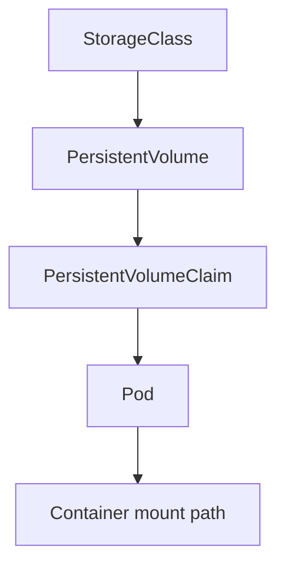
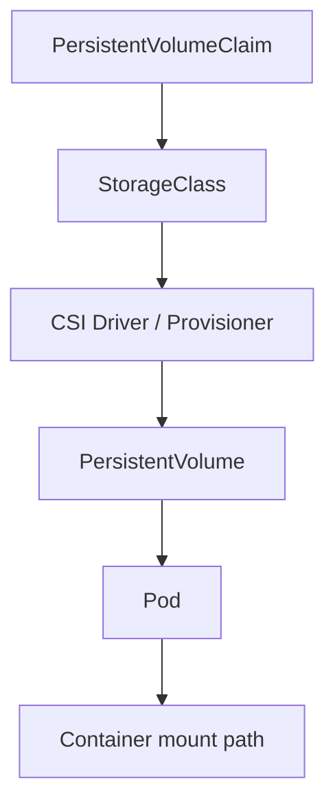
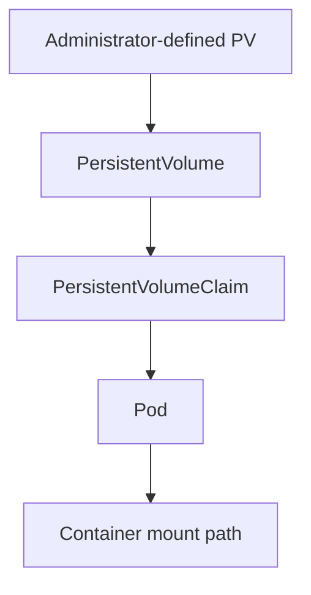

# Kubernetes Storage Reference

This reference page explains how Kubernetes provides storage to workloads and how that storage is commonly used by DSX-Connect connectors such as the **Filesystem connector**.

Many DSX-Connect deployment guides assume storage already exists. Use this page when you need background on:

- `StorageClass`
- `PersistentVolume` (PV)
- `PersistentVolumeClaim` (PVC)
- dynamic provisioning
- SMB-backed storage on k3s

---

## Kubernetes Storage at a Glance

Most Kubernetes storage flows through these layers:



In practice:

* **StorageClass** defines *how* storage is provisioned
* **PersistentVolume (PV)** represents the actual storage resource
* **PersistentVolumeClaim (PVC)** is the application request for storage
* the **Pod** mounts the PVC into the container filesystem

---

## Dynamic Provisioning vs Static Provisioning

Kubernetes storage is usually provided in one of two ways.

### Dynamic provisioning

With dynamic provisioning, the cluster uses a **StorageClass** and a CSI driver or provisioner to create storage automatically when a PVC is created.



This is the most common pattern in modern clusters.

### Static provisioning

With static provisioning, an administrator creates the **PersistentVolume** ahead of time, and the PVC binds to that existing volume.

This is useful for pre-existing storage and shares that is not managed by Kubernetes - i.e. a NAS appliance, file server (NFS/SMB).



This pattern is still useful for local development, pre-existing shares, and simple `hostPath`-style setups.

---

## Core Concepts

### StorageClass

A **StorageClass** defines how storage should be provisioned in the cluster.

Examples of what a StorageClass can represent:

* an SMB CSI driver
* an NFS CSI driver
* a cloud file service
* a distributed storage platform such as Longhorn or CephFS

StorageClass implementations are platform-specific.

### PersistentVolume (PV)

A **PersistentVolume** is the actual storage resource Kubernetes can mount.

Depending on the environment, a PV might map to:

* an SMB share
* an NFS export
* a cloud-backed volume
* a local host path

With dynamic provisioning, PVs are usually created automatically.

### PersistentVolumeClaim (PVC)

A **PersistentVolumeClaim** is what applications request.

Example:

```yaml
apiVersion: v1
kind: PersistentVolumeClaim
metadata:
  name: example-pvc
spec:
  accessModes:
    - ReadWriteMany
  storageClassName: smb-csi
  resources:
    requests:
      storage: 100Gi
```

Pods do not normally mount PVs directly. They mount PVCs.

---

## Access Modes

Common access modes include:

* `ReadWriteOnce` (`RWO`) — one node can mount read/write
* `ReadWriteMany` (`RWX`) — multiple nodes can mount read/write
* `ReadOnlyMany` (`ROX`) — multiple nodes can mount read-only

For shared filesystem-style access across multiple pods or nodes, `RWX` is usually required.

!!! note
    `RWX` support depends on the storage backend. Not every StorageClass supports it.

---

## k3s Storage Notes

k3s ships with the **local-path** provisioner by default, which is useful for node-local development storage. Shared backends such as **SMB** or **NFS** require additional drivers or provisioners. ([docs.k3s.io][1])

That means:

* for simple single-node local testing, `local-path` may be enough
* for shared filesystem storage, you usually install an SMB or NFS CSI driver

---

## Example: SMB Storage on k3s

This example shows how to use the **SMB CSI driver** to expose an SMB share to pods in a k3s cluster.

Use this pattern when your storage lives on:

* a Windows file server
* a NAS appliance
* another SMB-accessible file share

!!! note "Before you start"
    This example assumes you already have:

    1. an existing SMB server/share
    2. credentials that can access that share
    3. Helm installed on your admin machine

The upstream SMB CSI driver supports dynamic provisioning against an existing SMB server/share. 


### 1. Install the SMB CSI driver

```bash
helm repo add csi-driver-smb https://raw.githubusercontent.com/kubernetes-csi/csi-driver-smb/master/charts
helm repo update

kubectl create namespace kube-system --dry-run=client -o yaml | kubectl apply -f -

helm install csi-driver-smb csi-driver-smb/csi-driver-smb \
  --namespace kube-system
```

You can check the status of the driver with:
```bash
kubectl get csidrivers
```

```markdown
NAME             ATTACHREQUIRED   PODINFOONMOUNT   STORAGECAPACITY   TOKENREQUESTS   REQUIRESREPUBLISH   MODES                  AGE
smb.csi.k8s.io   false            true             false             <unset>         false               Persistent,Ephemeral   36s
```


!!! note
    The upstream chart README shows installation into `kube-system` and documents available chart versions.

### 2. Install SMB client utilities on each node

The CSI node plugin needs SMB client utilities available on the node OS.

Ubuntu / Debian:

```bash
sudo apt-get update
sudo apt-get install -y cifs-utils
```

RHEL / Rocky / AlmaLinux:

```bash
sudo dnf install -y cifs-utils
```

### 3. Create an SMB credentials secret

Create a secret with credentials for the share.

`smb-secret.yaml`

```yaml
apiVersion: v1
kind: Secret
metadata:
  name: smbcreds
  namespace: default
type: Opaque
stringData:
  username: myuser
  password: mypassword
```

Apply it:

```bash
kubectl apply -f smb-secret.yaml
```

### 4. Create an SMB StorageClass

This is where the share location is defined for dynamic provisioning.

`smb-storageclass.yaml`

```yaml
apiVersion: storage.k8s.io/v1
kind: StorageClass
metadata:
  name: smb-csi
provisioner: smb.csi.k8s.io
parameters:
  source: "//192.168.1.10/shared"
  csi.storage.k8s.io/provisioner-secret-name: smbcreds
  csi.storage.k8s.io/provisioner-secret-namespace: default
  csi.storage.k8s.io/node-stage-secret-name: smbcreds
  csi.storage.k8s.io/node-stage-secret-namespace: default
reclaimPolicy: Delete
volumeBindingMode: Immediate
mountOptions:
  - dir_mode=0777
  - file_mode=0777
  - vers=3.0
```

Apply it:

```bash
kubectl apply -f smb-storageclass.yaml
```

### 5. Create a PVC

Now request storage from that StorageClass.

`scan-pvc.yaml`

```yaml
apiVersion: v1
kind: PersistentVolumeClaim
metadata:
  name: dsxconnect-scan-pvc
spec:
  accessModes:
    - ReadWriteMany
  storageClassName: smb-csi
  resources:
    requests:
      storage: 100Gi
```

Apply it:

```bash
kubectl apply -f scan-pvc.yaml
```

Check status:

```bash
kubectl get pvc
```

You want to see `STATUS: Bound`.

### 6. Test the volume in a pod

Before using the volume with DSX-Connect, it is often helpful to verify the mount in a simple test pod.

`storage-test.yaml`

```yaml
apiVersion: v1
kind: Pod
metadata:
  name: storage-test
spec:
  containers:
    - name: test
      image: busybox
      command: ["sleep", "3600"]
      volumeMounts:
        - name: storage
          mountPath: /mnt/storage
  volumes:
    - name: storage
      persistentVolumeClaim:
        claimName: dsxconnect-scan-pvc
```

Apply it:

```bash
kubectl apply -f storage-test.yaml
kubectl exec -it storage-test -- ls -la /mnt/storage
```

---

## Using the PVC with DSX-Connect

For the Filesystem connector Helm chart, reference the claim like this:

```yaml
scanVolume:
  enabled: true
  existingClaim: dsxconnect-scan-pvc
  mountPath: /app/scan_folder

env:
  DSXCONNECTOR_ASSET: /app/scan_folder
```

This means:

* Kubernetes mounts the PVC into the pod
* the mounted filesystem appears at `/app/scan_folder`
* the Filesystem connector scans that in-container path

---

## hostPath for Single-Node Development

For quick local development on a single-node cluster, you can also use `hostPath`.

This bypasses the StorageClass-driven provisioning path and mounts a node-local directory directly into the pod.

```mermaid
flowchart TD
    NODE[Node filesystem path]
    PV[PersistentVolume]
    PVC[PersistentVolumeClaim]
    POD[Pod]
    PATH[/Container mount path]

    NODE --> PV
    PV --> PVC
    PVC --> POD
    POD --> PATH
```

This is simpler for development, but it has important limitations:

* storage is tied to a specific node
* pods may need scheduling constraints
* it is not a shared cluster-wide storage solution

For production-like shared storage, prefer SMB, NFS, or another RWX-capable backend.

---

## Troubleshooting

Check installed CSI drivers:

```bash
kubectl get csidrivers
```

Check storage classes:

```bash
kubectl get storageclass
```

Check PVCs:

```bash
kubectl get pvc
```

Check SMB CSI driver pods:

```bash
kubectl get pods -n kube-system | grep smb
```

Describe a PVC if it is stuck in `Pending`:

```bash
kubectl describe pvc dsxconnect-scan-pvc
```

Common causes of issues:

* SMB CSI driver not installed
* `cifs-utils` missing on nodes
* invalid credentials secret
* incorrect `source` share path
* firewall or network access to the SMB server blocked

---

## Related DSX-Connect Guides

* [Filesystem Connector - Kubernetes Deployment](../deployment/kubernetes/filesystem.md)
* [Filesystem Connector - Docker Deployment](../deployment/docker/filesystem.md)
