# DSX-Transfer Product Modes

DSX-Transfer fits into a few related product modes.
The main distinction is who owns the transfer workflow and who owns the commit decision.

At the simplest level, DSX-Transfer sits between a source and a destination.
It reads files from the source, scans them with DSXA, applies transfer policy, makes a commit decision, and records an audit report.

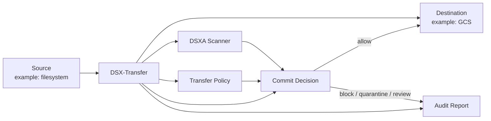

## Simplified Usage Models

There are several practical ways to use DSXA and DSX-Transfer.

### 0. Direct DSXA File Scanning

Use this when an application only needs file scanning as a service.
The application calls DSXA directly, receives a scan result, and decides what to do next.

DSX-Transfer is not in the transfer path in this mode.
The application owns the transfer, policy interpretation, destination write, audit, and retry behavior.

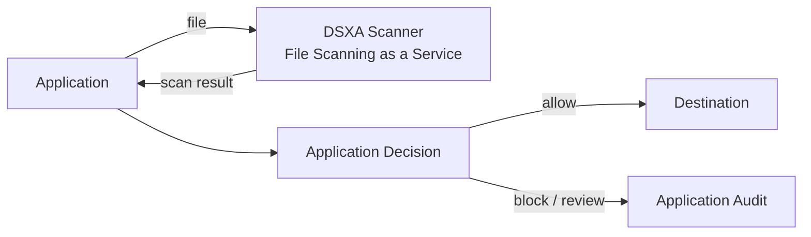

### 1. Direct Integration Code

Use this when an application team wants guarded transfer behavior inside its own application, scheduled job, queue consumer, or background worker.

The VS Code extension helps generate the integration workspace:

- `dsx-transfer.yaml` for transfer behavior
- Python adapter code for application invocation
- local harness and smoke-test files
- validation and report inspection workflow

In this model, the application decides when to run a transfer.
DSX-Transfer performs scan-before-commit enforcement and returns a report the application can use for retry, alerting, or workflow decisions.

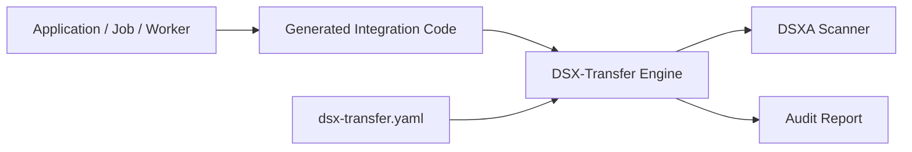

### 2. DSX-Transfer Middleware

Use this when DSX-Transfer should run as a service or container between a sender and a destination.

This splits into three related middleware shapes.

#### 2a. Submit Policy And Files

Use this when the caller owns file selection and file delivery into DSX-Transfer.
DSX-Transfer does not primarily define or enumerate the source.
Instead, the caller says:

```text
Here is the transfer policy.
Here are the files or readable file references.
Decide whether each file is allowed to reach the destination.
```

DSX-Transfer scans the submitted files, applies the submitted or referenced policy, commits allowed files to the configured destination, and reports blocked or failed outcomes.

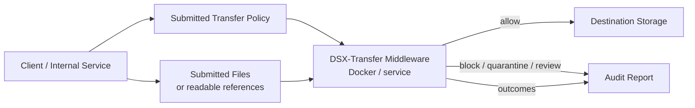

#### 2b. Submit Transfer Config And Let DSX-Transfer Handle The Transfer

Use this when the caller wants a service or container to own the transfer run after policy and transfer intent are submitted.
The caller provides a transfer request or `dsx-transfer.yaml`-style config that includes source intent, destination intent, scanner settings, transfer policy, and runtime reporting settings.
DSX-Transfer then handles planning, reading, scanning, commit decisions, destination writes, audit, and checkpointing.

In this model, the caller says:

```text
Here is the transfer config.
It includes the source, destination, scanner, policy, and runtime settings.
Run the guarded transfer and report the outcome.
```

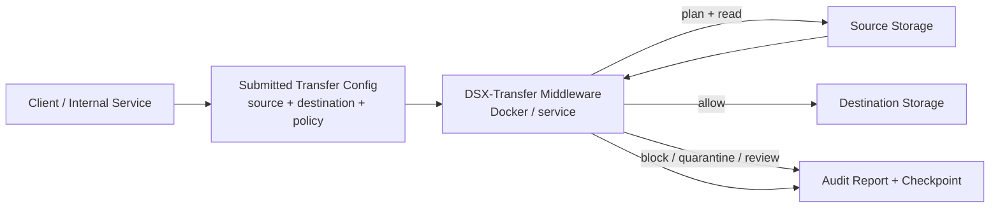

#### 2c. Submit Files To A Preconfigured DSX-Transfer Service

Use this when DSX-Transfer service owns the policy and destination configuration ahead of time.
Clients do not submit a full transfer config.
They send files or readable references to a named route, tenant, workflow, or policy profile.

In this model, the caller says:

```text
Here are the files.
Use the service's configured policy and destination.
Decide whether each file is allowed to reach the destination.
```

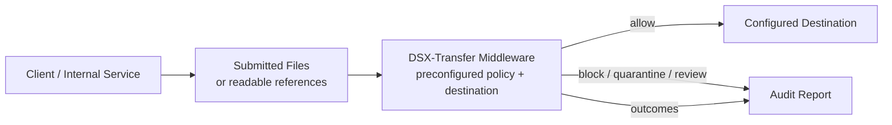

### 3. Call From A Third-Party Product

Use this when an existing transfer platform already owns the transfer workflow.
Examples include MOVEit, SFTPGo, Sterling, GoAnywhere, and similar products.

The third-party product calls DSX-Transfer during its transfer lifecycle.
DSX-Transfer scans the file, applies policy, and returns a commit decision that the product maps to allow, block, quarantine, or hold.

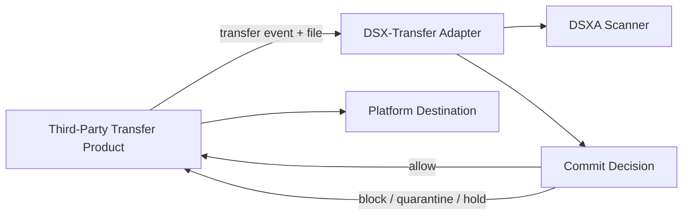

## Detailed Mode: Enterprise Transfer Platform Adapter

Use this mode when a customer already has an Enterprise File Transfer Management or Managed File Transfer platform.
Examples include MOVEit, SFTPGo, IBM Sterling, GoAnywhere, Axway, and similar systems.

In this mode, the transfer platform owns users, partners, protocols, schedules, routing, portals, and operational transfer workflows.
DSX-Transfer owns the scan and policy decision that tells the platform whether a file can continue.

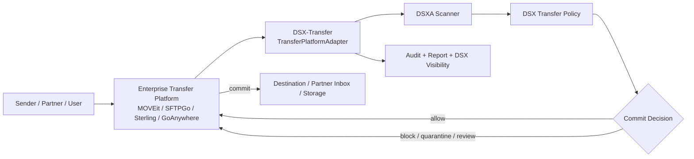

The preferred integration point is pre-commit or pre-upload.
That preserves the strongest guarantee: blocked files do not land in the final destination.

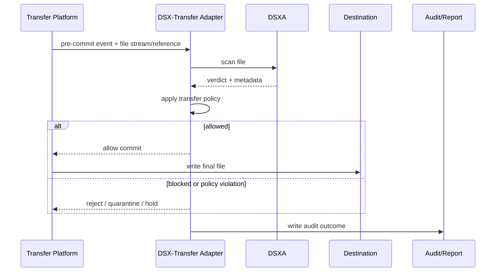

### Responsibilities

| Layer | Owns |
| --- | --- |
| Enterprise transfer platform | Users, partners, inboxes, SFTP/FTPS/HTTPS protocols, scheduling, routing, business workflows, platform reporting |
| DSX-Transfer adapter | Platform event mapping, content handoff, scanner invocation, policy evaluation, allow/block/quarantine decision, DSX audit |
| DSXA | Malware scanning, verdicts, scan metadata |

### Why This Mode Exists

Customers with mature transfer platforms usually do not want DSX to replace the transfer platform.
They want DSX to add malware-aware enforcement to that platform.

This is the integration story:

```text
Keep the enterprise transfer workflow.
Insert DSX as the security decision point.
```

## Detailed Mode: Build-Your-Own Guarded Transfer

Use this mode when a team is building its own transfer, migration, ingestion, or movement workflow.
The team may want a CLI, a Python integration, a scheduled job, a background worker, or an application-owned transfer pipeline.

In this mode, DSX-Transfer owns the transfer engine path:

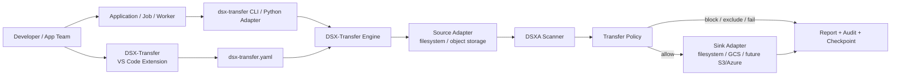

The VS Code extension helps developers create the portable config, run local validation, run local harnesses, and inspect the latest report.
The same `dsx-transfer.yaml` can be used from the CLI, from generated Python code, or from future automation.

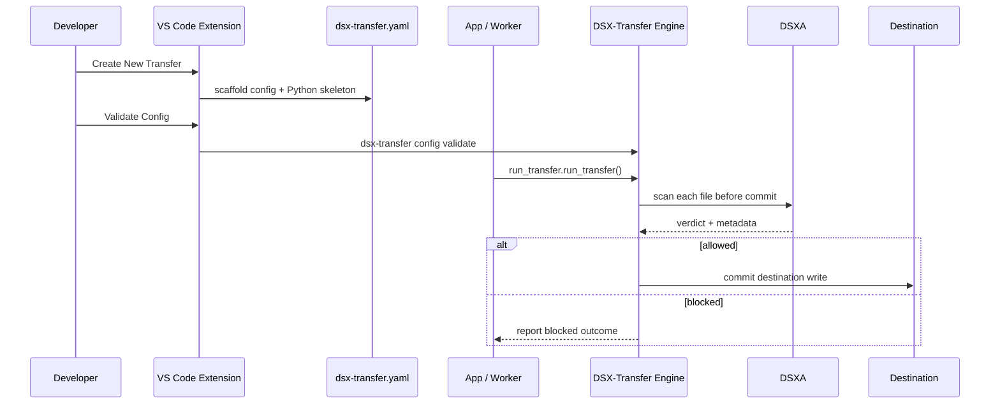

### Responsibilities

| Layer | Owns |
| --- | --- |
| Application team | When transfers run, business workflow, retries/alerts around the job, deployment, credentials injection |
| DSX-Transfer VS Code extension | Scaffolding, config authoring, validation, local harness, report inspection |
| DSX-Transfer engine | Source planning, reading, scan-before-commit enforcement, destination writes, audit, checkpointing |
| DSXA | Malware scanning, verdicts, scan metadata |

### Why This Mode Exists

Some teams do not have an MFT platform or need transfer logic inside their own application.
For them, DSX-Transfer is the guarded transfer engine and developer workflow.

This is the developer story:

```text
Keep transfer behavior in dsx-transfer.yaml.
Call DSX-Transfer from your app.
Get scan-before-commit enforcement without rebuilding scanner and policy plumbing.
```

## Side-By-Side Positioning

| Mode | Who owns transfer workflow? | What DSX provides | Primary integration object |
| --- | --- | --- | --- |
| 0. Direct DSXA scanning | Customer application | File scan result | DSXA SDK/API call |
| 1. Direct integration code | Customer application/job/worker | Transfer engine, config, scan gate, policy, audit, checkpoint | `dsx-transfer.yaml` plus generated Python adapter |
| 2a. Middleware: submit policy and files | Caller owns file selection; DSX-Transfer owns commit decision | Service-side scan and policy enforcement for submitted files | Policy payload plus files/references |
| 2b. Middleware: submit transfer config | DSX-Transfer service owns transfer run after request | Planning, reading, scanning, destination writes, audit, checkpoint | Transfer request or `dsx-transfer.yaml`-style config |
| 2c. Middleware: submit files to preconfigured service | DSX-Transfer service owns configured policy/destination | Scan and commit decision using configured route/profile | Files/references plus route/profile identity |
| 3. Third-party product call | MOVEit, SFTPGo, Sterling, GoAnywhere, etc. | Scan and commit decision adapter | `TransferPlatformAdapter` |

## Shared Concepts

The DSX-Transfer modes should share the same core vocabulary:

- DSXA scan result
- transfer policy
- allow/block/quarantine/manual-review decision
- audit outcome
- report summary
- blocked and failed item details

That shared model keeps product behavior consistent even when the deployment shape changes.

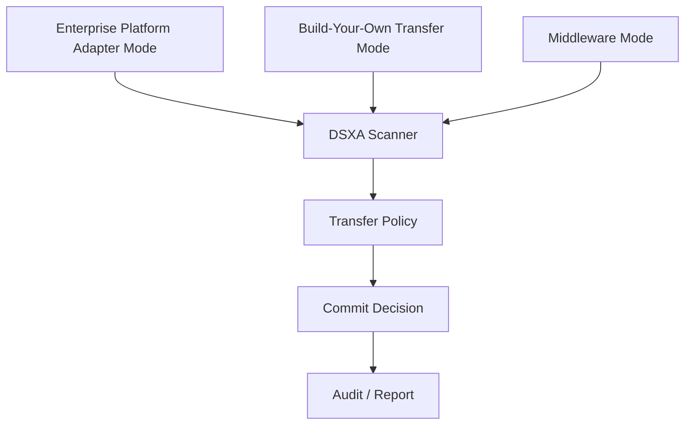

## Design Rule

```text
Use a TransferPlatformAdapter when the external platform owns the transfer lifecycle.
Use the DSX-Transfer engine when DSX owns the transfer lifecycle.
Use the VS Code extension when developers need to create, validate, run, and embed guarded transfers.
```
