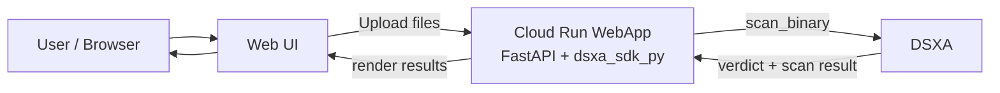

# DSXA WebApp File Upload Demo

Minimal example webapp for a loan-processing style intake flow:

- user uploads one or more files
- server scans each file with `dsxa_sdk_py`
- benign files are accepted into an intake folder
- malicious or non-compliant files are rejected and reported back in the UI

## Key Components

- FastAPI entrypoint: `examples/webapp/app.py`
- HTML/CSS/JS page template: `examples/webapp/templates/index.html`
- Upload API route: `upload_and_scan()` in `examples/webapp/app.py`
- Per-file scan logic: `scan_one_upload()` in `examples/webapp/app.py`
- Intake policy decisions: `classify_scan()` in `examples/webapp/policy.py`
- SDK async binary scan call: `AsyncDSXAClient.scan_binary()` in `dsxa_sdk_py/client.py`

The main per-file handoff from the webapp into the SDK happens here:

```python
async with semaphore:
    response: ScanResponse = await client.scan_binary(
        payload,
        custom_metadata=f"loan-intake:{filename}",
    )
```

That code lives in `scan_one_upload()` in `examples/webapp/app.py`.

Inside the SDK, that resolves to the underlying DSXA REST call here:

```python
response = await self._request(
    "POST",
    "/scan/binary/v2",
    headers=headers,
    content=bytes(data),
)
```

That code lives in `AsyncDSXAClient.scan_binary()` in `dsxa_sdk_py/client.py`.

## Install

- Python 3.10+
- Install the webapp dependencies with the SDK extras:

```bash
cd dsxa_sdk_py
pip install -e ".[webapp]"
```

## Configure

```bash
export DSXA_BASE_URL=https://scanner.example.com
export DSXA_AUTH_TOKEN=your-token   # optional if auth is disabled
export DSXA_PROTECTED_ENTITY=1
export DSXA_VERIFY_TLS=true
export WEBAPP_SCAN_CONCURRENCY=4
export WEBAPP_BLOCK_EXECUTABLES=true
export WEBAPP_MAX_UPLOAD_FILES=5000
export WEBAPP_MAX_VISIBLE_RESULTS=100
export WEBAPP_UPLOAD_DIR="demo_uploads/accepted"
```

`WEBAPP_BLOCK_EXECUTABLES` is an intake-policy setting in the sample webapp. When enabled, executable file types are rejected even if DSXA returns a benign verdict.

`WEBAPP_MAX_UPLOAD_FILES` is only a webapp multipart-upload limit. It is not a DSXA scanning limit.

`WEBAPP_MAX_VISIBLE_RESULTS` is only a browser/UI rendering cap for the sample results panes. It does not change how many files are uploaded or scanned.

## Run

```bash
uvicorn examples.webapp.app:app --reload
```

Then open `http://127.0.0.1:8000`.

## Docker

Build from the `dsxa_sdk_py` project root:

```bash
docker build -f examples/webapp/Dockerfile -t dsxa-webapp-demo .
```

Run locally:

```bash
docker run --rm -p 8080:8080 \
  -e DSXA_BASE_URL=https://scanner.example.com \
  -e DSXA_AUTH_TOKEN=your-token \
  -e DSXA_PROTECTED_ENTITY=1 \
  -e WEBAPP_SCAN_CONCURRENCY=4 \
  dsxa-webapp-demo
```

Then open `http://127.0.0.1:8080`.

If DSXA is running on your host machine, set `DSXA_BASE_URL` to `http://host.docker.internal:PORT` instead of `127.0.0.1` or `localhost`.

If DSXA and this demo are both running as containers on the same Docker host, place them on the same user-defined Docker network and set `DSXA_BASE_URL` to the DSXA container name and internal port, for example `http://dsxa:15002`.

## Cloud Run

This example can run on Google Cloud Run as a simple containerized webapp.

Architecture:



Notes:

- Accepted files are currently written to the container filesystem.
- On Cloud Run, that storage is ephemeral and not durable across instance restarts.
- For a real deployment, store accepted files in GCS instead of `WEBAPP_UPLOAD_DIR`.
- The Cloud Run service must be able to reach your DSXA endpoint over the network.

Build and push with Cloud Build from the `dsxa_sdk_py` project root:

```bash
gcloud builds submit --config examples/webapp/cloudbuild.yaml .
```

Deploy to Cloud Run:

```bash
gcloud run deploy dsxa-webapp-demo \
  --image gcr.io/PROJECT_ID/dsxa-webapp-demo \
  --platform managed \
  --region us-central1 \
  --allow-unauthenticated \
  --set-env-vars DSXA_BASE_URL=https://scanner.example.com,DSXA_AUTH_TOKEN=your-token,DSXA_PROTECTED_ENTITY=1,WEBAPP_SCAN_CONCURRENCY=4
```

If DSXA uses a private or internal address, Cloud Run also needs the appropriate VPC connectivity to reach it.
